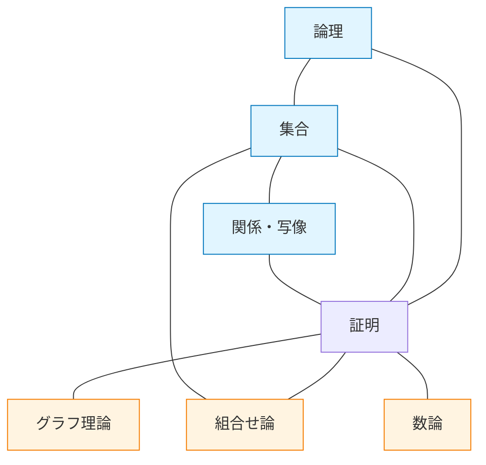
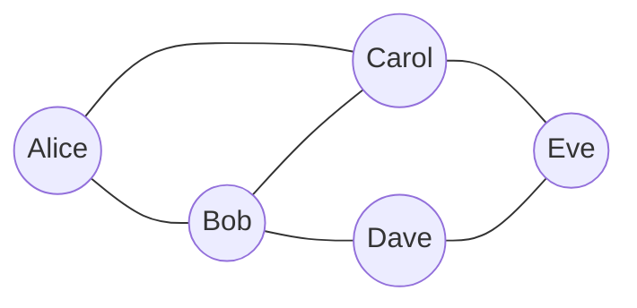
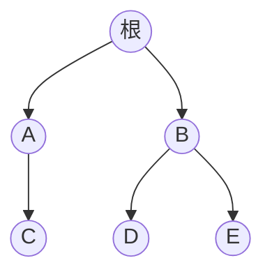

# 第 1 章 離散数学

## まえがき — この章で何を手に入れるのか

ある朝、あなたはこんな疑問を持つかもしれません。

- 4 桁の暗証番号は何通りあって、どれくらい「破られにくい」のか？
- LINE の友だちリストの「友だちの友だち」は、平均何人くらいまで広がるのか？
- 「もし雨が降ったら傘を持ってくる」と約束した日に、雨が降らず傘も持って来なかったら、約束を破ったことになるの？
- なぜ Google は世界中の何兆ページから 0.3 秒で答えを返せるの？
- なぜ「素因数分解は遅い」というだけで、ネットショッピングの暗号は安全なの？

これらは見た目バラバラな問いですが、すべて **「とびとびの対象を扱う数学＝離散数学」** で答えられます。

離散数学は CS のすべての分野の母語です。アルゴリズム、データベース、ネットワーク、暗号、AI、コンパイラ、どれを開いても本章の用語が当然のように出てきます。逆に言えば **本章を腑に落とせれば、後の章は読みやすくなる** ということ。

> **🎯 章の目標**
>
> この章を読み終わるころには、あなたは次のことができるようになります。
>
> - 真理値表を書いて、複雑な条件文を整理できる。
> - 「**かつ・または・ならば**」の関係をプログラムと数学の両方で扱える。
> - 集合・写像という言葉でデータの関係を語れる。
> - 数学的帰納法で「すべての $n$ について」型の主張を証明できる。
> - $n$ 個から $r$ 個を選ぶ場合の数を、暗算 / 紙で計算できる。
> - グラフを使って SNS や地図をモデル化できる。
> - ユークリッドの互除法を手で実行できる。
>
> 焦らず、自分のペースで読み進めてください。**手を動かすこと** が一番の学習です。

---

## 1.1 なぜ「離散」なのか — 連続数学との違い

### 1.1.1 2 つの数学の世界

数学には大きく分けて 2 つの世界があります。

| | 連続数学 | 離散数学 |
|---|---|---|
| 扱う対象 | なめらかに変化する量 | とびとびの値 |
| 例 | 気温、車の速度、川の流れ | 人数、文字、コインの裏表 |
| 必要な道具 | 微分・積分 | 集合・論理・組合せ |
| 値の取り方 | 0.0001…秒 のように連続 | 1 個、2 個、… のように離散 |
| コンピュータとの相性 | 近似が必要 | そのまま扱える |

連続数学のほうが「学校で習った数学」っぽく感じるかもしれません。グラフを描いて接線の傾きを求めたり、面積を計算したり。

それに対して離散数学は、もっと「**数えたり・並べたり・つないだり**」する数学です。コンピュータは結局のところ、有限のメモリの中で **整数や記号** を操作するだけなので、その挙動を厳密に語るには離散数学の言葉が要ります。

### 1.1.2 コンピュータは「とびとび」でできている

コンピュータの中身を覗くと、すべてが **0 か 1 か** の 2 値で表現されています。

- 1 ビット: $0$ または $1$
- 1 バイト: $00000000$ から $11111111$ までの 256 通り
- 整数 `int`: 大きさが決まっていて、整数しか入らない
- 文字: 1 文字 = 1 つの数値（Unicode のコードポイント）
- 画像: 各画素 = (赤, 緑, 青) の 3 つの整数
- ネットワーク: パケットの並び、IP アドレスは整数

中間値はどこにもありません。たとえば「気温 23.5℃」をコンピュータに保存するときも、内部では浮動小数点数という有限のビット表現に **離散化** されます。0.1 が誤差なく表せないのはこのためです（第 9 章で詳述）。

つまり **離散数学はコンピュータの母語** です。CS のあらゆる場面で離散数学の考え方が顔を出します。

### 1.1.3 この章の地図

本章は次の 7 つのテーマを扱います。



これらは互いに関連しあっています。たとえば「グラフを彩色する場合の数」を求めるには、グラフ理論と組合せ論の両方が必要です。「ある規則を満たす数の列を数える」には数論と組合せ論が交差します。最初は別々に学び、終盤で繋がりが見えると面白くなります。

> **🌱 ここで一息**
> 「微積分は連続、離散数学はとびとび」――この大きな対比だけ覚えて先へ進みましょう。難しいことは何もありません。日常の感覚を数学の言葉に翻訳していくだけです。

---

## 1.2 命題論理 — 「正しい・間違っている」を計算する

### 1.2.1 命題とは何か

**命題 (proposition)** とは「**真か偽か、はっきり判定できる文**」のことです。

| 文 | 命題か？ | 真偽 |
|---|---|---|
| 「2 は素数である」 | はい | 真 |
| 「3 は偶数である」 | はい | 偽 |
| 「東京タワーは高い」 | いいえ | 人によって違う |
| 「明日は晴れるかも」 | いいえ | 推測 |
| 「$x > 5$」 | いいえ | $x$ の値が決まらないと判定できない |
| 「この文は偽である」 | いいえ | 自己言及で真偽が定まらない（嘘つきパラドクス） |

命題でないものを排除する理由は単純で、「真か偽かが決まらないものは数学では扱えない」からです。

最後の「この文は偽である」は哲学者がよく使う有名な例で、もしこれが真ならば「この文は偽」となって偽になり、偽ならば真になり…と無限ループに陥ります。これは **嘘つきパラドクス (Liar's Paradox)** と呼ばれ、後にゲーデルやチューリングが「**証明できない真の命題が存在する**」「**停止性は判定不能**」を示すのに使った武器でもあります（第 8 章）。

命題には記号 $p, q, r, \ldots$ を割り当てます。たとえば

- $p$: 「今日は雨である」
- $q$: 「私は傘を持つ」

としておくと、「もし雨なら傘を持つ」は $p \to q$ と書けます。**自然言語をシンボルに置き換える** ことで、機械的な計算ができるようになる――これが論理学の出発点です。

### 1.2.2 結合子と真理値表

複数の命題を組み立てるための「接着剤」が **論理結合子 (logical connectives)** です。覚えるのは 5 つだけ。

| 結合子 | 記号 | 日本語 | プログラミング | 真になる条件 |
|---|---|---|---|---|
| 否定 | $\neg p$ | 「$p$ ではない」 | `!p` | $p$ が偽のとき |
| 連言 | $p \land q$ | 「$p$ かつ $q$」 | `p && q` | 両方真のとき |
| 選言 | $p \lor q$ | 「$p$ または $q$」 | `p \|\| q` | どちらか真のとき |
| 含意 | $p \to q$ | 「$p$ ならば $q$」 | `if (p) then q` | （後述） |
| 同値 | $p \leftrightarrow q$ | 「$p$ と $q$ は同値」 | `p == q` | 真偽が一致 |

これらの意味を **完全に** 定義するのが、有名な **真理値表 (truth table)** です。

$p$ と $q$ の真偽の組合せは 4 通り（$2 \times 2$）。それぞれで結合子の値を埋めます。

```
+---+---+----+-------+------+--------+----------+
| p | q | ¬p | p ∧ q | p∨q  | p → q  | p ↔ q   |
+---+---+----+-------+------+--------+----------+
| T | T |  F |   T   |   T  |   T    |    T     |
| T | F |  F |   F   |   T  |   F    |    F     |
| F | T |  T |   F   |   T  |   T    |    F     |
| F | F |  T |   F   |   F  |   T    |    T     |
+---+---+----+-------+------+--------+----------+
```

ここで多くの初学者がつまずくのが **含意 $p \to q$** の動きです。「F → T が真？ F → F が真？」と疑問に思うはず。順番に見ていきましょう。

### 1.2.3 含意の意味を腑に落とす

「**もし雨が降ったら、私は傘を持つ**」という約束を考えます。$p$ が「雨が降る」、$q$ が「傘を持つ」です。

4 つの状況を順に検証してみます。

| 状況 | $p$ (雨) | $q$ (傘) | 約束は守られた？ |
|---|---|---|---|
| ① 雨が降って、傘も持った | T | T | ✅ 守った |
| ② 雨が降ったのに、傘を持たなかった | T | F | ❌ 破った |
| ③ 雨は降らなかったが、傘は持った（念のため） | F | T | ✅ 守った（むしろ立派） |
| ④ 雨は降らず、傘も持たなかった | F | F | ✅ 守った（そもそも約束の前提が起きていない） |

つまり、「**約束を破ったと言えるのは、雨が降ったのに傘を持たなかったときだけ**」。だから $p \to q$ は ② のときだけ偽になります。

> **💡 ポイント**
> 「前提 $p$ が偽のときは、$p \to q$ は何でも真」というのは、奇妙に思えますが「**前提が起きていないなら、約束を破る機会がそもそもない**」と読むと自然です。法律でも「契約条件が発生しなかったら違約はない」と扱います。

### 1.2.4 自然言語の翻訳でつまずくポイント

人間の言葉と論理は、見た目より相性が悪いことがあります。よくある落とし穴を見ておきましょう。

**「または」の使い方**

論理の $\lor$ は **包含的選言 (inclusive or)** で、両方真でも真です。一方、日常の「または」は時々 **排他的選言 (exclusive or, XOR)** の意味で使われます。

- 「コーヒーまたは紅茶どちらか **しか** お代わりできません」 → これは XOR
- 「ログインに失敗した、もしくは権限がありません」 → どちらでもありえる、これは $\lor$

プログラミング言語の `||` は包含的選言です。

XOR は数学的には $p \oplus q$ と書き、真理値表は

```
+---+---+--------+
| p | q | p ⊕ q |
+---+---+--------+
| T | T |   F    |
| T | F |   T    |
| F | T |   T    |
| F | F |   F    |
+---+---+--------+
```

「**ちょうどどちらか一方だけが真**」という意味。暗号やビット演算で頻出します。

**「ならば」と「のときに限り」**

- 「$p$ ならば $q$」 = $p \to q$
- 「$p$ のときに限り $q$」 = $q \to p$（逆向き！）
- 「$p$ ならば、かつそのときに限り $q$」 = $p \leftrightarrow q$

数学の証明では「ならば」と「のときに限り」を厳密に区別する必要があります。自然言語の感覚で読むと逆方向に読み間違えやすいので注意。

### 1.2.5 トートロジーと矛盾

- どんな組み合わせでも常に真になる式 → **トートロジー (恒真式, tautology)**
- どんな組み合わせでも常に偽になる式 → **矛盾 (恒偽式, contradiction)**

代表的なトートロジーをいくつか紹介します。

| トートロジー | 式 | 意味 |
|---|---|---|
| 排中律 | $p \lor \neg p$ | どんな命題も真か偽のどちらか |
| 同一律 | $p \to p$ | $p$ ならば $p$ |
| 対偶律 | $(p \to q) \leftrightarrow (\neg q \to \neg p)$ | 元と対偶は同値 |
| 推論律（モーダス・ポネンス） | $((p \to q) \land p) \to q$ | $p \to q$ かつ $p$ なら $q$ が言える |
| 矛盾からの爆発 | $(p \land \neg p) \to q$ | 矛盾からは何でも導ける |

最後の「**矛盾からの爆発 (ex falso quodlibet)**」は重要です。1 つでも矛盾が混入したシステムからは、好きな結論を引き出せてしまいます。だからこそ、論理体系の **無矛盾性** が CS の検証で重視されます（第 5 章・第 8 章）。

矛盾の例: $p \land \neg p$（同時に真かつ偽は不可能）。

### 1.2.6 ド・モルガンの法則 — 否定を分配する魔法

実用上もっとも重要な恒等式の一つが、**ド・モルガンの法則 (De Morgan's laws)** です。

$$\neg (p \land q) \;\equiv\; \neg p \lor \neg q$$
$$\neg (p \lor q) \;\equiv\; \neg p \land \neg q$$

「否定がカッコの中に入ると、$\land$ と $\lor$ がひっくり返る」と覚えてください。

具体例で見てみましょう。「**この本は面白くて、かつ安い**」を否定すると?

- 元: 面白い ($p$) ∧ 安い ($q$)
- 否定: ¬(面白い ∧ 安い)
- ド・モルガン: ¬面白い ∨ ¬安い
- 日常語: 「**面白くないか、または高い（の少なくとも一方）**」

直感的にも合ってますね。両方を満たさないなら、どちらか一方は外れているはずです。

**🇬🇧 歴史コラム**: オーガスタス・ド・モルガン (1806–1871) はイギリスの数学者で、ジョージ・ブール（後述）と同時代を生きました。19 世紀に確立されたブール代数とド・モルガンの法則は、それから 100 年後の電子計算機の論理回路設計に決定的な貢献をすることになります。

### 1.2.7 プログラムでの応用

ド・モルガンの法則は、プログラムのリファクタリングで毎日のように使います。

```python
# 元のコード（読みにくい）
if not (user.is_active and user.has_paid):
    deny_access()

# ド・モルガンで書き換え（読みやすい）
if not user.is_active or not user.has_paid:
    deny_access()
```

両者は **数学的に等価** なので、安心して書き換えられます。

もう 1 つの例:

```python
# 元のコード
while not (i >= 10 or done):
    process()
    i += 1

# ド・モルガンで書き換え
while i < 10 and not done:
    process()
    i += 1
```

「条件が直感的に読めない」と感じたらド・モルガンで書き換える――これが熟練エンジニアの定番テクニックです。

> **🧠 ここで考えてみよう**
> あなたが書いているコードに `if (!(a || b))` のような条件分岐があったら、ド・モルガンで `if (!a && !b)` に書き換えてみてください。読みやすさが変わるのを実感できます。

### 1.2.8 含意の言い換え

含意 $p \to q$ は次のように書き換えられます（とても重要）。

$$p \to q \;\equiv\; \neg p \lor q$$

なぜ等しいか、真理値表で確認しましょう。

```
+---+---+--------+----+-----------+
| p | q | p → q  | ¬p | ¬p ∨ q   |
+---+---+--------+----+-----------+
| T | T |   T    |  F |    T      |
| T | F |   F    |  F |    F      |
| F | T |   T    |  T |    T      |
| F | F |   T    |  T |    T      |
+---+---+--------+----+-----------+
```

両方の列が完全に一致しています。だから等価です。

この書き換えは **対偶 (contrapositive)** と並んで、後の証明や論理回路の設計で繰り返し使います。たとえば「if 文の事前条件と事後条件」を分析するとき、含意を $\lor$ と $\neg$ だけに直すと、論理回路や SAT ソルバが処理しやすい形になります。

### 1.2.9 対偶 — 「裏返して」考える

$p \to q$ と論理的に同じ意味の式に **対偶 $\neg q \to \neg p$** があります。

例:
- 元: 「3 で割り切れる数 ($p$) は、各桁の和が 3 で割り切れる ($q$)」
- 対偶: 「各桁の和が 3 で割り切れない ($\neg q$) なら、その数は 3 で割り切れない ($\neg p$)」

両方とも同じ事実を語っています。**証明したい命題が直接示しにくいときは、対偶を示す**――これが「対偶による証明」のテクニックです（後ほど詳しく扱います）。

注意: **「逆」と「裏」は対偶ではない**。

| 名称 | 形 | $p \to q$ と同値？ |
|---|---|---|
| 元 | $p \to q$ | （元） |
| 逆 | $q \to p$ | **同値ではない** |
| 裏 | $\neg p \to \neg q$ | **同値ではない** |
| 対偶 | $\neg q \to \neg p$ | **同値（重要）** |

混同しがちなので、表にして覚えてください。

### 1.2.10 連言標準形と選言標準形

複雑な論理式を **標準形** に直すと、機械処理しやすくなります。

**連言標準形 (CNF, Conjunctive Normal Form)**: 「リテラルの $\lor$」の $\land$ で書ける形。

例: $(p \lor \neg q) \land (\neg p \lor r) \land (q \lor r)$

**選言標準形 (DNF, Disjunctive Normal Form)**: 「リテラルの $\land$」の $\lor$ で書ける形。

例: $(p \land \neg q) \lor (\neg p \land r)$

任意の論理式は CNF / DNF に変換可能です。SAT ソルバ（後述）は CNF を入力に取ります。

### 1.2.11 ブール代数と論理ゲート

19 世紀の数学者 **ジョージ・ブール (George Boole, 1815–1864)** は『論理の数学的分析』（1847）で、論理を代数のように扱う仕組みを作りました。これが **ブール代数 (Boolean algebra)** です。

|論理| ブール代数 |
|---|---|
| $p \land q$ | $p \cdot q$ または $pq$ |
| $p \lor q$ | $p + q$ |
| $\neg p$ | $\bar p$ または $p'$ |
| 真 | $1$ |
| 偽 | $0$ |

普通の代数と似たルールで計算できますが、いくつか異なる点があります。

- $1 + 1 = 1$（足しても 1 のまま、論理的な「または」だから）
- $p + p = p$（冪等律）
- $p \cdot p = p$（冪等律）

このブール代数を電気回路で実装したのが、20 世紀の **クロード・シャノン (Claude Shannon, 1916–2001)** が修士論文で示したアイデアです。**スイッチの ON/OFF を真/偽に対応づけ、論理演算を回路で実現できる** ことを示したのです。

その結果、論理ゲートが生まれ、CPU が生まれ、現代のコンピュータがあります。

```
論理ゲート（記号と動作）

  AND ゲート       OR ゲート       NOT ゲート
   p ─┐            p ─┐             p ─┤>○─ ¬p
      ├○─ p∧q        ├○─ p∨q
   q ─┘            q ─┘
```

実は、AND・OR・NOT がすべて **NAND ゲート（NOT-AND）** だけで作れます。「NAND は完全集合 (functionally complete)」と言い、これが現代 CPU が NAND を多用する理由です。第 9 章で詳しく扱います。

### 1.2.12 SAT 問題への入口

「ある CNF 式に対して、それを真にする変数の代入があるかどうか」を判定する問題を **SAT 問題 (Satisfiability)** と呼びます。

例: $(p \lor q) \land (\neg p \lor r) \land (\neg q \lor \neg r)$ を満たす $p, q, r$ はある？

総当たりで $2^3 = 8$ 通り試せばわかりますが、変数が 100 個になれば $2^{100} \approx 10^{30}$ 通り。それでも現代の SAT ソルバは数百万変数の問題を解けます。

SAT は **NP 完全** という有名な計算問題で、計算理論の中心テーマです（第 8 章）。集積回路の検証、自動運転の経路計画、暗号解読、ソフトウェアの形式検証――SAT に帰着して解く実用問題は数えきれません。

### 1.2.13 よくある誤り（落とし穴集）

|誤り | 正しくは |
|---|---|
| 「$p \to q$」と「$q \to p$」を混同 | 逆と元は別物。「雨なら傘」と「傘なら雨」は違う |
| 「$\neg(p \land q)$」を「$\neg p \land \neg q$」と書き換え | 正しくは $\neg p \lor \neg q$（ド・モルガン） |
| 「$p \to q$ が偽」を「$p$ が偽」と思う | $p \to q$ が偽になるのは $p$ が真で $q$ が偽のときだけ |
| 量化子の順番を入れ替える | $\forall \exists$ と $\exists \forall$ は違う（次節） |

これらは試験でも実務でも本当によく見るミスです。**疑ったら真理値表に戻る** が鉄則です。

---

## 1.3 述語論理 — 「すべて」と「ある」を語る

### 1.3.1 命題論理だけでは足りない

命題論理は「文単位」で扱う論理でしたが、次のような文は表せません。

- 「**すべての** 偶数は 2 で割り切れる」
- 「**ある** 整数が存在して $x^2 = 4$ となる」

これらは **量化 (quantification)** を含む文です。これを扱えるように拡張したのが **述語論理 (predicate logic)** です。

### 1.3.2 述語と量化子

**述語 (predicate)** $P(x)$ は、「$x$ について真偽が決まる文」です。

例:
- $P(x)$: 「$x$ は素数である」
- $\text{LessThan}(x, y)$: 「$x$ は $y$ より小さい」
- $\text{Friend}(x, y)$: 「$x$ と $y$ は友だち」

述語に **量化子 (quantifier)** を組み合わせると一般的な命題になります。

| 量化子 | 記号 | 意味 |
|---|---|---|
| 全称量化子 | $\forall x.\, P(x)$ | 「すべての $x$ について $P(x)$」 |
| 存在量化子 | $\exists x.\, P(x)$ | 「ある $x$ が存在して $P(x)$」 |

具体例:
- $\forall n \in \mathbb{N}.\, n^2 \geq 0$ … 「すべての自然数 $n$ について $n^2 \geq 0$」（真）
- $\exists x \in \mathbb{R}.\, x^2 = 2$ … 「ある実数 $x$ が存在して $x^2 = 2$」（真、$x = \sqrt 2$）
- $\forall p.\, (\text{prime}(p) \to p \neq 4)$ … 「すべての素数 $p$ について、$p \neq 4$」

### 1.3.3 自由変数と束縛変数

述語論理を学ぶと「束縛変数 / 自由変数」という概念が出てきます。

$\forall x.\, P(x)$ の $x$ は **束縛 (bound)** されています。「$x$ という名前は内側でしか意味を持たない」という宣言です。

一方、$P(y)$ だけだと、$y$ が外から決まる **自由 (free)** な変数です。

これは関数型プログラミングの **クロージャ** と似ています。

```python
def f():
    x = 10
    return lambda y: x + y   # x は束縛, y は引数(束縛), 外側はクロージャ

g = f()
print(g(5))   # 15
```

述語論理の $\forall x.\, P(x)$ は、「$x$ をすべての値で試したか」を問う論理操作。プログラムの「ループ」と「論理学の量化子」は深いところで繋がっています。

### 1.3.4 量化子の否定

量化子の否定は **「ひっくり返る」** と覚えると便利です。

$$\neg \forall x.\, P(x) \;\equiv\; \exists x.\, \neg P(x)$$
$$\neg \exists x.\, P(x) \;\equiv\; \forall x.\, \neg P(x)$$

意味を考えると当然です。
- 「すべての人が幸せだ」を否定すると「不幸な人が一人はいる」
- 「素数が存在する」を否定すると「すべての数は素数ではない」

> **🌱 試してみよう**
> 「**すべての学生が試験に合格した**」を否定すると、どうなりますか？
>
> 答え: 「**ある学生が試験に合格しなかった**」（=「合格しなかった学生がいる」）

「全員が幸せ」を否定したいときに「全員が不幸」と言ってしまうのは典型的な誤り。**否定は最も小さい反例**で十分です。

### 1.3.5 量化子のネスト

量化子は組み合わせて使えます。順番が大事です。

- $\forall x.\, \exists y.\, x < y$ … 「どんな $x$ に対しても、それより大きい $y$ がある」（真）
- $\exists y.\, \forall x.\, x < y$ … 「すべての $x$ より大きい $y$ が 1 つ存在する」（偽、最大値は無限大）

英語にすると違いがはっきりします。
- 前者: "For every $x$, there exists $y$ such that…"
- 後者: "There exists $y$ such that for every $x$…"

数学の文章を読むときは、量化子の順番に細心の注意を払いましょう。連続関数の「$\varepsilon$-$\delta$ 定義」も同じ構造を持っており、解析学に進む人には必須です（第 3 章）。

### 1.3.6 述語論理と SQL

データベースの問い合わせ言語 SQL は、本質的には述語論理に近いものです。

```sql
SELECT name FROM students WHERE score >= 80;
```

これは「**すべての students テーブルの行 $r$ について、$r$.score $\geq 80$ ならば $r$.name を出力**」という述語論理の式と等価です。第 12 章ではこれを **関係代数** という形で扱います。

---

## 1.4 集合 — ものの集まりを数学する

### 1.4.1 集合とは

**集合 (set)** は「ものの集まり」です。日常的すぎて拍子抜けかもしれませんが、これが数学の土台です。

集合は中括弧 `{ }` で書きます。

```
A = {1, 2, 3}
B = {りんご, バナナ, みかん}
C = {x | x は 2 より大きい整数}   ← 内包的記法
```

`x | 条件` は「条件を満たす $x$ の集まり」と読みます。

要素が含まれることを $x \in A$、含まれないことを $x \notin A$ と書きます。

集合の重要なルール:
- **重複は許さない**: $\{1, 2, 2, 3\} = \{1, 2, 3\}$
- **順序は問わない**: $\{1, 2, 3\} = \{3, 1, 2\}$

これが **タプル** や **多重集合** との違いです。

### 1.4.2 よく使う集合

CS でよく出てくる「定番の集合」を覚えておきましょう。

| 記号 | 意味 |
|---|---|
| $\mathbb{N}$ | 自然数 ($0, 1, 2, \ldots$) |
| $\mathbb{Z}$ | 整数 ($\ldots, -2, -1, 0, 1, 2, \ldots$) |
| $\mathbb{Q}$ | 有理数（分数で書ける数） |
| $\mathbb{R}$ | 実数（数直線上のすべての数） |
| $\mathbb{C}$ | 複素数 |
| $\emptyset$ または $\{\}$ | 空集合（要素なし） |

### 1.4.3 集合演算 — ベン図で理解する

2 つの集合 $A, B$ に対する基本演算は 4 つです。

```
和 (A ∪ B): A と B のどちらかに入っているもの
   ┌───────────┐
   │■■A■■■■■B■■│   ← 全体が和
   └───────────┘

積 (A ∩ B): A と B の両方に入っているもの
   ┌─────┬─────┐
   │  A  │▓▓▓│ B  │   ← ▓ が積（重なり部分）
   └─────┴─────┘

差 (A \ B): A に入っていて B に入っていないもの
   ┌─────┬─────┐
   │■■A■│  B  │       ← ■ が A \ B
   └─────┴─────┘

対称差 (A △ B): A か B のどちらか一方だけ
   ┌─────┬─────┬─────┐
   │■■A■│     │■■B■│   ← ■ が対称差
   └─────┴─────┴─────┘
```

具体例:
- $A = \{1, 2, 3, 4\}$、$B = \{3, 4, 5, 6\}$ のとき
  - $A \cup B = \{1, 2, 3, 4, 5, 6\}$
  - $A \cap B = \{3, 4\}$
  - $A \setminus B = \{1, 2\}$
  - $A \triangle B = \{1, 2, 5, 6\}$

**Python で試す**:

```python
A = {1, 2, 3, 4}
B = {3, 4, 5, 6}

print(A | B)   # 和: {1, 2, 3, 4, 5, 6}
print(A & B)   # 積: {3, 4}
print(A - B)   # 差: {1, 2}
print(A ^ B)   # 対称差: {1, 2, 5, 6}
```

Python の集合型は数学の集合とほぼ同じインターフェースを持っており、教科書の演算をそのまま試せます。

### 1.4.4 部分集合とべき集合

**部分集合 (subset)** $A \subseteq B$: 「$A$ のすべての要素が $B$ にも含まれる」。

例: $\{1, 2\} \subseteq \{1, 2, 3\}$（真）。
例: $\emptyset \subseteq A$（空集合は **どんな集合の部分集合** でもある）

**べき集合 (power set)** $\mathcal{P}(A)$: 「$A$ のすべての部分集合の集合」。

例: $A = \{a, b\}$ のとき
$$\mathcal{P}(A) = \{ \emptyset, \{a\}, \{b\}, \{a, b\} \}$$

要素数 $n$ の集合のべき集合は **$2^n$ 個** の要素を持ちます。各要素について「入れるか入れないか」の 2 択を独立に選ぶからです（乗法則・1.7.1 節）。

> **🧠 ここで考えてみよう**
> 3 種類のトッピング（チーズ、ハム、トマト）から好きな組み合わせでピザを作るとき、何種類のピザが作れますか？（何も乗せないという選択肢も含めて）
>
> 答え: $2^3 = 8$ 種類

### 1.4.5 直積 — タプルを生み出す

$A \times B$ は「$A$ の要素と $B$ の要素のペアの集合」です。

例: $A = \{1, 2\}$、$B = \{a, b\}$
$$A \times B = \{(1, a), (1, b), (2, a), (2, b)\}$$

要素数は $|A| \times |B| = 2 \times 2 = 4$。

データベースの「テーブル」、関係（次節）、座標 $(x, y)$、$\mathbb{R}^2$ の平面、3D 空間 $\mathbb{R}^3$ ――どれも直積に基づいています。

### 1.4.6 集合の代数法則

集合演算は、論理演算と同じ法則を満たします。

| 法則 | 集合 | 論理 |
|---|---|---|
| 交換 | $A \cup B = B \cup A$ | $p \lor q \equiv q \lor p$ |
| 結合 | $A \cup (B \cup C) = (A \cup B) \cup C$ | $p \lor (q \lor r) \equiv (p \lor q) \lor r$ |
| 分配 | $A \cap (B \cup C) = (A \cap B) \cup (A \cap C)$ | $p \land (q \lor r) \equiv (p \land q) \lor (p \land r)$ |
| ド・モルガン | $\overline{A \cup B} = \bar A \cap \bar B$ | $\neg(p \lor q) \equiv \neg p \land \neg q$ |

集合と論理は表裏一体。**「$\cup$ と $\lor$」「$\cap$ と $\land$」「$\bar{\;\;}$ と $\neg$」** がそれぞれ対応していると思って差し支えありません。

### 1.4.7 ラッセルのパラドクス（歴史コラム）

19 世紀末、数学者たちは「集合とは何でも入れていい入れ物」という素朴集合論を信じていました。しかし 1901 年、哲学者 **バートランド・ラッセル** が次のようなパラドクスを発見し、数学界に激震が走りました。

> $R = \{ x \mid x \notin x \}$ — 「自分自身を含まない集合の集合」を定義する。
> このとき、$R \in R$ だろうか？
>
> もし $R \in R$ なら、定義から $R \notin R$（矛盾）。
> もし $R \notin R$ なら、定義から $R \in R$（矛盾）。

これに対処するため、20 世紀の数学者たちは **公理的集合論 (ZFC)** という慎重な体系を作りました。素朴な「何でも集めていい」を制限し、矛盾しない範囲で集合を構築できるようにしたのです。

実はこの問題は CS の **型理論** とも深く関わっており、「型はそれ自身を含まない」「階層化が必要」という現代プログラミング言語の設計指針につながっています。

### 1.4.8 カントールの偉業 — 無限にも大きさがある

**ゲオルク・カントール (1845–1918)** は、集合論を数学の主要分野に押し上げた人物です。彼は次の驚くべき事実を示しました。

- $\mathbb{N}$ と $\mathbb{Z}$ は同じ大きさ（並べ方を工夫すれば 1 対 1 対応がつく）
- $\mathbb{N}$ と $\mathbb{R}$ は違う大きさ（$\mathbb{R}$ の方が圧倒的に大きい）

「無限に種類がある」というのは当時としてはあまりに革命的で、彼の説は同時代の数学者から猛反発を受けました。しかし今や **対角線論法** はあらゆる学生が学ぶ古典です。

CS では「**プログラムは可算個しかないが、関数は非可算個ある**」→「**書けない関数が必ず存在する**」という決定不能性の議論につながります（第 8 章）。チューリングの停止問題証明も対角線論法の応用です。

---

## 1.5 関係と写像

### 1.5.1 関係とは

集合 $A \times B$ の **部分集合** を **2 項関係 (binary relation)** といいます。要するに「$A$ と $B$ の要素ペアのうち、特定の条件を満たすものの集まり」です。

例: 整数の「より小さい」関係 $<$
$$\{(1, 2), (1, 3), (2, 3), \ldots\}$$

要素 $(1, 2)$ が含まれることは $1 < 2$ と書きます。

実用例:
- $\text{Friend}$: SNS の友だち関係（人 × 人）
- $\text{Owns}$: 顧客が商品を所有する関係（顧客 × 商品）
- $\text{Subscribes}$: ユーザがチャンネルを購読する関係（YouTube）
- $\text{Follows}$: Twitter のフォロー関係（人 × 人、有向）

データベースの **リレーション** はまさにこの「関係」のことで、SQL の JOIN は関係と関係を組み合わせて新しい関係を作る操作です（第 12 章）。

### 1.5.2 関係の性質

集合 $A$ 上の関係 $R$ が満たす性質に名前があります。

| 性質 | 定義 | 例 |
|---|---|---|
| 反射律 | $\forall a.\, a R a$ | $a = a$, $a \leq a$ |
| 対称律 | $a R b \Rightarrow b R a$ | $a = b$, 兄弟関係 |
| 反対称律 | $a R b \land b R a \Rightarrow a = b$ | $\leq$, $\subseteq$ |
| 推移律 | $a R b \land b R c \Rightarrow a R c$ | $<$, $=$ |

### 1.5.3 同値関係 — 「仲間分け」の数学

**反射律・対称律・推移律** をすべて満たす関係を **同値関係** といいます。代表例は「等しい (=)」。

同値関係があると、集合を **互いに重ならないグループ** に分けられます（**同値類** と呼びます）。

例: 整数を「7 で割った余り」で同値とすると、$\mathbb{Z}$ は 7 つのグループに分かれます。

```
余り 0: { ..., -7, 0, 7, 14, 21, ... }
余り 1: { ..., -6, 1, 8, 15, 22, ... }
余り 2: { ..., -5, 2, 9, 16, 23, ... }
...
余り 6: { ..., -1, 6, 13, 20, 27, ... }
```

これがハッシュテーブルや暗号のモジュロ演算の基礎です。

身近な例:
- 「同じ国籍」: 同値関係。世界の人を国別グループに分ける。
- 「同じクラス」: 同値関係。生徒を 1-A, 1-B, … に分ける。
- 「兄弟」: 推移律を満たさないので **同値関係ではない**（A と B が兄弟、B と C が兄弟でも、A と C は他人かもしれない）。

### 1.5.4 半順序関係 — 「並べる」関係

**反射律・反対称律・推移律** を満たす関係を **半順序 (partial order)** といいます。

例:
- $\leq$ (整数の大小)
- $\subseteq$ (集合の包含)
- 「整除」 ($a \mid b$ = 「$a$ は $b$ を割る」)
- ファイルシステムの「先祖ディレクトリ」

「半」がつくのは、すべてのペアが比較可能とは限らないから。たとえば集合 $\{1, 2\}$ と $\{2, 3\}$ はどちらが「大きい」とも言えません（包含関係にない）。

すべて比較可能なら **全順序 (total order)**。$\leq$ は全順序です。

DAG (有向非巡回グラフ) はまさに半順序関係をグラフ化したもので、ビルドシステムやタスク依存解析、コミット履歴の表現に使われます（第 7 章）。

### 1.5.5 写像（関数）

**写像 (map / function)** $f: A \to B$ は「$A$ の各要素に $B$ の要素を 1 つずつ対応させる規則」。

```
A                B
●─────────────→●     f(a₁) = b₁
●─────────────→●     f(a₂) = b₂
●─────────────→●     f(a₃) = b₂   ← 別の要素が同じ先を指してもよい
●            ●       ← B 側に余りがあってもよい
```

ただし、$A$ の要素から線が **2 本以上出る** のはダメ。「1 つずつ」が原則です。

集合論の言葉では、写像は「特殊な関係」です。$f \subseteq A \times B$ で、各 $a$ に対し $(a, b) \in f$ となる $b$ がちょうど 1 つ。

### 1.5.6 単射・全射・全単射

3 種類の特別な写像があります。

```
単射 (injective):  異なる入力 → 異なる出力
   A         B
   ●────→ ●
   ●────→ ●
   ●────→ ●
   ●         ●  (B に余り OK)
重ならない！

全射 (surjective): B のすべての要素に対応がある
   A         B
   ●────→ ●
   ●─┐    ●
   ●─┴──→ ●
余りなし！

全単射 (bijective): 単射かつ全射 = 1 対 1 の対応
   A         B
   ●────→ ●
   ●────→ ●
   ●────→ ●
完璧なペア！
```

身近な例:
- 「日本人 → 国籍」は全射ではない（国籍が「日本」以外の人もいる）
- 「日本人 → マイナンバー」は全単射のはず（1 人 1 つ、重複しない）
- 「整数 → その絶対値」は単射ではない（$+3$ も $-3$ も $3$ になる）
- 「文字列 → SHA-256 ハッシュ」は単射 **ではない**（鳩の巣原理で必ず衝突がある、1.7.5 節）

### 1.5.7 合成と逆

写像 $f: A \to B$、$g: B \to C$ に対し、**合成** $g \circ f: A \to C$ を $(g \circ f)(x) = g(f(x))$ で定義します。

数学では「右から左へ」読みます。プログラムの合成と一致しています:

```python
def compose(g, f):
    return lambda x: g(f(x))

double = lambda x: x * 2
inc = lambda x: x + 1
both = compose(double, inc)
print(both(3))   # double(inc(3)) = double(4) = 8
```

全単射には **逆写像** $f^{-1}$ があり、$f^{-1}(f(x)) = x$ かつ $f(f^{-1}(y)) = y$。

暗号化と復号、エンコードとデコードはまさに逆写像のペアです。

---

## 1.6 証明の作法 — 「正しい」を示す技法

プログラムの正しさを示すのも、数学の定理を示すのも、本質は同じ「証明」です。CS で使う 4 つの基本パターンを身につけましょう。

### 1.6.1 直接証明

「$p$ ならば $q$」を示すには、**$p$ を仮定して $q$ を導けばよい**。

**例題 1**: 「$n$ が偶数なら、$n^2$ も偶数である」を示せ。

**証明**:
1. $n$ が偶数だと仮定する（前提）。
2. すると、ある整数 $k$ を使って $n = 2k$ と書ける（偶数の定義）。
3. このとき $n^2 = (2k)^2 = 4k^2 = 2 \cdot (2k^2)$。
4. $2k^2$ は整数なので、$n^2$ は 2 の倍数、すなわち偶数。 □

「□」は証明の終わりを示す記号で、$Q.E.D.$ や ∎ も使われます。

**例題 2**: 「奇数 + 奇数 = 偶数」を示せ。

**証明**:
1. $a, b$ を任意の奇数とする。
2. $a = 2k + 1$, $b = 2m + 1$ と書ける（$k, m$ は整数）。
3. $a + b = (2k + 1) + (2m + 1) = 2k + 2m + 2 = 2(k + m + 1)$。
4. $k + m + 1$ は整数なので $a + b$ は偶数。 □

このように、**定義からスタートして、代数操作で結論に至る** のが直接証明の典型です。

### 1.6.2 対偶による証明

「$p$ ならば $q$」を示す代わりに、**「$\neg q$ ならば $\neg p$」を示す**。両者は同値なので OK。

**例題**: 「$n^2$ が偶数なら、$n$ も偶数である」を示せ。

直接示そうとすると難しい（$n^2$ から $n$ を取り出すのが面倒）。対偶を考えてみよう。

**対偶**: 「$n$ が奇数なら、$n^2$ も奇数である」

**証明**:
1. $n$ が奇数と仮定。
2. ある整数 $k$ で $n = 2k + 1$。
3. $n^2 = (2k+1)^2 = 4k^2 + 4k + 1 = 2(2k^2 + 2k) + 1$。
4. これは「奇数」の形なので $n^2$ は奇数。 □

直接の方が遠回りな問題は、対偶でしばしば一気に解けます。

### 1.6.3 背理法

「$p$ である」を示すために、**$\neg p$ を仮定して矛盾を導く**。

**例題（古典）**: 「$\sqrt 2$ は無理数である」を示せ。

**証明**:
1. 仮に $\sqrt 2$ が有理数だとする。すると $\sqrt 2 = a/b$（$a, b$ は整数、$b \neq 0$、**既約**）と書ける。
2. 両辺 2 乗: $2 = a^2 / b^2$ → $a^2 = 2b^2$。
3. $a^2$ が偶数 → $a$ も偶数（前項で示した）。$a = 2m$ と書く。
4. $4m^2 = 2b^2$ → $b^2 = 2m^2$。
5. すると $b^2$ も偶数 → $b$ も偶数。
6. しかし、$a$ も $b$ も偶数なら、$a/b$ は **既約** ではない。これは ① の仮定に矛盾。
7. よって $\sqrt 2$ は有理数ではない（無理数である）。 □

**例題（ユークリッド）**: 「素数は無限に存在する」を示せ。

**証明**:
1. 仮に素数が有限個 $p_1, p_2, \ldots, p_n$ しかないとする。
2. $N = p_1 \cdot p_2 \cdots p_n + 1$ という数を作る。
3. $N$ をどの $p_i$ で割っても余り $1$ なので、$N$ は $p_i$ では割り切れない。
4. ところが $N \geq 2$ なので、何らかの素数で割り切れるはず。
5. つまり $p_1, \ldots, p_n$ 以外の素数が存在する。これは ① の仮定に矛盾。
6. よって素数は無限にある。 □

これは紀元前 300 年の **ユークリッド** が示した、人類最古級の優美な証明の一つです。

> **💡 ポイント**
> 背理法は強力ですが、結論が「**ない**」「**できない**」型のとき特に効果を発揮します。

### 1.6.4 数学的帰納法 — 「ドミノ倒し」の原理

自然数についての性質を示す最強の道具です。

**仕組み**:
1. **基底**: $P(1)$（または $P(0)$）が成り立つことを示す。
2. **帰納段階**: $P(k)$ が成り立つと仮定して、$P(k+1)$ も成り立つことを示す。

これだけで「すべての自然数 $n$ について $P(n)$」が結論できます。

イメージはドミノ倒し:


- 基底 = **最初のドミノが倒れる**
- 帰納段階 = **ドミノが隣を倒すよう並んでいる**
- 結論 = **すべてのドミノが倒れる**

**例題 1**: 「$1 + 2 + 3 + \cdots + n = \dfrac{n(n+1)}{2}$」を示せ。

**証明**:

**基底** ($n = 1$): 左辺 $= 1$、右辺 $= \dfrac{1 \cdot 2}{2} = 1$。一致 ✓

**帰納段階**: $n = k$ で成り立つと仮定する。つまり
$$1 + 2 + \cdots + k = \frac{k(k+1)}{2} \quad (\text{仮定})$$

これを使って $n = k+1$ でも成り立つことを示す。
$$1 + 2 + \cdots + k + (k+1) = \underbrace{\frac{k(k+1)}{2}}_{\text{仮定より}} + (k+1)$$
$$= \frac{k(k+1) + 2(k+1)}{2} = \frac{(k+1)(k+2)}{2}$$

これはまさに $n = k+1$ の式の形 $\dfrac{(k+1)((k+1)+1)}{2}$。よって $P(k+1)$ も成立。 □

**例題 2**: 「$n^3 - n$ は 6 で割り切れる」を示せ。

**証明**:
**基底** ($n = 1$): $1 - 1 = 0$。0 は 6 で割り切れる ✓

**帰納段階**: $k^3 - k$ が 6 で割り切れると仮定。
$(k+1)^3 - (k+1) = (k^3 + 3k^2 + 3k + 1) - (k + 1) = k^3 - k + 3k^2 + 3k = (k^3 - k) + 3k(k+1)$。

第 1 項は仮定より 6 の倍数、第 2 項は連続 2 整数の積 $k(k+1)$ が偶数なので $3k(k+1)$ は 6 の倍数。和も 6 の倍数。 □

### 1.6.5 強い帰納法

$P(k+1)$ を示すのに、$P(1), P(2), \ldots, P(k)$ **すべて** を仮定として使う形。

例:「**すべての 2 以上の自然数は素数の積に分解できる**」は強い帰納法で示します。

**証明**:
- 基底: $n = 2$ なら $2$ 自身が素数なので OK。
- 帰納段階: $2, 3, \ldots, k$ がすべて素数の積に分解できると仮定。$n = k + 1$ について:
  - もし $n$ が素数ならそれ自身が積（自分 1 個の積）として OK。
  - もし合成数なら $n = a \cdot b$（$2 \leq a, b \leq k$）と書ける。仮定より $a, b$ ともに素数の積に分解可能なので $n$ も素数の積。 □

これは **算術の基本定理** の半分（存在）の証明です。一意性はもう少し複雑です。

### 1.6.6 ループ不変条件 — プログラムの帰納法

プログラムの正しさを示すには、ループの **不変条件 (invariant)** を見つけるのが定石です。

```python
# 1 から n までの和を求める
s = 0
i = 1
while i <= n:
    s = s + i
    i = i + 1
# このとき s = n(n+1)/2 になっている
```

不変条件: 「ループの先頭で `s = (i-1) * i / 2`」

- ループに入る前: $i = 1$, $s = 0$. $(i-1) \cdot i / 2 = 0 \cdot 1 / 2 = 0 = s$。✓
- ループ 1 周後: $s' = s + i = (i-1)i/2 + i = i(i+1)/2$、$i' = i+1$。新しい $i'-1 = i$ で、$(i'-1) i' / 2 = i(i+1)/2 = s'$。✓
- 終了時: $i = n + 1$、$s = n(n+1)/2$。✓

不変条件 = 帰納の仮定、ループの 1 周 = 帰納段階、と置き換えれば、ループ正当性は数学的帰納法そのものです。詳細は第 5 章（ホア論理）。

### 1.6.7 よくある証明の誤り

|誤り | 例 |
|---|---|
| 帰納段階で結論を仮定に使う | 循環論法 |
| 基底の確認を忘れる | 「$P(k) \to P(k+1)$」だけで終わる |
| 「すべて」を「あるもの」と置き換える | 反例にすぎない |
| 「逆」を「対偶」と取り違える | 1.2.9 節 |
| 「Without loss of generality」を本当に WLOG でない場面で使う | 場合分けが足りていない |

証明はパズルのようなもの。**間違えたら戻って書き直す**。これも CS の習慣です。

---

## 1.7 組合せ論 — 「数える」数学

### 1.7.1 加法則と乗法則

数え上げの基本ルールは 2 つだけ。

**乗法則 (multiplication rule)**: 段階的に選ぶときは掛ける。

**例**: 朝食にシリアル 3 種、ジュース 4 種から 1 つずつ選ぶ → $3 \times 4 = 12$ 通り。

**加法則 (addition rule)**: 互いに排他的なら足す。

**例**: シリアル 3 種、または、トースト 2 種から 1 つ選ぶ → $3 + 2 = 5$ 通り。

> **🧠 試してみよう**
> 4 桁の暗証番号は何通り？（$0$〜$9$ の数字、重複可）
>
> 各桁が独立に 10 通り → $10 \times 10 \times 10 \times 10 = 10000$ 通り。
> これは銀行の暗証番号が「総当たり可能」と言われる理由です。

### 1.7.2 順列

$n$ 個から $r$ 個を **順序を考えて** 並べる場合の数:

$$P(n, r) = \frac{n!}{(n-r)!} = n \cdot (n-1) \cdot (n-2) \cdots (n-r+1)$$

**例**: 5 人から 3 人を選んで並べる方法 = $5 \times 4 \times 3 = 60$ 通り。

**例**: 26 文字のアルファベットから重複なしで 4 文字並べる = $26 \times 25 \times 24 \times 23 = 358800$ 通り。

### 1.7.3 組合せ

順序を **考えない** 場合の数:

$$\binom{n}{r} = \frac{n!}{r!(n-r)!}$$

**例**: 10 人から 3 人を選んで委員会を作る = $\dfrac{10!}{3! \cdot 7!} = \dfrac{10 \cdot 9 \cdot 8}{3 \cdot 2 \cdot 1} = 120$ 通り。

順列との違いは「並べるか・選ぶだけか」。委員会の場合「A, B, C」と「B, C, A」は同じ委員会です。

**ロト 6 の当選確率**: 1〜43 の数字から 6 個を選ぶ。当選パターンは
$$\binom{43}{6} = \frac{43!}{6! \cdot 37!} = 6,096,454$$
つまり当選確率は約 **600 万分の 1**。これは「**雷に打たれて死ぬ確率の 100 倍以下**」です。

### 1.7.4 二項定理とパスカルの三角形

$$(x + y)^n = \sum_{k=0}^n \binom{n}{k} x^{n-k} y^k$$

たとえば $(x+y)^3 = x^3 + 3x^2y + 3xy^2 + y^3$。係数 $1, 3, 3, 1$ は $\binom{3}{0}, \binom{3}{1}, \binom{3}{2}, \binom{3}{3}$。

**パスカルの三角形** は組合せ数を可視化したもの。

```
                1
              1   1
            1   2   1
          1   3   3   1
        1   4   6   4   1
      1   5  10  10   5   1
    1   6  15  20  15   6   1
```

各数は「**左上 + 右上**」（$\binom{n}{r} = \binom{n-1}{r-1} + \binom{n-1}{r}$）。これは「ある人を委員会に入れる/入れない」で場合分けすれば直感的に説明できます。

おまけ: パスカルの三角形には他にもたくさんの不思議が隠れています。
- 各行の合計は $2^n$（べき集合の要素数）
- 斜めに足すとフィボナッチ数列
- 偶奇を白黒で塗ると **シェルピンスキーのフラクタル** になる

### 1.7.5 鳩の巣原理 — 自明だが強力

**$n+1$ 羽の鳩を $n$ 個の巣に入れると、必ずどこかの巣に 2 羽以上入る。**

「当たり前すぎる」と思うかもしれませんが、応用は広い。

**例**: 367 人いる集団なら、必ず誕生日が同じ 2 人がいる。
理由: 1 年は 366 日（うるう年込み）。367 人を 366 個の「日」に振り分けると鳩の巣。

**例**: ハッシュ関数で出力が 256 ビットなら、$2^{256}+1$ 個の入力を試せば必ず衝突する。

**例**: ファイルサイズが $n$ ビットの圧縮はすべて成功するか？ → No。$2^n$ 個の入力に対し、出力が $n$ より小さいなら鳩の巣で必ず衝突するから（無圧縮ファイルが存在する）。これは **ロスレス圧縮の理論的限界** です。

**例（驚きの応用）**: 5 人いれば、必ず「3 人の互いに知り合い」または「3 人の互いに知らない」の組がある（**ラムゼーの定理 R(3,3) = 6** の前段階）。これは鳩の巣 + 場合分けで示せます。

### 1.7.6 包除原理

「複数のグループの和」を数えるとき、**重なりを引く** ルール。

$$|A \cup B| = |A| + |B| - |A \cap B|$$

3 つでは:
$$|A \cup B \cup C| = |A| + |B| + |C| - |A \cap B| - |B \cap C| - |C \cap A| + |A \cap B \cap C|$$

**例**: あるクラスで英語が好きな人 25 人、数学が好きな人 20 人、両方好きな人 10 人。少なくとも 1 つが好きな人は?
$$25 + 20 - 10 = 35\ \text{人}$$

**例（オイラー関数）**: 1 から 30 までの整数のうち、30 と互いに素なものはいくつか？
$30 = 2 \cdot 3 \cdot 5$ なので、2, 3, 5 のいずれでも割れない数を数える。包除原理で
$$30 - \lfloor 30/2 \rfloor - \lfloor 30/3 \rfloor - \lfloor 30/5 \rfloor + \lfloor 30/6 \rfloor + \lfloor 30/10 \rfloor + \lfloor 30/15 \rfloor - \lfloor 30/30 \rfloor = 8$$
答え: 8 個。

これが **オイラーのトーシェント関数 $\varphi(n)$** で、RSA 暗号の鍵生成に登場します（1.9 節 + 第 15 章）。

### 1.7.7 重複を許す組合せ — 「仕切り棒」のテクニック

「リンゴ 5 個を 3 人に配る方法は何通り？（0 個でも OK）」のような問題は、見た目より厄介に見えますが、**仕切り棒のテクニック (stars and bars)** で機械的に解けます。

リンゴ 5 個と仕切り 2 本（3 人なので仕切りは 2 本）を並べる: $\binom{5+2}{2} = \binom{7}{2} = 21$ 通り。

```
●●●|●|●     → A=3, B=1, C=1
●●●●●||      → A=5, B=0, C=0
||●●●●●      → A=0, B=0, C=5
```

一般化: $n$ 個の同じものを $k$ 人に配る ⇒ $\binom{n+k-1}{k-1}$ 通り。

これは IP アドレスの分配、メモリ割当、確率の分配問題で頻出します。

---

## 1.8 グラフ理論 — つながりの数学

### 1.8.1 グラフとは

**グラフ (graph)** は、点（頂点・ノード）と線（辺・エッジ）でつながりを表す構造です。

```
     A───B
     │   │
     │   │
     C───D───E
```

これは頂点 $\{A, B, C, D, E\}$ と辺 $\{(A,B), (A,C), (B,D), (C,D), (D,E)\}$ からなるグラフです。

**身の回りの例**:
- SNS: 人がノード、フォロー関係が辺
- 地図: 街がノード、道路が辺
- Web: ページがノード、リンクが辺
- Git: コミットがノード、親子関係が辺

SNS の友達関係を可視化するとこんなイメージ:


- ファイル依存関係: モジュールがノード、import が辺
- 化学: 原子がノード、結合が辺

「**何かと何かのつながり**」が現れる場面はすべてグラフでモデル化できます。

### 1.8.2 グラフの種類

| 種類 | 特徴 | 例 |
|---|---|---|
| 無向グラフ | 辺に向きなし | Facebook の友達関係 |
| 有向グラフ | 辺に向きあり | Twitter のフォロー |
| 重み付きグラフ | 辺に数値あり | 道路の距離・料金 |
| 多重グラフ | 同じ頂点間に複数辺 | 複数路線がある駅間 |
| DAG | 有向非巡回グラフ | タスクの依存関係、コミット履歴 |
| 二部グラフ | 頂点が 2 グループに分かれ、辺は異グループ間のみ | マッチング、推薦 |

### 1.8.3 重要な用語

- **次数 (degree)**: 頂点に接続する辺の数。
- **パス (path)**: 頂点をたどる経路。
- **閉路 (cycle)**: 始点と終点が同じパス。
- **連結 (connected)**: 任意の 2 頂点間に経路がある。
- **木 (tree)**: 連結で閉路のないグラフ。
- **森 (forest)**: 閉路のない（連結とは限らない）グラフ。

木の構造の例:



ファイルシステム、HTML の DOM、組織図、家系図、二分探索木 (BST)、AST はすべて木です。

### 1.8.4 ケーニヒスベルクの橋問題

グラフ理論の起源です。1736 年、数学者 **オイラー** が解いた歴史的問題。

「ケーニヒスベルク（現カリーニングラード）の街には 4 つの陸地と 7 つの橋がある。すべての橋を **ちょうど 1 度ずつ** 渡って出発点に戻れるか？」

```
       橋1
   A ━━━━━━ B
   ┃ \    /  ┃
   橋2  橋4   橋5
   ┃ /\ /    ┃
   ┃/   \    ┃
   D ━橋3━ C ━橋6━
   橋7
```

オイラーの結論: **不可能**。

理由は次の通り。閉路を作るには、どの陸地にも「入った回数 = 出た回数」でなければならず、そのためには各頂点の **次数が偶数** である必要がある。ところがこの街では奇数次数の陸地があった。

これが「グラフ理論」という新分野を生み、後の Google マップの経路探索、回路の配線、配送ルートの最適化に繋がります。

応用例: 一筆書き問題、郵便配達ルート、Eulerian Circuit、中国人郵便配達問題（CPP）。

### 1.8.5 SNS 上の「6 次の隔たり」

「**世界中の誰とでも、平均 6 人の知り合いを介してつながる**」という説。

これは **小世界ネットワーク** という性質で、グラフ理論の研究対象です。Facebook の実データでは、平均 4.7 人で世界中とつながることが分かっています。

「友達の友達」を辿るアルゴリズムは **幅優先探索 (BFS)** で、第 7 章で詳しく学びます。BFS は階層を 1 つずつ広げて辿る方式です。

```
出発点 A
    │  距離 1
   ┌┴┐
   B  C
   │  │  距離 2
  ┌┴┐ ┌┴┐
  D E F G
```

LinkedIn の「あなたを2 次のコネクションに紹介可能」という機能、Twitter のおすすめユーザー、これらは全部グラフ探索の応用です。

### 1.8.6 グラフの表現方法

プログラムでグラフを扱うとき、典型的に 2 通りあります。

**隣接行列 (adjacency matrix)**: $V \times V$ の表で、辺の有無 (0/1) を記録。

```
   A B C D
A [0 1 1 0]
B [1 0 0 1]
C [1 0 0 1]
D [0 1 1 0]
```

利点: 辺の存在判定が $O(1)$。欠点: $V$ が大きいとメモリを食う ($O(V^2)$)。

**隣接リスト (adjacency list)**: 各頂点が持つ「隣の頂点リスト」を保持。

```
A: [B, C]
B: [A, D]
C: [A, D]
D: [B, C]
```

利点: メモリ $O(V + E)$。欠点: 辺の存在判定が $O(\deg)$。

実用ではほとんどのアルゴリズムが隣接リストを採用します。Twitter のフォローグラフのように疎なグラフ（辺が少ない）にメモリ効率が良いから。

### 1.8.7 木 — 特別なグラフ

**木の重要な性質**:
- 連結で閉路がない
- $V$ 頂点なら辺はちょうど $V - 1$ 本
- 任意の 2 頂点間に **唯一の** パスがある
- 1 本でも辺を消すと連結性が崩れる
- 1 本でも辺を加えると閉路ができる

CS でこれを使うのは、第 7 章のデータ構造（二分探索木、ヒープ、Trie）、第 13 章のコンパイラ（AST）、第 15 章の暗号（Merkle 木）など、**ありとあらゆる場面**。

---

## 1.9 数論の基礎 — 暗号の母

整数の性質を扱う数論は、現代の **暗号** の基盤です。

### 1.9.1 割り算と余り

整数 $a, b$ ($b > 0$) について:
$$a = bq + r \quad (0 \leq r < b)$$
を満たす商 $q$ と余り $r$ がただ 1 つ存在する。

例: $17 = 5 \times 3 + 2$。つまり $17 \div 5$ の商は $3$、余りは $2$。

プログラミングでは `17 / 5` と `17 % 5` で表現されます。負の数の余りは言語ごとに微妙に違うので注意（Python は数学と一致、C/Java は別）。

### 1.9.2 最大公約数 — ユークリッドの互除法

2 つの整数の最大公約数 (GCD) を求める古典アルゴリズム。

**規則**: $\gcd(a, b) = \gcd(b, a \bmod b)$、$\gcd(a, 0) = a$

**例**: $\gcd(252, 198)$ を求める。

```
252 = 198 × 1 + 54        →  gcd(252, 198) = gcd(198, 54)
198 = 54  × 3 + 36        →  gcd(198, 54)  = gcd(54, 36)
54  = 36  × 1 + 18        →  gcd(54, 36)   = gcd(36, 18)
36  = 18  × 2 + 0         →  gcd(36, 18)   = gcd(18, 0) = 18
                          ↓
                     答: 18
```

**Python で試す**:

```python
def gcd(a, b):
    while b:
        a, b = b, a % b
    return a

print(gcd(252, 198))   # 18
```

このアルゴリズムは紀元前 300 年のユークリッドの著書『原論』から不変です。**2300 年使える知識** だと思うと感動的ですね。

計算量: $O(\log \min(a, b))$。素晴らしく速い。

### 1.9.3 拡張ユークリッド互除法

$\gcd(a, b) = ax + by$ となる整数 $x, y$ を求めるアルゴリズム。**ベズー恒等式** とも呼ばれる。

例: $\gcd(252, 198) = 18 = 252 \cdot 4 + 198 \cdot (-5)$。

これが何の役に立つのか? **モジュロ逆元** を求めるのに使います。

$ax \equiv 1 \pmod n$ となる $x$ を $a$ の **モジュロ逆元** と呼び、$\gcd(a, n) = 1$ のとき存在します。拡張ユークリッドで $ax + ny = 1$ を解けば、$x$ がモジュロ逆元。

**用途**: RSA 暗号の鍵生成。$ed \equiv 1 \pmod{\varphi(n)}$ となる $d$ を見つける必要があり、まさに拡張ユークリッドで解きます。

### 1.9.4 合同式

「$n$ で割った余りが等しい」関係を $a \equiv b \pmod n$ と書きます。

例: $17 \equiv 2 \pmod 5$。

**重要な性質**:
- $a \equiv b \pmod n$ ならば $a + c \equiv b + c \pmod n$
- $a \equiv b \pmod n$ ならば $ac \equiv bc \pmod n$
- ただし「両辺を割る」は単純にはできない（モジュロ逆元が必要）

これがコンピュータの世界でいう「**モジュロ演算**」。ハッシュテーブル、暗号、エラー検出符号、曜日計算――どこにでも顔を出します。

### 1.9.5 フェルマーの小定理

$p$ が素数で $\gcd(a, p) = 1$ のとき:
$$a^{p-1} \equiv 1 \pmod p$$

例: $p = 7$, $a = 3$ なら $3^6 = 729 = 104 \cdot 7 + 1 \equiv 1 \pmod 7$。

**応用**: 素数判定（ミラー・ラビン素数判定法のベース）、RSA 暗号の証明。

これを一般化したのが **オイラーの定理**: $\gcd(a, n) = 1$ のとき $a^{\varphi(n)} \equiv 1 \pmod n$。$\varphi$ は前述のオイラーのトーシェント関数。

### 1.9.6 RSA 暗号への橋渡し

整数論の中で最も有名な応用は **RSA 暗号**。インターネットの SSL/TLS で日々使われています。

その安全性は、ある単純な事実に依拠します:

> **大きな数の素因数分解は難しい**

$10003 = ?$ を分解してみてください。手では辛い。これが $300$ 桁になると、現在のコンピュータでも数十億年かかります。

簡単に手順を見ておきましょう（詳細は第 15 章）。

1. 大きな素数 $p, q$ を選び、$n = pq$ を計算。
2. $\varphi(n) = (p-1)(q-1)$ を計算。
3. $\gcd(e, \varphi(n)) = 1$ となる $e$ を選ぶ（公開鍵の指数）。
4. $ed \equiv 1 \pmod{\varphi(n)}$ となる $d$ を **拡張ユークリッド** で求める（秘密鍵）。
5. メッセージ $m$ を $c = m^e \bmod n$ で暗号化、$m = c^d \bmod n$ で復号。

なぜこれで復号できるか? **オイラーの定理** より $m^{\varphi(n)} \equiv 1$ なので、$m^{ed} \equiv m^1 \equiv m$。

**RSA = 数論の塊** です。フェルマー、オイラー、ユークリッドの 2000 年以上の蓄積が、ボタン 1 つでネット決済を成立させているのは、ほとんど詩的な話だと思いませんか。

### 1.9.7 素数の篩 — エラトステネスのアイデア

「2 から $n$ までの素数をすべて求める」のに最古の方法。

```
1. 2 から n までを並べる
2. 2 の倍数（2 自身は除く）に印
3. 次の印のない数 = 3 を取る、3 の倍数に印
4. 次の印のない数 = 5 を取る、5 の倍数に印
5. ... これを √n まで続ける
6. 印のない数がすべて素数
```

```python
def sieve(n):
    is_prime = [True] * (n + 1)
    is_prime[0] = is_prime[1] = False
    for i in range(2, int(n**0.5) + 1):
        if is_prime[i]:
            for j in range(i*i, n+1, i):
                is_prime[j] = False
    return [i for i, p in enumerate(is_prime) if p]

print(sieve(30))   # [2, 3, 5, 7, 11, 13, 17, 19, 23, 29]
```

紀元前 200 年のエラトステネス（地球の周長を計算した人としても有名）が考案し、**今でも標準的な素数列挙アルゴリズム** です。

---

## 1.10 代数系入門 — 構造を見つける

抽象的に見えますが、CS では **何度も同じ構造が現れる** という事実があります。それを統一的に扱うために、代数系（群・環・体）の言葉が便利です。

### 1.10.1 群 — 演算 1 つを持つ世界

集合 $G$ と演算 $*$ が次を満たすとき、$G$ は **群 (group)** です。

1. 結合律: $(a*b)*c = a*(b*c)$
2. 単位元 $e$ が存在: $e*a = a*e = a$
3. 各 $a$ に対し逆元 $a^{-1}$ が存在: $a*a^{-1} = a^{-1}*a = e$

例:
- $(\mathbb{Z}, +)$: 整数と加算。単位元は $0$、$a$ の逆元は $-a$。
- $(\mathbb{Q}^*, \times)$: 0 を除く有理数と掛け算。単位元は $1$、$a$ の逆元は $1/a$。
- 時計の合同類 $(\mathbb{Z}/12\mathbb{Z}, +)$: 12 時間で循環する世界。
- 対称群 $S_n$: $n$ 個の置換と合成。

群はあらゆる「対称性」を扱う言語です。暗号（楕円曲線、有限体）、誤り訂正符号、量子計算でみんな群を使います。

### 1.10.2 環 — 2 つの演算

加算と乗算が両方使え、加算については群、乗算については結合律と分配律がある集合を **環 (ring)** といいます。

例: $(\mathbb{Z}, +, \times)$、多項式環 $\mathbb{R}[x]$、行列環 $M_n(\mathbb{R})$。

### 1.10.3 体 — 0 以外で割れる環

すべての非零要素に乗法逆元があれば **体 (field)**。

例: $\mathbb{Q}, \mathbb{R}, \mathbb{C}$、有限体 $\mathbb{F}_p$（$p$ は素数）。

有限体 $\mathbb{F}_p$ は CS で特に重要。
- AES 暗号の S-Box
- 楕円曲線暗号（ECC）
- 誤り訂正符号（QR コード、CD/DVD）
- Reed-Solomon 符号
- ゼロ知識証明

これら全部、有限体上の計算が中心です。

> **🌱 試してみよう**
> 5 で割った余りで考えると、$3 \times 4 = 12 \equiv 2 \pmod 5$。これは「有限体 $\mathbb{F}_5$」での乗算結果です。手計算で 4×4 表を作ってみてください。

---

## 1.11 演習問題

1. 真理値表を書いて、$(p \to q) \land (q \to r) \to (p \to r)$ がトートロジーであることを確認せよ。
2. ド・モルガンの法則を使って、$\neg((a \lor b) \land c)$ を「否定が変数の前にしか出ない形」に書き換えよ。
3. $\{1, 2, 3, 4\}$ のべき集合をすべて書き出し、要素数が $2^4 = 16$ となることを確認せよ。
4. 「すべての偶数は 2 で割り切れる」を述語論理の式で書け。
5. 写像 $f: \mathbb{Z} \to \mathbb{Z}$, $f(x) = 2x + 1$ は単射か、全射か。
6. 数学的帰納法で $\sum_{i=1}^n i^2 = \dfrac{n(n+1)(2n+1)}{6}$ を示せ。
7. 5 人を一列に並べる方法、および 5 人から 3 人を選ぶ方法は、それぞれ何通りか。
8. 鳩の巣原理を使って、「13 人いれば必ず同じ星座の 2 人がいる」を示せ。
9. $\gcd(1071, 462)$ をユークリッドの互除法で求めよ。
10. 友達 5 人を頂点、互いに友達の関係を辺としてグラフを描いた。辺の総数の最大値を求め、その理由をグラフ理論の言葉で説明せよ。
11. クラス 30 人のうち、英語が好きな人 18 人、数学が好きな人 12 人、どちらも嫌いな人 5 人。両方好きな人は何人か。包除原理を使え。
12. 拡張ユークリッドで $\gcd(31, 17)$ を求め、$31 x + 17 y = 1$ となる整数 $x, y$ を求めよ。
13. 「リンゴ 7 個を 4 人に配る方法（0 個 OK）は何通りか」を仕切り棒のテクニックで求めよ。
14. CNF $(p \lor q) \land (\neg p \lor r) \land (\neg q \lor \neg r)$ を満たす真偽の割り当てが存在するか、総当たりで判定せよ。
15. プログラム
    ```python
    s = 0
    for i in range(1, n+1):
        s += i*i
    ```
    のループ不変条件を提案し、終了時に `s = n(n+1)(2n+1)/6` が成立することを示せ。

**ヒント**: 答えに自信がなければ本文に戻ること。証明問題は手書きで紙に書くと頭に残ります。

---

## 1.12 この章のまとめ

ここまでで、離散数学の主要な道具がそろいました。

- **論理**: 命題と真理値表、ド・モルガンの法則、対偶 — コードの条件分岐や仕様の表現、論理回路、SAT
- **集合と写像**: ものの集まりと対応の数学 — データ型・関係・関数の基礎、データベース、型理論
- **証明**: 直接・対偶・背理法・帰納法 — プログラムの正しさ、ループ不変条件
- **組合せ論**: 数え上げ — 計算量解析、確率、暗号、ロト 6 の確率
- **グラフ理論**: つながりの数学 — SNS、地図、依存関係、ファイルシステム
- **数論**: 整数の性質 — 暗号、ハッシュ、モジュロ演算、RSA
- **代数系**: 構造の言葉 — 暗号、誤り訂正、量子計算

これらは別々の話題に見えますが、**コンピュータが扱う離散的な対象** という共通点で結びついています。

本章で学んだ用語や記号は、本書の残りすべての章で使われます。とくに

- 集合と写像 → 第 6 章（プログラミング言語）、第 12 章（DB）、第 13 章（コンパイラ）
- 証明と帰納法 → 第 7 章（アルゴリズム）、第 5 章（論理と検証）
- 組合せ論 → 第 4 章（確率）、第 17 章（機械学習）
- グラフ理論 → 第 7 章、第 11 章（ネットワーク）、第 16 章（分散）
- 数論と代数 → 第 15 章（暗号）、第 20 章（量子・先端）

繰り返し出てくる「共通言語」だと意識しておきましょう。

---

## 1.13 次に読むもの

入門レベルから順に。

- **動画で学ぶ**: 3Blue1Brown『Essence of …』シリーズ（数学の直感を視覚で）。
- **入門書**:
  - 結城浩『数学ガール』シリーズ — 物語形式で帰納法・素数・対角線論法を紹介。
  - 小島寛之『数学的思考の構造』。
- **教科書**:
  - Rosen, *Discrete Mathematics and Its Applications* — 米国大学の標準。網羅的。
  - Lehman, Leighton, Meyer, *Mathematics for Computer Science* (MIT) — 無料 PDF、CS 向け。
  - Knuth, Graham, Patashnik, *Concrete Mathematics* — 名著、組合せ論深掘り。
- **演習集**:
  - 大学入試の論理・集合問題（意外と良問）。
  - AtCoder, LeetCode の数学カテゴリ。
  - Project Euler の最初の 100 問。

> **🌟 メッセージ**
> 離散数学は「定義を覚える科目」ではなく「**世界を分解して再構成する技法**」です。記号に怖気づかず、いつも「これは何の話だろう？」と日常の例に置き換えながら読み進めてください。最初は遅く感じても、しばらくすると数式を読むのが「文章を読むのと同じ速さ」になります。そこからが本番です。
>
> どうしても詰まったら、いったん飛ばして次の章に進んでも構いません。CS の他の分野で具体的な使われ方を見ると、戻ってきたとき急に意味が腑に落ちることが多々あります。**本書は何度も往復することを前提にしてあります**。
