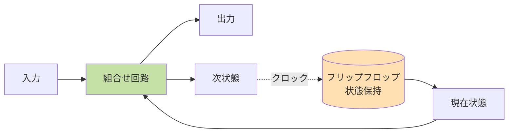

# 第 5 章 計算のための論理

## まえがき — 機械が「考える」仕組み

「コンピュータは論理的に動く」とよく言いますが、実際にどう論理的なんでしょう? CPU の中ではどんな「論理」が走っているの? プログラムの「正しさ」って数学で証明できるの? AI の推論や型システムの裏には何があるの?

これらの問いは、すべて **論理学 (logic)** の世界に通じます。

第 1 章でも論理結合子・量化子に触れましたが、本章では一歩深く「**機械が扱える形式体系としての論理**」を学びます。論理回路、SAT ソルバ、定理証明支援系、プログラム検証、型理論――現代の CS で「正しさ」「推論」を機械化するすべての基礎です。

> **🎯 章の目標**
>
> - 命題論理・述語論理を **形式体系として** 厳密に理解する
> - 自然演繹やシーケント計算で証明を組み立てられる
> - SAT 問題、ホア論理、モデル検査、型理論など現代の検証技術の入口を知る
> - 「**証明可能・決定可能・検証可能**」の違いを語れるようになる

第 1 章をざっと復習しておくとスムーズです。

---

## 5.1 なぜ論理を学ぶか

論理は CS のあらゆる場面の基礎です。

| 場面 | 論理の出番 |
|---|---|
| ハードウェア | 論理回路、ブール代数 |
| プログラミング言語 | 型システム = 論理 (Curry-Howard) |
| データベース | SQL の WHERE 句 ≈ 述語論理 |
| AI | Prolog、定理証明、ナレッジグラフ |
| 形式検証 | TLA+, Coq, Lean によるバグ撲滅 |
| 暗号 | ゼロ知識証明 |
| 量子計算 | 量子論理 |

「**論理を 1 度学べば、CS のほとんどの分野で再利用できる**」――それくらい根本的な道具です。

---

## 5.2 命題論理の形式体系

### 5.2.1 構文 (syntax)

論理式 (formula) を再帰的に作る規則:

1. 原子命題 $p, q, r, \ldots$ は論理式
2. $\varphi$ が論理式なら $\neg \varphi$ も
3. $\varphi, \psi$ が論理式なら $\varphi \land \psi, \varphi \lor \psi, \varphi \to \psi, \varphi \leftrightarrow \psi$ も

例: $((p \to q) \land (q \to r)) \to (p \to r)$

「**何が許される式か**」を機械的に判定できる――これが形式体系の意義。プログラマには馴染みのある「文法 (grammar)」と思えば OK。

### 5.2.2 意味論 (semantics)

**真理値割り当て** $v: \text{原子命題} \to \{T, F\}$ に対し、論理式の真偽が決まる。これは第 1 章の真理値表のとおり。

主要な概念:
- **充足可能 (satisfiable)**: ある $v$ で真
- **トートロジー (valid)**: すべての $v$ で真
- **充足不能 (unsatisfiable)**: どの $v$ でも偽

### 5.2.3 標準形

**CNF (連言標準形)**: 「リテラル（変数 or その否定）の選言」の連言
$$(p \lor \neg q) \land (\neg p \lor r) \land (q \lor r \lor \neg s)$$

**DNF (選言標準形)**: 「リテラルの連言」の選言
$$(p \land q) \lor (\neg p \land r) \lor (q \land r)$$

任意の論理式は CNF / DNF に変換可能。SAT ソルバは CNF を入力。

### 5.2.4 SAT 問題

「**与えられた CNF 式を真にする変数割り当てがあるか**」を判定する問題。

- NP 完全（クックの定理、第 8 章）
- 理論的には難しいが、現代の SAT ソルバは **数百万変数** を解く
- DPLL アルゴリズム、CDCL（Conflict-Driven Clause Learning）

#### SAT の応用

- **集積回路の検証**: 設計ミスがないか
- **ソフトウェア検証**: アサーションの違反検出
- **計画問題**: AI のプランニング
- **暗号解読**: 部分的に
- **依存関係解決**: パッケージマネージャ

「**現代の SAT ソルバは魔法**」と言われるくらい強力で、Z3 や MiniSat など実用ツールが豊富です。

### 5.2.5 演繹システム — 「証明する装置」

「真理値表で確かめる」のではなく、**規則の連鎖で結論を導く** 体系。

#### 自然演繹 (Natural Deduction)

「人が証明を書くのに自然な形」を目指したシステム。

主な規則:
- $\land$ 導入: $\dfrac{A \quad B}{A \land B}$
- $\land$ 除去: $\dfrac{A \land B}{A}$ (and $\dfrac{A \land B}{B}$)
- $\lor$ 導入: $\dfrac{A}{A \lor B}$
- $\to$ 除去 (モーダス・ポネンス): $\dfrac{A \quad A \to B}{B}$
- $\to$ 導入（条件法）: 「$A$ を仮定し $B$ を導けたなら、$A \to B$」

例: $(p \to q) \land p$ から $q$ を導く
1. 仮定: $(p \to q) \land p$
2. $\land$ 除去: $p \to q$
3. $\land$ 除去: $p$
4. モーダス・ポネンス: $q$ ✓

#### シーケント計算

ゲンツェン (Gentzen) が考案、証明探索向き。「左辺の集合 $\vdash$ 右辺の集合」の形で書く。

形式手法のツール群（Coq, Lean）はこの系統の論理を内部で動かしています。

### 5.2.6 健全性と完全性

- **健全性 (soundness)**: 導出可能な式はすべて真。$\Gamma \vdash \varphi \Rightarrow \Gamma \models \varphi$
- **完全性 (completeness)**: 真の式はすべて導出可能。$\Gamma \models \varphi \Rightarrow \Gamma \vdash \varphi$

両方成り立つ体系を **完全な体系** と呼ぶ。命題論理は完全。

---

## 5.3 ブール代数と論理回路

論理結合子は AND・OR・NOT ゲートに対応。

論理結合子 AND・OR・NOT はそのままハードウェアのゲートに対応します:

```
  AND ゲート          OR ゲート           NOT ゲート
                      
  p ──┐              p ──┐                p ──▷○── ¬p
       ╲─── p∧q          ╲─── p∨q
  q ──╱              q ──╱
        D 字型              楯型              三角 + 丸
```

CPU の中にはこれらが **何十億個** も並び、命令を実行しています。

### 5.3.1 ゲートの完全集合

**NAND（または NOR）だけで全結合子を表現できる**。CMOS では NAND が物理的に実装しやすいので、現代の CPU は本質的に NAND の集合体です。

```
NAND だけで NOT を作る:    NAND だけで AND を作る:
   p ──┐                     p ──┐
       NAND── ¬p                 NAND──┐
   p ──┘                     q ──┘     NAND── p ∧ q
                             NAND の出力 ─┘
```

### 5.3.2 簡略化 — 回路の最適化

論理式を最小化する手法:
- **カルノー図 (Karnaugh map)**: 4-6 変数まで視覚的に
- **クワイン-マクラスキー法**: 機械的、大規模に対応

論理式を簡略化する = ゲート数を減らす = 消費電力削減 + 速度向上。半導体設計の基本。

### 5.3.3 順序回路と FSM

組合せ回路は「現在の入力だけ」で出力が決まる。**順序回路** はフリップフロップで状態を持つ:



これが CPU、メモリ、I/O 制御。第 9 章で詳しく扱います。

---

## 5.4 述語論理（一階論理）

### 5.4.1 構文

- 個体定数 $a, b, c, \ldots$
- 変数 $x, y, z, \ldots$
- 関数記号 $f, g, \ldots$
- 述語記号 $P, Q, \ldots$
- 結合子と量化子 $\forall, \exists$

例: 「すべての人にはお母さんがいる」
$$\forall x.\, \text{Person}(x) \to \exists y.\, \text{Mother}(y, x)$$

### 5.4.2 意味論（モデル）

**構造** $\mathcal{M} = (D, I)$:
- $D$: 議論の対象（領域）
- $I$: 記号を $D$ 上の対象・関数・関係に解釈

論理式の真偽は構造とともに決まる。

### 5.4.3 健全性・完全性

ゲーデルの完全性定理 (1929): 一階述語論理は健全かつ完全。

ただし **決定不能** （真偽を判定するアルゴリズムが原理的に存在しない、第 8 章）。

### 5.4.4 ゲーデルの不完全性定理

ゲーデルの **不完全性定理** (1931): 「自然数論を含む十分強い体系では、真だが証明できない命題が存在する」。

- 第 1 不完全性: 真の命題で証明できないものがある
- 第 2 不完全性: 体系は自分の無矛盾性を証明できない

これは「**完璧な数学体系の夢**」を打ち砕いた、20 世紀最大の哲学的衝撃の 1 つ。チューリングの停止問題はこの結果と双子の関係にあります。

---

## 5.5 自動推論

### 5.5.1 導出原理 (Resolution)

CNF に変換した上で、節 $(A \lor C)$ と $(\neg A \lor D)$ から $(C \lor D)$ を導く。

ロビンソンの導出原理 (Robinson 1965) は、空節（矛盾）を導けば充足不能と判定。

```
節1: (p ∨ q)
節2: (¬p ∨ r)
─────────────
新節: (q ∨ r)   ← p を消去
```

これがプロログのバックワードチェイニング、SAT ソルバの中身、形式検証のエンジン。

### 5.5.2 ユニフィケーション

述語論理での「変数代入による式の一致化」:
- $P(x, f(y))$ と $P(a, f(b))$ は $\{x \mapsto a, y \mapsto b\}$ で統一可能

Prolog や型推論の中核。

### 5.5.3 Prolog

論理プログラミングの代表。

```prolog
parent(alice, bob).
parent(bob, charlie).
ancestor(X, Y) :- parent(X, Y).
ancestor(X, Y) :- parent(X, Z), ancestor(Z, Y).

?- ancestor(alice, charlie).   % true
```

事実と規則を書くだけで、推論は処理系がやってくれる。エキスパートシステム、自然言語処理、計画問題に応用。

---

## 5.6 ホア論理 — プログラムの正当性を論理で

### 5.6.1 三組

$$\{P\} \; C \; \{Q\}$$

「事前条件 $P$ で $C$ を実行すると、事後条件 $Q$ が成り立つ」。Tony Hoare の発明（1969）。

### 5.6.2 主な規則

- 代入規則: $\{Q[E/x]\}\, x := E\, \{Q\}$
- 連接: $\{P\}\,C_1\,\{R\}, \{R\}\,C_2\,\{Q\} \Rightarrow \{P\}\, C_1; C_2\, \{Q\}$
- 分岐: 条件ごとに分けて検証
- ループ: **不変条件 $I$** を使う
  $$\{I \land B\}\,C\,\{I\} \Rightarrow \{I\}\,\text{while } B \text{ do } C\,\{I \land \neg B\}$$

### 5.6.3 例: ループの正当性

```python
s = 0
i = 1
while i <= n:
    s = s + i
    i = i + 1
# s = n*(n+1)/2 になっているはず
```

不変条件: $I: s = (i-1)i/2$

- ループ前: $i = 1$, $s = 0$ で $I$ 成立
- ループ内: $s$ が $i$ 増える、$i$ が 1 増えるので $I$ が保たれる
- ループ後: $i = n+1$ で $I$ より $s = n(n+1)/2$ ✓

ホア論理は **形式検証** の入り口。Dafny, F* などの検証言語が現代版。

---

## 5.7 型理論 — Curry-Howard 同型

### 5.7.1 「型 = 命題、プログラム = 証明」

驚くべき発見: **型システムと論理体系は同じ構造を持つ**。

| 論理 | 型理論 |
|---|---|
| 命題 $A$ | 型 $A$ |
| 含意 $A \to B$ | 関数型 $A \to B$ |
| 連言 $A \land B$ | 直積型 $A \times B$ |
| 選言 $A \lor B$ | 直和型 $A + B$ |
| 真 ($\top$) | 単位型 (Unit) |
| 偽 ($\bot$) | 空型 (Void) |
| 証明 | プログラム |

「$A \to B$ という型の関数を書く」は「$A \to B$ という命題の証明を構成する」のと同じ。**プログラムを書くこと自体が定理を証明すること** になります。

### 5.7.2 依存型

普通の型は値に依存しないが、依存型は **値を含む型** を許す。

例: 「長さ $n$ のリスト」型 `Vec n A`、「ソート済みリスト」型。

依存型が使える言語: Coq, Agda, Lean 4, Idris。**プログラムが定理証明そのもの**。

### 5.7.3 検証された実装の例

- **CompCert**: C コンパイラを Coq で完全検証。GCC が出すバグが原理的に出ない。
- **seL4**: マイクロカーネル全体を Isabelle で検証。商用利用も。
- **Coquelicot, mathlib (Lean)**: 大規模な数学定理ライブラリ。

「**バグ 0 のソフトウェア**」が現実に作られている時代です。

---

## 5.8 モデル検査 (Model Checking)

### 5.8.1 概要

**有限状態システム** をクリプキ構造で表し、**時相論理** の式が成り立つかを **網羅的に検証**。

時相論理:
- LTL (Linear Temporal Logic): 「常に $p$」「いつか $p$」「$p$ になるまで $q$」
- CTL (Computation Tree Logic): 分岐構造での量化子

### 5.8.2 応用

- ハードウェア検証 (Intel, ARM の CPU 設計)
- プロトコル解析 (TCP, TLS の正しさ)
- 組込みシステム (車載、医療)
- 並行プログラム

ツール: SPIN, NuSMV, TLA+ Toolbox。

Amazon は AWS の分散システムに **TLA+** を使い、設計段階のバグを多く発見しています。Lamport の論文と本があります。

---

## 5.9 SMT ソルバ

SAT に算術・配列・ビットベクトルなどの **理論** を組み込んだもの。

例: $x + y = 10 \land x > 3 \land y < 5$ は充足可能? → $x = 6, y = 4$ で yes。

### 5.9.1 Z3 — Microsoft Research の傑作

```python
from z3 import *

x, y = Int('x'), Int('y')
solve(x + y == 10, x > 3, y < 5)   # [x = 6, y = 4]
```

応用:
- コンパイラ最適化の検証
- シンボリック実行 (KLEE)
- 契約に基づく検証
- スケジューリング
- セキュリティ脆弱性の発見

「**論理問題なら Z3 に投げる**」が現代の流儀になっています。

---

## 5.10 SQL の論理基盤

データベースの SQL は、本質的に **一階論理** に近いものです。

```sql
SELECT name FROM students WHERE score >= 80;
```

これは集合 $\{x : \text{Student}(x) \land x.\text{score} \geq 80\}$ から名前の射影。第 12 章で **関係代数** と **タプル関係論理** として扱います。

NULL の存在で **3 値論理 (T/F/Unknown)** になる点に注意。`x = NULL` は常に Unknown で、`WHERE` 句では弾かれます。

---

## 5.11 ファジー論理・直観主義論理

### 5.11.1 ファジー論理

「真 / 偽」の代わりに **0〜1 の連続値** で扱う。家電の制御、機械学習の前段で使われた歴史。

### 5.11.2 直観主義論理

「**排中律 $p \lor \neg p$ を認めない**」論理。「証明できないものは未確定」とする立場。

Curry-Howard で **関数プログラミング** に対応。Coq や Agda の基礎は直観主義論理です。

### 5.11.3 様相論理

「**必然 $\Box p$**」「**可能 $\Diamond p$**」を扱う論理。プログラムの状態遷移、知識表現、信念システム、AI に応用。

---

## 5.12 演習問題

1. $(p \to q) \to ((q \to r) \to (p \to r))$ がトートロジーであることを真理値表で確認せよ。
2. CNF $(p \lor q) \land (\neg p \lor r) \land (\neg q \lor r)$ が充足可能か、導出原理で判定せよ。
3. NAND ゲートだけで AND, OR, NOT を構成せよ。
4. ループ `s := 0; i := 1; while i ≤ n do s := s + i; i := i + 1` の不変条件を提示し、終了時 `s = n(n+1)/2` を示せ。
5. 「ある町に床屋がいて、その床屋は『自分で髭を剃らない人』だけの髭を剃る」――この床屋は自分の髭を剃るか。集合論のラッセルのパラドクスとの関係を述べよ。
6. SAT ソルバが NP 完全問題を解けるのに、現代的に大規模インスタンスを処理できる理由を CDCL の概略で説明せよ。
7. Curry-Howard 対応で、Python のタプル `(int, str)` がどんな命題に対応するか述べよ。
8. Z3 で「$x^2 = 4$ かつ $x > 0$」を満たす整数 $x$ を求めるコードを書け。
9. ホア論理で `x := y; y := x` がスワップにならない理由を、変数の同時実行と一時変数の必要性で説明せよ。
10. ゲーデルの不完全性定理が「コンパイラは完全な静的解析を持てない」と読み替えられる理由を、ライスの定理（第 8 章）の概念とともに考察せよ。

---

## 5.13 この章のまとめ

論理は「**思考を機械が再現できる形にする**」ための数学。

| 概念 | 役割 |
|---|---|
| 命題論理 | 回路、SAT |
| 述語論理 | DB、AI |
| ホア論理 | プログラム検証 |
| 型理論 | 関数型、定理証明 |
| モデル検査 | プロトコル検証 |
| SMT | 多用途な検証 |

「**真**」だけでなく「**証明可能**」「**決定可能**」「**不変条件**」という概念が CS 全体を貫いています。1 度学べば一生使える共通言語です。

## 5.14 次に読むもの

- **入門**: 戸田山和久『論理学をつくる』
- **CS 向け**: Huth & Ryan, *Logic in Computer Science*
- **計算理論**: Sipser, *Introduction to the Theory of Computation*
- **型理論**: Pierce, *Types and Programming Languages*; Pierce, *Software Foundations* (Coq、無料)
- **形式手法**: Lamport, *Specifying Systems*
- **実践**: Z3 公式チュートリアル
- **歴史**: Hofstadter『ゲーデル、エッシャー、バッハ』

> **🌟 メッセージ**
> 論理は「機械が考える」ための言語。プログラマが普段書いている `if` 文の裏には、本章で学んだ論理の世界が広がっています。**型とプログラムは同じもの**――この発見が腑に落ちると、「正しさ」が新しい意味を持つようになります。
