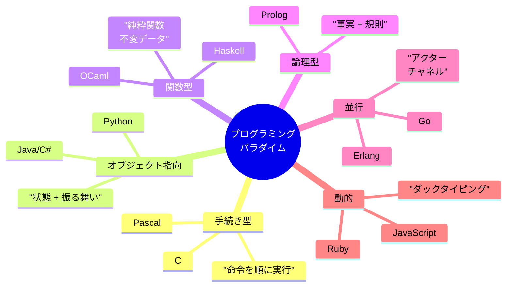

# 第 6 章 プログラミング言語パラダイム

## まえがき — 「考え方」が変わるとコードが変わる

Python しか知らない人と、Haskell も知っている人では、同じ問題に対して **書くコードがまったく違う** ことがあります。なぜでしょう?

それは、プログラミング言語が **思考の道具** だからです。違う言語を学ぶことは、違う思考法を獲得すること。同じ「ToDo アプリを作る」でも、手続き型・オブジェクト指向・関数型・論理型では設計が根本から変わります。

> **🎯 章の目標**
>
> - 主要 5 パラダイム（手続き型・OOP・関数型・論理型・並行）を区別できる
> - 言語に依存しない概念（束縛・スコープ・型・評価戦略）を獲得する
> - C・Java・Python・Haskell など複数言語の発想を比較できる
> - 同じ問題に対する複数の解像度を持てるようになる

---

主要パラダイムの全体像:



## 6.1 なぜ複数のパラダイムを学ぶか

### 6.1.1 言語は思考の道具

サピア=ウォーフ仮説の言語学版に「**プログラミング言語は思考の枠を作る**」というのがあります。

- C しか知らないプログラマは「グローバル変数 + 関数 + 配列」で考えがち
- Haskell に触れた人は「データの変換」を中心に考える
- Erlang を学ぶと「メッセージで通信」が自然になる

**1 言語しか知らないと、その言語の制約が思考の限界になります**。複数のパラダイムを横断することで、「これはオブジェクトじゃなくて関数で書いた方がきれい」「これは状態を分離してメッセージで通信させよう」などと、設計の選択肢が広がります。

### 6.1.2 「適材適所」の判断ができる

| 場面 | 向いているパラダイム |
|---|---|
| ハードウェア制御、OS | 手続き型 (C) |
| 大規模ビジネスアプリ | OOP (Java, C#) |
| データ処理パイプライン | 関数型 (Scala, F#) |
| Web 開発 | 動的言語 (Python, JS) |
| 推論・専門家システム | 論理型 (Prolog) |
| 並行処理・分散 | アクター (Erlang, Akka) |
| 安全性が極限に必要 | Rust、依存型言語 |

エンジニアは「言語ファン」ではなく「**問題に適した言語を選ぶ職人**」であるべきです。

---

## 6.2 言語横断の基本概念

パラダイムを語る前に、すべての言語に共通する **基礎概念** を押さえましょう。

### 6.2.1 束縛とスコープ

**束縛 (binding)**: 名前に値を結びつける操作。

```python
x = 10   # 名前 x を値 10 に束縛
```

**スコープ (scope)**: 名前が見える範囲。

```python
def f():
    y = 20
    return y
# ここでは y は見えない
```

#### 静的スコープ vs 動的スコープ

- **静的（レキシカル）スコープ**: ソースコードの **書かれた場所** で名前解決。現代の主流。
- **動的スコープ**: **呼び出し時の文脈** で名前解決。Bash、古い Lisp、Emacs Lisp の名残。

```bash
# Bash は動的スコープ
x=1
f() { echo $x; }
g() { local x=2; f; }   # f は呼ばれた時点の x = 2 を見る
g                        # 出力: 2
```

静的スコープのほうが「**どこで使われても同じ意味**」になり、保守しやすい。

### 6.2.2 クロージャ

「**関数 + その外側の変数の束縛**」を 1 つにまとめたもの。

```python
def make_counter():
    count = 0
    def increment():
        nonlocal count
        count += 1
        return count
    return increment

counter = make_counter()
print(counter())   # 1
print(counter())   # 2
```

`increment` は外側の `count` を覚えています。これがクロージャ。JavaScript, Python, Lisp すべてに存在する重要概念です。

### 6.2.3 評価戦略

引数を関数に渡すとき、いつ評価するか。

| 戦略 | 内容 | 言語 |
|---|---|---|
| 値呼び (call by value) | 渡す前に評価、コピー | C, Java の基本型 |
| 参照呼び (call by reference) | 変数自体を渡す | C++ の参照、Pascal の var |
| 共有呼び (call by sharing) | 参照のコピーを渡す | Python, Java のオブジェクト |
| 必要呼び (call by need / 遅延評価) | 必要になるまで評価しない | Haskell |

#### 遅延評価の威力

```haskell
naturals = [1..]   -- 無限の自然数リスト
take 10 naturals   -- 先頭 10 個 = [1..10]
```

無限リストを定義しても、必要分しか計算されないから OK。これが Haskell の魅力。

### 6.2.4 型システム

#### 静的 vs 動的

- **静的型 (static)**: コンパイル時に型を決める (Java, C++, Haskell, Rust)
- **動的型 (dynamic)**: 実行時に型を決める (Python, Ruby, JS)

#### 強い型付け vs 弱い型付け

- **強い**: 暗黙の型変換を許さない (Python の `1 + "1"` はエラー)
- **弱い**: 暗黙の変換が多い (JavaScript の `1 + "1"` は `"11"`)

#### 型推論

明示的に書かなくても型が決まる仕組み。

```ocaml
let f x = x + 1   (* OCaml: x: int, f: int -> int と推論 *)
```

Hindley-Milner 型推論 (ML, OCaml, Haskell) は完全推論。Java の `var`、TypeScript は局所推論。

### 6.2.5 多相 (polymorphism)

「1 つの名前で複数の型に対応する」仕組み。

- **パラメトリック多相**: ジェネリクス。`List<T>` のような型変数。
- **サブタイプ多相**: OOP の継承。`Animal` 型に `Dog` が代入できる。
- **アドホック多相**: オーバーロード、型クラス。`+` が int でも float でも使える。

### 6.2.6 メモリモデル

| 言語 | メモリ管理 |
|---|---|
| C | 手動 (`malloc`, `free`) |
| C++ | RAII + スマートポインタ |
| Rust | 所有権・借用（コンパイル時に検査） |
| Java, Go, Python | ガベージコレクション |
| Haskell | GC + 参照透過性 |

「**メモリをどう扱うか**」は言語設計の根幹。安全性・性能・開発速度のトレードオフです。

---

## 6.3 手続き型プログラミング (C)

### 6.3.1 基本思想

「**順番に命令を実行する**」。変数を更新しながら、関数で機能を分割。

```c
#include <stdio.h>

int sum(int *arr, int n) {
    int s = 0;
    for (int i = 0; i < n; i++) s += arr[i];
    return s;
}

int main() {
    int data[] = {1, 2, 3, 4, 5};
    printf("%d\n", sum(data, 5));   // 15
    return 0;
}
```

### 6.3.2 ポインタ — C の魂

ポインタはメモリアドレスを指す変数。

```c
int x = 42;
int *p = &x;     // p は x のアドレス
*p = 100;        // x が 100 に変わる
```

「`a[i]` は `*(a + i)`」という配列とポインタの等価性が C の核。

### 6.3.3 構造体

```c
struct Point {
    double x, y;
};

struct Point p = {1.0, 2.0};
double dx = p.x;
```

第 7 章で扱うデータ構造（連結リスト、木、ハッシュ）はすべて C で実装できます。

### 6.3.4 マニュアルメモリ管理

```c
int *arr = malloc(100 * sizeof(int));
// 使う...
free(arr);
```

free 忘れ → メモリリーク。free 後アクセス → use-after-free（脆弱性）。**現代の脆弱性の多くは C/C++ のメモリ問題**。

### 6.3.5 学ぶ意味

C は **ハードウェアに最も近い高水準言語**。OS, ネットワーク, 組込み, ゲームエンジン, データベースの内部はほとんど C/C++。第 9-10 章を理解するには C 経験が必須です。

---

## 6.4 オブジェクト指向プログラミング (OOP)

### 6.4.1 中心概念

- **カプセル化**: 状態と振る舞いを 1 つのクラスに、内部を隠す
- **継承**: 既存クラスを拡張
- **多態性**: 同じインターフェースで違う実装

### 6.4.2 例 (Java)

```java
abstract class Shape {
    abstract double area();
}

class Circle extends Shape {
    double r;
    Circle(double r) { this.r = r; }
    double area() { return Math.PI * r * r; }
}

class Square extends Shape {
    double s;
    Square(double s) { this.s = s; }
    double area() { return s * s; }
}

Shape[] shapes = { new Circle(5), new Square(3) };
for (Shape sh : shapes) System.out.println(sh.area());
```

「Shape として扱える」けど中身は別、というのが多態性。

### 6.4.3 SOLID 原則

| 原則 | 意味 |
|---|---|
| **S**ingle Responsibility | 1 クラス 1 責務 |
| **O**pen/Closed | 拡張に開き、変更に閉じる |
| **L**iskov Substitution | 派生型は基底型の代わりに使える |
| **I**nterface Segregation | 太いインターフェースを分割 |
| **D**ependency Inversion | 抽象に依存し、具象に依存しない |

### 6.4.4 継承 vs コンポジション

「**継承より合成 (Composition over Inheritance)**」が現代の格言。深い継承は脆い。

```java
// 継承（脆い）
class TimedQueue extends Queue { ... }

// 合成（柔軟）
class TimedQueue {
    private Queue queue;
    private Timer timer;
    ...
}
```

### 6.4.5 デザインパターン

GoF の 23 パターンが古典:
- **Strategy**: アルゴリズムを差し替える
- **Observer**: 状態変化を通知
- **Factory**: オブジェクト生成を抽象化
- **Decorator**: 機能を後付け
- **Adapter**: インターフェースを合わせる

これらは「**共通言語**」。チーム内で「ここは Strategy で」と言えば伝わります。

---

## 6.5 関数型プログラミング

### 6.5.1 中心思想

- **関数を第一級** に扱う（変数に入れる、引数に渡す）
- **副作用を最小化** する（純粋関数）
- **不変データ** を使う

### 6.5.2 純粋関数

「**入力が同じなら出力が同じ、副作用なし**」。

```haskell
-- 純粋
double :: Int -> Int
double x = x * 2
```

副作用 (IO, ファイル, 乱数) は型で明示する:

```haskell
getLine :: IO String   -- IO 型で副作用を明示
```

### 6.5.3 高階関数

関数を引数に取る、または返す関数。

```python
# Python でも書ける
nums = [1, 2, 3, 4, 5]
squares = list(map(lambda x: x*x, nums))         # [1, 4, 9, 16, 25]
evens = list(filter(lambda x: x % 2 == 0, nums))  # [2, 4]
total = sum(nums)
```

`map`, `filter`, `reduce` は関数型の三種の神器。Spark や MapReduce の発想もここから。

### 6.5.4 代数的データ型 (ADT) とパターンマッチ

```haskell
data Tree a = Leaf | Node (Tree a) a (Tree a)

insert :: Ord a => a -> Tree a -> Tree a
insert x Leaf = Node Leaf x Leaf
insert x (Node l v r)
  | x < v     = Node (insert x l) v r
  | x > v     = Node l v (insert x r)
  | otherwise = Node l v r
```

「**データの形に合わせてコードを書く**」。Rust の `enum`、Swift の `enum` などにも継承されています。

### 6.5.5 モナド

「**副作用を型で扱う仕組み**」。`>>=` 演算子で連鎖。

```haskell
do
  x <- getLine
  putStrLn ("Hello, " ++ x)
```

理屈は難しいが「**JavaScript の Promise も同じ構造**」と思えば近い。

### 6.5.6 関数型の応用

- **React の状態管理**: 純粋な reducer (Redux)
- **Spark / MapReduce**: 並列の高階関数
- **型安全なエラー**: `Result<T, E>`, `Option<T>`
- **不変データ構造**: 永続データ構造 (Clojure)

---

## 6.6 論理型プログラミング (Prolog)

「**事実と規則を書くと、推論は処理系がやってくれる**」言語。

```prolog
parent(alice, bob).
parent(bob, charlie).

ancestor(X, Y) :- parent(X, Y).
ancestor(X, Y) :- parent(X, Z), ancestor(Z, Y).

?- ancestor(alice, charlie).   % true
?- ancestor(X, charlie).        % X = bob ; X = alice
```

ユニフィケーションとバックトラックで、変数の値を探索。エキスパートシステム、自然言語処理、計画問題に応用。

DataLog（Prolog の制限版）はデータベースクエリやコンプライアンスチェックに使われています。

---

## 6.7 並行・並列プログラミング

### 6.7.1 並行 vs 並列

- **並行 (concurrent)**: 論理的に同時に進む
- **並列 (parallel)**: 物理的に同時に実行

複数のタスクを「同時」に動かす設計。

### 6.7.2 モデル

| モデル | 言語/フレームワーク | 特徴 |
|---|---|---|
| 共有メモリ + ロック | Java, C++ | 古典的、デッドロック注意 |
| アクター | Erlang, Akka, Scala | メッセージ通信、分離が綺麗 |
| CSP / チャネル | Go, Clojure core.async | チャネル経由で通信 |
| データ並列 | CUDA, OpenMP | 同じ操作を多数のデータに |
| async/await | JS, Python, Rust | 非同期 IO の抽象化 |

### 6.7.3 Go のチャネル例

```go
ch := make(chan int)
go func() { ch <- 42 }()   // ゴルーチンで送信
v := <-ch                  // 受信
```

「**メモリを共有して通信するな、通信してメモリを共有せよ**」が Go の哲学。

### 6.7.4 Erlang のアクター

```erlang
spawn(fun() ->
    receive
        {hello, From} -> From ! world
    end
end).
```

各アクターが独立したプロセス。耐障害性が極めて高い (WhatsApp の数百万接続を Erlang で動かしていました)。

---

## 6.8 動的言語 (Python, Ruby, JavaScript)

### 6.8.1 ダックタイピング

「**ガアガア鳴いたらアヒル**」: 型ではなく振る舞いで判定。

```python
def quack_test(x):
    x.quack()  # quack メソッドがあれば何でも OK
```

### 6.8.2 メタプログラミング

```python
def timer(fn):
    import time
    def wrapper(*args, **kwargs):
        start = time.time()
        result = fn(*args, **kwargs)
        print(f"{fn.__name__}: {time.time() - start:.3f}s")
        return result
    return wrapper

@timer
def slow_func():
    import time; time.sleep(1)

slow_func()   # slow_func: 1.001s
```

デコレータ、リフレクション、動的クラス生成など。Ruby on Rails の魔法はここに由来します。

### 6.8.3 動的 + 静的のハイブリッド

近年のトレンド: **型ヒント** で動的言語に静的検査を加える。
- Python: `typing`, `mypy`
- JavaScript: TypeScript

「ダイナミックの柔軟性 + 静的の安全性」を両立。

---

## 6.9 Rust — 所有権モデル

C++ の性能と関数型の安全性を両立させる新世代言語。

```rust
fn main() {
    let s = String::from("hello");
    let s2 = s;             // s の所有権が s2 へ移動
    // println!("{}", s);   // エラー: s はもう使えない
    println!("{}", s2);
}
```

**所有権 + 借用 + ライフタイム** をコンパイル時に検査。GC なしでメモリ安全。

System プログラミング、CLI ツール、WebAssembly、組込みなど活躍範囲が拡大中。

---

## 6.10 ドメイン特化言語 (DSL)

汎用言語の上に薄く乗せた特化言語。SQL, regex, HTML, CSS, GraphQL, Dockerfile はすべて DSL。

Lisp のマクロや Ruby のブロックで自作する文化もあります。Rails の `validates :email, presence: true` のような書き方は内部 DSL の代表。

---

## 6.11 同じ問題を複数言語で

「**Hello, World**」 → 「**ToDo CLI**」 → 「**簡易ブログ**」と段階的に同じ問題を複数言語で書くと、パラダイムの違いが体感できます。

| 言語 | 強み | 学ぶ理由 |
|---|---|---|
| C | ハードウェア寄り | OS、低レイヤを理解 |
| Java/C# | 大規模 OOP | 業務で頻出 |
| Python/JS | 素早い試作 | データ分析、Web |
| Haskell/OCaml | 型安全 + 関数型 | 抽象思考 |
| Rust | 所有権 + 性能 | 次世代システム |
| Erlang/Elixir | 並行・耐障害 | 分散思想 |
| Prolog | 論理推論 | 推論を体感 |
| Go | シンプル + 並行 | サーバ実装 |

最低でも **3 つのパラダイム** を経験することをお勧めします。

---

## 6.12 演習問題

1. C で `qsort` を呼び出さず、自前のクイックソートを実装せよ。
2. Java でストラテジーパターンを使ってソート手法を切替可能なクラスを設計せよ。
3. Haskell で二分木 ADT を定義し、`map`、`fold`、`size` を書け。
4. JavaScript の `var`、`let`、`const` のスコープと巻き上げの違いを実験で確認せよ。
5. Python のデコレータで関数の実行時間を測る `@timeit` を実装せよ。
6. Prolog で家系図を表現し、いとこ関係を定義せよ。
7. Rust で借用チェッカに引っかかるコードと、それを直したコードのペアを示せ。
8. Go のチャネルで「Producer / Consumer」を実装せよ。
9. Erlang のアクターで「Ping / Pong」プログラムを書け。
10. 同じ「リスト中の偶数の和」を C, Python, Haskell の 3 言語で書き、コードの違いを比較せよ。

---

## 6.13 この章のまとめ

| パラダイム | 中心概念 | 代表言語 |
|---|---|---|
| 手続き型 | 順序、変数、関数 | C, Pascal |
| OOP | クラス、継承、多態 | Java, C#, Python |
| 関数型 | 純粋関数、不変、高階関数 | Haskell, OCaml |
| 論理型 | 事実、規則、ユニフィケーション | Prolog |
| 並行 | アクター、チャネル | Erlang, Go |

パラダイムは「**世界の切り取り方**」。同じ問題を別の角度から見られるエンジニアは、設計の選択肢が圧倒的に広いです。

## 6.14 次に読むもの

- Sebesta, *Concepts of Programming Languages*
- Pierce, *Types and Programming Languages*
- Friedman & Wand, *Essentials of Programming Languages*
- Bryant & O'Hallaron, *Computer Systems: A Programmer's Perspective*
- 『プログラミング言語の基礎概念』五十嵐淳

> **🌟 メッセージ**
> 「**1 つの言語の名人**」になるより、「**複数言語を使える設計者**」を目指しましょう。1 つを深く、複数を広くが理想です。
