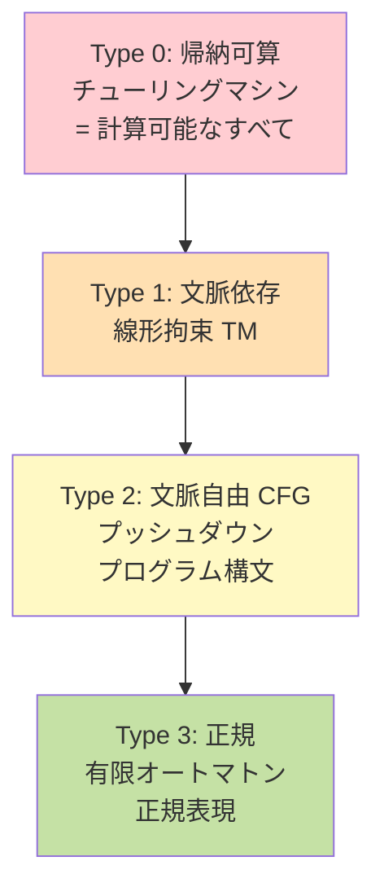
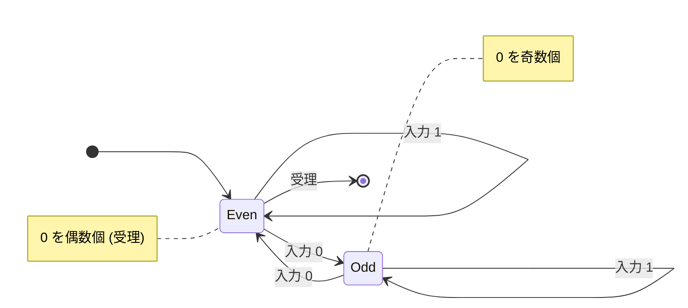

# 第 8 章 計算理論

## まえがき — コンピュータにできない仕事がある

「**どんな問題でもコンピュータに頑張らせれば解ける**」と思っていませんか? 実は違います。

- 「**このプログラムは無限ループに入りますか?**」を判定するアルゴリズムは **絶対に存在しない**
- 「**1000 都市の最適巡回経路を求めよ**」は 1 兆年計算しても終わらない
- 「**正規表現と DFA は同じ表現力**」というのは、なぜ?

これらの問いに答えるのが **計算理論 (Theory of Computation)** です。

計算理論は「**何が計算できて、何が計算できないか**」「**効率よく計算できるかどうか**」を扱う学問。1936 年のチューリング、ゲーデル、チャーチ、ポストの仕事から始まり、今に至るまで CS の **理論的な核** であり続けています。

> **🎯 章の目標**
>
> - 有限オートマトン・プッシュダウンオートマトン・チューリングマシンの 3 階層を理解する
> - 正規言語・文脈自由言語・帰納可算言語の階層 (Chomsky 階層) を語れる
> - 停止問題・ライスの定理など「**計算の限界**」を理解する
> - P・NP・NP 完全の意味を厳密に語れる
> - 「**この問題は NP 完全だから諦めて近似する**」と判断できる

---

## 8.1 なぜ計算理論を学ぶか

### 8.1.1 「無駄な努力を避ける」ための地図

計算理論を知っていると:
- 「**この問題は理論的に効率良く解けない**」と分かれば、別アプローチに早く切り替えられる
- 「**この機能は完璧な静的解析できない**」と認めて、ヒューリスティックを使える
- 「**正規表現で書ける範囲・書けない範囲**」を判断できる

### 8.1.2 CS の他分野との関係

| 計算理論の概念 | 応用分野 |
|---|---|
| 有限オートマトン | 字句解析、ネットワークプロトコル、UI の状態機械 |
| 文脈自由文法 | コンパイラ、自然言語処理、データ形式 |
| チューリングマシン | プログラムの正当性、計算可能性 |
| 停止問題 | 静的解析の限界、検証ツール |
| NP 完全 | 暗号、最適化、AI |

「**抽象的に見えて応用が広い**」のが計算理論の魅力です。

---

## 8.2 形式言語と文法

### 8.2.1 用語

- **アルファベット** $\Sigma$: 記号の有限集合（例: $\{0, 1\}$, $\{a, b, c\}$）
- **文字列**: 記号の有限列
- **言語**: 文字列の集合（$\Sigma^*$ の部分集合）

例: $\Sigma = \{0, 1\}$ で
- 言語 $L_1$ = 「`0` を偶数個含む文字列の集合」
- 言語 $L_2$ = 「回文」
- 言語 $L_3$ = 「素数を 2 進表現した文字列」

### 8.2.2 文法

文法 $G = (V, \Sigma, R, S)$:
- $V$: 非終端記号
- $\Sigma$: 終端記号
- $R$: 生成規則
- $S$: 開始記号

例: 簡単な算術式
```
E → E + T | T
T → T * F | F
F → ( E ) | num
```

### 8.2.3 Chomsky 階層

Noam Chomsky が 1956 年に提案した、文法と機械の対応:



下に行くほど表現力が弱く、判定が簡単。上に行くほど強力だが判定が難しくなります。


| 型 | 文法 | 言語 | 認識する機械 | 例 |
|---|---|---|---|---|
| 0 | 制限なし | 帰納可算 | チューリングマシン | プログラム全般 |
| 1 | 文脈依存 | 文脈依存 | 線形拘束オートマトン | $a^n b^n c^n$ |
| 2 | 文脈自由 | 文脈自由 | プッシュダウンオートマトン | プログラミング言語の構文 |
| 3 | 正規 | 正規 | 有限オートマトン | 正規表現 |

「**言語と機械が 1 対 1 対応**」――計算理論の最大の発見の 1 つ。

---

## 8.3 有限オートマトン (Finite Automaton)

### 8.3.1 DFA — 決定性有限オートマトン

5 項組 $(Q, \Sigma, \delta, q_0, F)$:
- $Q$: 状態の集合
- $\Sigma$: 入力アルファベット
- $\delta: Q \times \Sigma \to Q$: 遷移関数
- $q_0$: 初期状態
- $F$: 受理状態の集合

入力を 1 文字ずつ読み、最後の状態が $F$ に入れば受理。

#### 例: 「0 を偶数個含む」DFA



```
状態 0 →入力 0→ 状態 1
状態 0 →入力 1→ 状態 0
状態 1 →入力 0→ 状態 0
状態 1 →入力 1→ 状態 1
```

### 8.3.2 NFA — 非決定性有限オートマトン

「複数の状態に同時にいる」「ε 遷移（入力なしで遷移）」を許す。

**驚きの定理**: NFA は DFA に変換できる（部分集合構成法）。表現力は同じ。

これを使うと正規表現エンジンを実装できます。

### 8.3.3 正規表現

連結・選言・スター（クリーネ閉包）で書ける式:
- `ab` (連結)
- `a|b` (選言)
- `a*` (0 回以上の繰り返し)

例:
- `ab*` = `a`, `ab`, `abb`, `abbb`, ...
- `(0|1)*` = 0 と 1 からなるすべての列

### 8.3.4 Kleene の定理

「正規表現で表せる言語 = DFA で受理できる言語 = 正規言語」

3 つすべて等価です。これが正規表現エンジン (egrep, sed, Python の re) の理論的根拠。

### 8.3.5 ポンプ補題 — 「正規でないこと」の証明道具

正規言語 $L$ について、十分長い文字列 $s \in L$ は $s = xyz$ と分解でき、$xy^iz \in L$ がすべての $i \geq 0$ で成り立つ。

これを使って **正規でない言語** を証明できます。

例: 「$L = \{a^n b^n : n \geq 0\}$ は正規ではない」
- 仮に正規なら、ポンプ補題で $a^p \in L$ を $xyz$ に分解可能
- $y$ は `a` のみで構成される
- $xy^2z = a^{p+|y|} b^p$ は $L$ に入らない → 矛盾 ✓

「**正規言語は数を数えられない**」のを示しています。プログラミング言語の括弧の対応は数を数える必要があるので、正規言語ではない（CFG が必要）。

### 8.3.6 実用上の正規表現

実用の正規表現エンジン (PCRE, Python の re) は **後方参照** や **ルックアラウンド** を持ち、理論的な正規表現を超えた力を持ちます。**指数時間** 攻撃 (ReDoS) に注意。

---

## 8.4 文脈自由文法と PDA

### 8.4.1 文脈自由文法 (CFG)

規則 $A \to \alpha$（$A$ は単一の非終端、$\alpha$ は記号列）。

例: 算術式
```
E → E + T | T
T → T * F | F
F → ( E ) | num
```

### 8.4.2 プッシュダウンオートマトン (PDA)

NFA + スタック。CFG と等価。

スタックがあるおかげで「数を数える」「対応を覚える」ことができます。

### 8.4.3 解析アルゴリズム

- **LL(k)**: 上から下、左から右、左端導出。Recursive Descent。手書きしやすい。
- **LR(k)**: 下から上。SLR, LALR, LR(1)。Yacc / Bison。

詳細は第 13 章のコンパイラへ。

### 8.4.4 CFL の限界

$\{a^n b^n c^n\}$ は文脈自由言語ではない。プログラミング言語の「変数の宣言と使用の対応」のような規則は CFL を超える。だから **意味解析** が別途必要。

---

## 8.5 チューリングマシン — 計算の最終モデル

### 8.5.1 定義

- 無限長のテープ
- 読み書きヘッド
- 有限個の状態
- 遷移ルール: 「読んだ記号と現在の状態に応じて、書く記号・動く向き・次の状態を決める」

```
    ... | 1 | 0 | 1 | 1 | _ | _ | ... ← テープ
            ▲
           ヘッド (現在状態 q)
```

シンプルすぎるように見えますが、これが **すべての計算を表現する万能モデル**。

### 8.5.2 Church-Turing 命題

「**直感的に計算可能なものはすべてチューリングマシンで計算可能**」

これは数学的に証明された定理ではないですが、$\lambda$ 計算、再帰関数、レジスタマシンなど、あらゆる計算モデルがチューリングマシンと等価であることが知られている **強い経験則**。

### 8.5.3 多テープ・非決定性

- 多テープ TM は単一テープ TM と等価（時間は多項式倍）
- 非決定性 TM (NTM) は決定性 TM とシミュレート可能（時間は指数倍）

---

## 8.6 計算可能性 — 「できないこと」を学ぶ

### 8.6.1 決定可能と認識可能

- **決定可能 (decidable)**: TM が常に停止し yes/no を返す問題
- **認識可能 (recognizable)**: yes のときは停止、no のときは停止しなくていい

### 8.6.2 停止問題 (Halting Problem)

「**TM $M$ が入力 $w$ で停止するか判定するアルゴリズムは存在しない**」（チューリング 1936）。

#### 証明（対角線論法のスケッチ）

1. 仮にそのような判定器 $H(M, w)$ が存在するとする
2. プログラム $D(M)$ を定義: 「$H(M, M)$ が yes なら無限ループ、no なら停止」
3. $D(D)$ を考える:
   - $H(D, D) = $ yes なら $D(D)$ は無限ループ → でも $H$ は yes と言っている → 矛盾
   - $H(D, D) = $ no なら $D(D)$ は停止 → でも $H$ は no と言っている → 矛盾

どちらでも矛盾。よって $H$ は存在しない。 □

これは「**完璧なバグ検出器は原理的に存在しない**」と読み替えられます。形式検証の限界。

### 8.6.3 ライスの定理

「**TM の入出力関数の自明でない性質はすべて決定不能**」

例えば:
- 「このプログラムは無限ループするか?」
- 「このプログラムは仕様 $\varphi$ を満たすか?」
- 「このプログラムは $f(x)$ を計算するか?」

これらすべて **一般には判定不能**。

実用への含意: **完全な静的解析は不可能**。だが近似（型・抽象解釈・モデル検査）は可能。実際の解析ツールは「保守的に false-positive を出す」または「不健全だが実用的に有用」のどちらかを選びます。

### 8.6.4 決定不能な有名問題

- 停止問題
- Post の対応問題
- 一階論理の充足可能性（命題論理は決定可能）
- ディオファントス方程式の解の存在（ヒルベルトの第 10 問題）
- ある正則表現と CFG の等価性

---

## 8.7 計算複雑性 — 「速いか遅いか」

### 8.7.1 主要なクラス

| クラス | 内容 |
|---|---|
| **P** | 決定性多項式時間で解ける問題 |
| **NP** | 「解の検証」が多項式時間。または非決定性多項式時間で解ける |
| **EXP** | 指数時間 |
| **PSPACE** | 多項式空間 |
| **BPP** | 確率的多項式時間（誤り 1/3 以下） |
| **BQP** | 量子多項式時間 |

### 8.7.2 包含関係

$$P \subseteq NP \subseteq PSPACE \subseteq EXP$$

### 8.7.3 P vs NP — 数学最大の未解決問題

「**P = NP か?**」は CS で最も有名な未解決問題。Clay 数学研究所のミレニアム懸賞問題（賞金 100 万ドル）。

直感: 「**解の検証が早ければ、解くのも早い?**」

例:
- ナンバープレース (数独): 解は確認しやすい (P)、解くのは難しい (NP)
- パスワード: ハッシュは検証しやすい (P)、逆算は難しい (NP)

ほとんどの計算機科学者は **P ≠ NP** だと予想していますが、誰も証明できていません。

### 8.7.4 還元と NP 完全

問題 $A$ から $B$ への **多項式時間還元** $A \leq_p B$: 「$A$ のインスタンスを $B$ のインスタンスに変換し、答えが一致」。

**NP 完全**: NP に属し、NP のすべての問題が還元される問題。

「**1 つでも P で解ければ P = NP**」。

### 8.7.5 Cook-Levin の定理

「**SAT は NP 完全**」（Cook 1971, Levin 1973）。

これを起点に、何千もの問題が NP 完全と判明しています。

### 8.7.6 代表的な NP 完全問題

| 問題 | 内容 |
|---|---|
| SAT, 3-SAT | 充足可能性 |
| グラフ彩色 | $k$ 色で塗り分け |
| 頂点カバー | カバーする最少頂点 |
| ハミルトン閉路 | 全頂点を通る閉路 |
| 巡回セールスマン (TSP) | 最短ツアー |
| 部分和、ナップサック | 整数の部分和 |
| 集合被覆 | 最少の集合で被覆 |

### 8.7.7 NP 完全だと判明したらどうする?

1. **近似アルゴリズム**: 最適の何倍以内で解く (TSP の 1.5 近似 = Christofides)
2. **ヒューリスティック**: 焼きなまし法、遺伝的アルゴリズム
3. **整数計画法 (ILP)**, **SAT/SMT ソルバ**: 実用的に解ける範囲が広い
4. **特殊構造を活用**: 木、平面、有界深さなら多項式

「**諦める**」のではなく「**戦略を変える**」のが正解。

### 8.7.8 NP 困難

NP のすべての問題が還元できるが、NP に入るとは限らない問題。NP 完全 ⊆ NP 困難。例: 停止問題、最適化版 TSP。

---

## 8.8 ランダム化アルゴリズム

### 8.8.1 ミラー・ラビン素数判定

確率的に素数判定する。誤り確率を任意に下げられる。

```python
def miller_rabin(n, k=20):
    # n が素数かどうかを k 回試行で判定
    # 誤り確率 < 4^(-k)
    ...
```

実用の RSA 鍵生成で使われています。

### 8.8.2 確率的アルゴリズムのクラス

- **BPP**: 誤り確率 ≤ 1/3 で多項式時間
- **RP**: 一方向誤り

「**多項式時間 BPP = 多項式時間 P**」かは未解決問題。多くの研究者は同じだろうと予想 (= ランダム性は本質的に必要ではない)。

---

## 8.9 量子計算入門

### 8.9.1 BQP

量子コンピュータが多項式時間で解けるクラス。

代表例:
- **Shor のアルゴリズム**: 整数の素因数分解を多項式時間（RSA を破る潜在的脅威）
- **Grover のアルゴリズム**: 非構造化探索を $O(\sqrt n)$ に高速化

第 20 章で詳しく扱います。

---

## 8.10 演習問題

1. 「`a` を偶数個含む文字列」を受理する DFA を 2 状態で設計せよ。
2. NFA → DFA の部分集合構成を、簡単な例で実行せよ。
3. ポンプ補題で $\{a^n b^n\}$ が正規言語でないことを示せ。
4. 加算（$1^a 0 1^b = 1^{a+b}$ などの表現）を行うチューリングマシンの状態遷移表を書け。
5. SAT を 3-SAT に還元する手続きを示せ。
6. 頂点被覆問題が NP 完全であることを 3-SAT からの還元で示せ。
7. ライスの定理が「コンパイラは絶対に最適化を完璧にできない」と読み替えられる理由を説明せよ。
8. $L = \{ww : w \in \{a, b\}^*\}$ は文脈自由か? 証明または反論せよ。
9. 任意の DFA を最小化する手順を述べよ。
10. P と NP の違いを「ナンバープレース」「シュレッダーで切られた書類の復元」などの例で説明せよ。

---

## 8.11 この章のまとめ

| 階層 | 機械 | 文法 | 例 |
|---|---|---|---|
| 正規 | DFA | 正規表現 | キーワード検索 |
| 文脈自由 | PDA | CFG | プログラム構文 |
| 文脈依存 | LBA | CSG | 自然言語の一部 |
| 帰納可算 | TM | Type-0 | プログラム全般 |

| 計算限界 | 結果 |
|---|---|
| 停止問題 | 決定不能 |
| ライスの定理 | 自明でない性質はすべて不能 |
| P vs NP | 未解決 |
| NP 完全 | 効率良く解けないと予想 |

「**できないこと**」を知ると、「**何ができるか**」を考える時間が増えます。これが計算理論の真の効用。

## 8.12 次に読むもの

- Sipser, *Introduction to the Theory of Computation*
- Hopcroft, Motwani, Ullman, *Introduction to Automata Theory*
- Arora & Barak, *Computational Complexity: A Modern Approach*
- Garey & Johnson, *Computers and Intractability* — NP 完全問題の辞書
- 渡辺治『計算理論の基礎』

> **🌟 メッセージ**
> 計算理論は CS で最もエレガントな分野の 1 つ。1936 年のチューリング、ゲーデル、チャーチが残した考えは、80 年経った今も色褪せていません。「**計算とは何か**」を哲学的に考える時間を持ってみてください。
