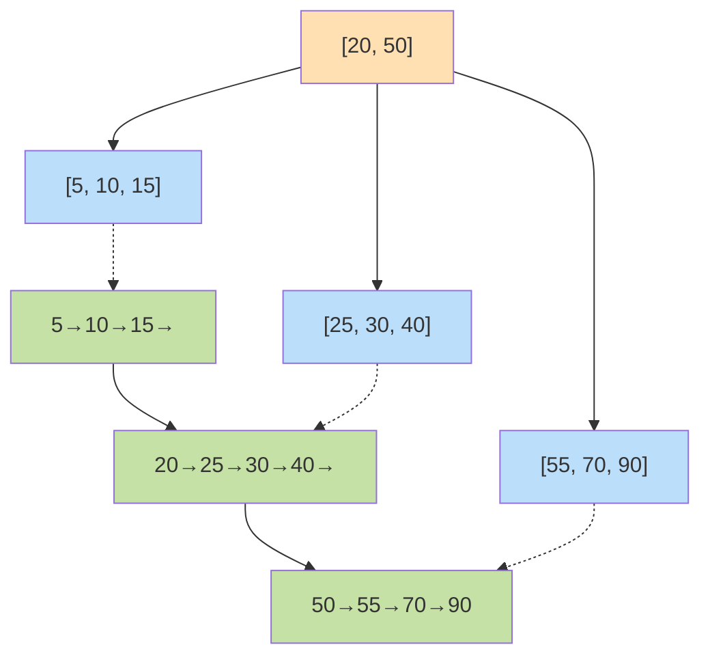
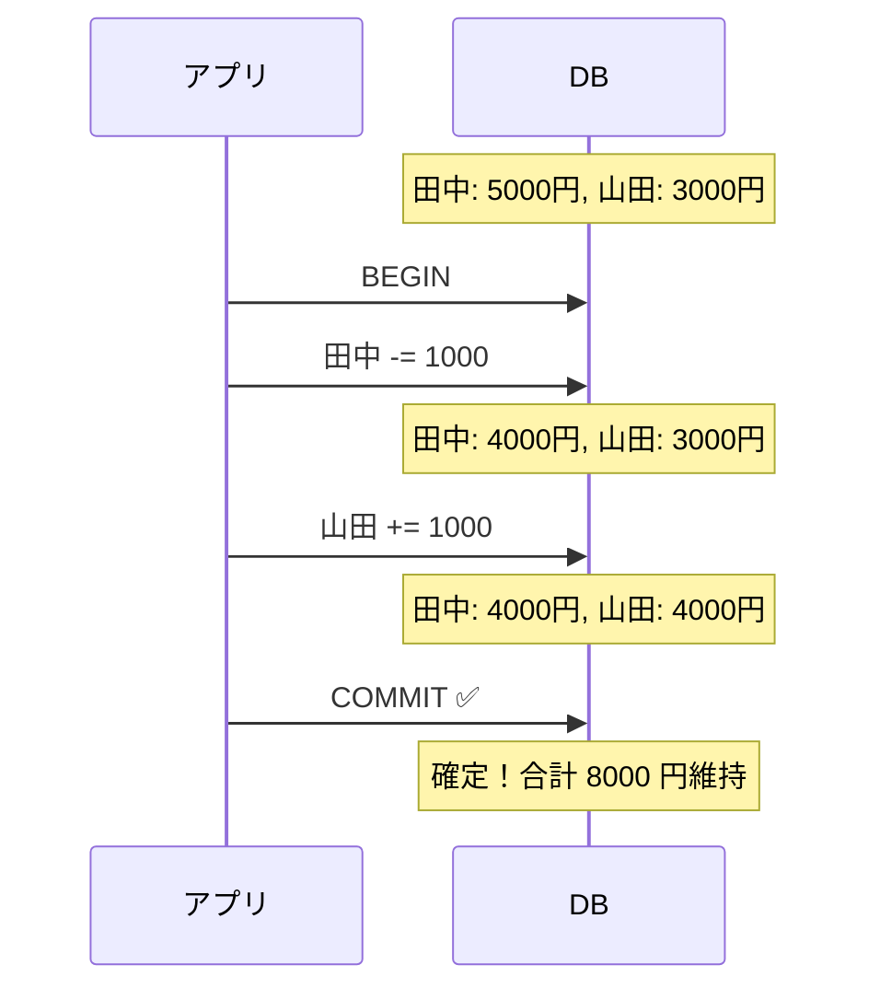

# 第 12 章 データベース

## まえがき — データを失わずに扱う

何百万人のユーザー登録情報、決済履歴、メッセージ。これらは **絶対に失えない** データです。サーバが突然落ちても、停電になっても、複数の人が同時に書き込みしても――データが壊れず、矛盾せず、消えないことを保証する。これがデータベースの仕事です。

「**N+1 クエリ**」「**雑なインデックス**」「**デッドロック**」「**トランザクションの誤解**」――現場の事故の大半はデータベースの誤用が原因です。**RDBMS の理論は半世紀前に確立されているのに、知らない人は今でも同じ罠に落ち続けています**。

> **🎯 章の目標**
>
> - リレーショナルモデル・関係代数・SQL を体系的に理解する
> - 正規化と非正規化のトレードオフを判断できる
> - インデックス・クエリプラン・トランザクション・ロック・MVCC を語れる
> - NoSQL の各カテゴリと CAP 定理を理解する

---

## 12.1 なぜ DB を学ぶか

「ORM 任せで何となく書ける」と思っても、内部を知らないとパフォーマンス問題で詰まります:

- 1000 ユーザーのページが 30 秒かかる → N+1 クエリ
- インデックス追加で 100 倍速くなった → なぜ?
- 並行アクセスで残高がおかしくなる → トランザクション不足
- DB が落ちたら全部消えた → バックアップ戦略の欠落

「**DB の中身が見える**」エンジニアは、設計段階でこれらを未然に防げます。

---

## 12.2 リレーショナルモデル

### 12.2.1 E.F. Codd の革命

1970 年、IBM の **Edgar F. Codd** が論文 "A Relational Model of Data for Large Shared Data Banks" でリレーショナルモデルを提唱。**集合論と論理学** をデータ管理に持ち込みました。

それまでは「ファイル + ポインタ」で複雑なデータ構造を作るのが主流でした。Codd は「**表（リレーション）+ 集合演算**」という、より抽象的な世界を提案。これがすべての RDBMS の基盤になりました。

### 12.2.2 用語

- **関係 (relation)**: 表
- **属性 (attribute)**: 列
- **タプル**: 行
- **ドメイン**: 属性が取り得る値の集合
- **スキーマ**: 表の構造定義

### 12.2.3 例

```
users 表:
+----+-------+----------------+
| id | name  | email          |
+----+-------+----------------+
|  1 | Alice | alice@xxx.com  |
|  2 | Bob   | bob@xxx.com    |
+----+-------+----------------+

orders 表:
+----+---------+--------+
| id | user_id | amount |
+----+---------+--------+
|  1 |       1 |   2000 |
|  2 |       1 |   3500 |
|  3 |       2 |   1200 |
+----+---------+--------+
```

`orders.user_id` は `users.id` を参照する **外部キー**。これが「関係」を作ります。

### 12.2.4 制約

| 制約 | 内容 |
|---|---|
| 主キー (PRIMARY KEY) | タプルを一意に識別 |
| 外部キー (FOREIGN KEY) | 別表の主キーを参照 |
| NOT NULL | 必須 |
| UNIQUE | 重複不可 |
| CHECK | 任意の条件 |

#### 参照整合性

「親が消えたら子をどうする?」
- CASCADE: 連動して削除
- SET NULL: NULL に
- RESTRICT: 削除を拒否

---

## 12.3 関係代数

集合演算 + 関係特有の演算:
- 選択 $\sigma_{条件}$: 行を絞る (WHERE)
- 射影 $\pi_{属性}$: 列を選ぶ (SELECT)
- 直積 $\times$
- 結合 $\bowtie$: 条件付き直積
- 和・差・共通

SQL とほぼ等価な表現力。クエリオプティマイザは、SQL を関係代数に変換し、等価な式に書き換えて高速化します。

---

## 12.4 SQL

### 12.4.1 DDL (Data Definition Language)

```sql
CREATE TABLE users (
  id BIGSERIAL PRIMARY KEY,
  email VARCHAR(255) UNIQUE NOT NULL,
  created_at TIMESTAMPTZ DEFAULT NOW()
);

CREATE INDEX idx_users_email ON users(email);
```

### 12.4.2 DML (Data Manipulation Language)

```sql
INSERT INTO users (email) VALUES ('a@b.com');
UPDATE users SET email = 'c@d.com' WHERE id = 1;
DELETE FROM users WHERE id = 1;
```

### 12.4.3 SELECT — 一番大事

```sql
SELECT u.id, u.name, COUNT(o.id) AS num_orders, SUM(o.amount) AS total
FROM users u
LEFT JOIN orders o ON o.user_id = u.id
WHERE u.created_at > '2024-01-01'
GROUP BY u.id, u.name
HAVING COUNT(o.id) > 5
ORDER BY total DESC
LIMIT 10;
```

### 12.4.4 評価順序

書き順と違い、論理的には:

1. FROM / JOIN
2. WHERE
3. GROUP BY
4. HAVING
5. SELECT
6. DISTINCT
7. ORDER BY
8. LIMIT / OFFSET

これを覚えると「WHERE で集約結果を絞れない理由」「SELECT のエイリアスを WHERE で使えない理由」が腑に落ちます。

### 12.4.5 JOIN

```sql
-- INNER JOIN: 両方にあるもの
SELECT * FROM users u INNER JOIN orders o ON u.id = o.user_id;

-- LEFT JOIN: 左を保持
SELECT * FROM users u LEFT JOIN orders o ON u.id = o.user_id;
-- 注文ない user は orders 列が NULL

-- FULL OUTER JOIN: 両方を保持
-- CROSS JOIN: 直積
```

### 12.4.6 サブクエリ・CTE・ウィンドウ関数

#### CTE (共通テーブル式)

```sql
WITH recent_orders AS (
  SELECT * FROM orders WHERE created_at > '2024-01-01'
)
SELECT * FROM recent_orders WHERE amount > 1000;
```

可読性が上がる。再帰 CTE で木構造も扱えます。

#### ウィンドウ関数

```sql
SELECT id, salary, dept,
       RANK() OVER (PARTITION BY dept ORDER BY salary DESC) AS rank
FROM employees;
```

「**部署内で給与順位を付ける**」のが SQL 1 文で書ける。`ROW_NUMBER`, `LAG`, `LEAD`, `SUM() OVER` など分析クエリで必須。

### 12.4.7 NULL — 3 値論理の罠

`NULL = NULL` は **UNKNOWN**（true でも false でもない）。

```sql
SELECT * FROM users WHERE email = NULL;       -- 結果なし!
SELECT * FROM users WHERE email IS NULL;      -- 正しい
```

`COALESCE(x, default)`、`IFNULL(x, default)` で扱う。

---

## 12.5 正規化 — スキーマ設計の理論

### 12.5.1 なぜ正規化?

非正規化の例:
```
users 表:
+----+-------+--------+--------+--------+
| id | name  | order1 | order2 | order3 |
+----+-------+--------+--------+--------+
| 1  | Alice |  2000  |  3500  | NULL   |
| 2  | Bob   |  1200  | NULL   | NULL   |
+----+-------+--------+--------+--------+
```

問題:
- 注文数の上限が決まる
- スカスカでムダ
- 検索しにくい

### 12.5.2 正規形

| 正規形 | 内容 |
|---|---|
| 1NF | 属性は不可分（多値属性禁止） |
| 2NF | 部分関数従属を排除 |
| 3NF | 推移関数従属を排除 |
| BCNF | より強い 3NF |
| 4NF, 5NF | 多値・結合従属 |

実務では 3NF/BCNF を目標。

### 12.5.3 非正規化

性能のために **意図的に重複を持つ** こともあります:
- 集計用にカウント列を持つ
- JSON 列で柔軟性
- マテリアライズドビュー

「**まず正規化、必要な箇所だけ非正規化**」が定石。

---

## 12.6 インデックス — 検索を高速化

### 12.6.1 構造

| 構造 | 用途 |
|---|---|
| B+ 木 | 範囲・等価検索とも $O(\log n)$。RDBMS の主役 |

B+ 木のイメージ:



葉ノード同士が **横にリンク** されているのが B+ 木の特徴。範囲スキャンが超高速 (`WHERE x BETWEEN 20 AND 50` が一気に取れる)。

| ハッシュ | 等価のみ、$O(1)$ 平均 |
| 全文 (GIN/GiST) | 部分文字列・自然言語 |
| ビットマップ | カーディナリティ低い列、列指向 DB |
| R 木 | 空間データ |

### 12.6.2 インデックスの効き方

効く:
```sql
WHERE id = 100
WHERE created_at BETWEEN '2024-01-01' AND '2024-12-31'
ORDER BY id
JOIN ... ON a.id = b.foreign_id
```

効かない:
```sql
WHERE LOWER(email) = 'a@b.com'   -- 関数変換
WHERE email LIKE '%xxx@%'         -- 先頭ワイルドカード
```

「関数を当てたら効かない」を避けるため、**関数インデックス** で対処:
```sql
CREATE INDEX idx_lower_email ON users(LOWER(email));
```

### 12.6.3 複合インデックス

```sql
CREATE INDEX idx_a_b ON t(a, b);
```

効く:
- `WHERE a = ? AND b = ?` ✓
- `WHERE a = ?` ✓（左から効く）
- `WHERE b = ?` ✗（左がない）

「**左から順に**」を覚える。

### 12.6.4 カバリングインデックス

クエリが必要な列をすべて含むと、表本体を読まずに済む（**Index Only Scan**）。

```sql
CREATE INDEX idx_user_status ON users(status, name);
SELECT name FROM users WHERE status = 'active';
-- インデックスだけで完結、超高速
```

### 12.6.5 トレードオフ

インデックスは検索を速くするが、**書き込みを遅くする**。書き込みのたびにインデックスも更新するから。

「**読み 9：書き 1 のテーブルにはインデックス、書き 9：読み 1 にはインデックス減らす**」が原則。

---

## 12.7 実行計画 — クエリの中身を見る

### 12.7.1 EXPLAIN

```sql
EXPLAIN ANALYZE
SELECT * FROM users WHERE email = 'a@b.com';
```

出力例 (PostgreSQL):
```
Index Scan using idx_users_email on users  (cost=0.43..8.45 rows=1 width=88)
                                            (actual time=0.024..0.024 rows=1 loops=1)
```

「Index Scan」「actual time」を読み解く。

### 12.7.2 スキャン方式

| 方式 | 内容 |
|---|---|
| Seq Scan | 全表走査 |
| Index Scan | インデックスを使う |
| Index Only Scan | インデックスだけで完結 |
| Bitmap Heap Scan | 大量行に対するインデックス利用 |

### 12.7.3 結合方式

| 方式 | 良い場面 |
|---|---|
| Nested Loop Join | 小規模 × インデックスあり |
| Hash Join | 等価結合・大量データ |
| Sort-Merge Join | ソート済み |

オプティマイザが自動選択しますが、**統計情報** が古いと誤った判断をします。`ANALYZE` で更新。

---

## 12.8 トランザクション — ACID

### 12.8.1 4 つの性質

- **A**tomicity (原子性): 全部成功か、全部失敗か
- **C**onsistency (一貫性): 制約を満たす
- **I**solation (隔離性): 並行実行が直列と同等
- **D**urability (永続性): コミット後は障害でも消えない

### 12.8.2 例: 銀行振込

```sql
BEGIN;
UPDATE accounts SET balance = balance - 1000 WHERE id = 1;
UPDATE accounts SET balance = balance + 1000 WHERE id = 2;
COMMIT;
```



途中で落ちたら **両方ロールバック**。「片方だけ引かれて消える」は許されない。これが ACID の **A (Atomicity)**。

### 12.8.3 分離レベル

| レベル | ダーティ | 反復不可 | ファントム |
|---|---|---|---|
| Read Uncommitted | あり | あり | あり |
| Read Committed | なし | あり | あり |
| Repeatable Read | なし | なし | あり (InnoDB は防ぐ) |
| Serializable | なし | なし | なし |

PostgreSQL のデフォルトは Read Committed、MySQL は Repeatable Read。

### 12.8.4 並行制御

#### 2 相ロック (2PL)

「取得相 → 解放相」を厳格に守る。直列化を保証。

#### MVCC (Multi-Version Concurrency Control)

「**読み手は書き手をブロックしない**」。各トランザクションが時点のスナップショットを見る。

PostgreSQL, Oracle, InnoDB が採用。

#### OCC (楽観的並行制御)

書き込み時に検証、衝突したらリトライ。Web アプリ向き。

### 12.8.5 デッドロック

```
Tx1: a → b (a 取得)
Tx2: b → a (b 取得)
   どちらも進めない
```

対策:
- リソース取得順を統一
- タイムアウトで検出 (DB が自動で 1 つを kill)
- `SHOW ENGINE INNODB STATUS` で診断

### 12.8.6 分散トランザクション

- **2 相コミット (2PC)**: 準備 → コミット
- **Saga パターン**: 補償アクションで巻き戻す

第 16 章で詳述。

---

## 12.9 障害復旧

### 12.9.1 WAL (Write-Ahead Log)

「**更新を先にログに書き、その後にデータページへ**」。

クラッシュ時にログをリプレイすれば復旧できる。すべての RDBMS の基盤。

### 12.9.2 ARIES アルゴリズム

REDO + UNDO + チェックポイントの古典的アルゴリズム。1992 年の論文だが今も現役。

### 12.9.3 バックアップ

- 論理バックアップ (`pg_dump`, `mysqldump`): SQL として
- 物理バックアップ: ファイルレベル
- ポイントインタイムリカバリ (PITR): WAL の連続適用で任意時点に復元

「**バックアップは取れているだけでなく、リストアできるか確認してこそ**」。

---

## 12.10 NoSQL

スキーマ柔軟性、水平スケール、特殊用途を狙う。

### 12.10.1 種類

| 種類 | 例 | 用途 |
|---|---|---|
| KVS | Redis, Memcached, DynamoDB | キャッシュ、セッション |
| ドキュメント | MongoDB, Couchbase | JSON、半構造データ |
| カラムファミリ | Cassandra, HBase, Bigtable | 書き込み多、時系列 |
| カラム指向 | ClickHouse, BigQuery, Redshift | OLAP、集計 |
| グラフ | Neo4j, Neptune | SNS、レコメンド |
| 検索 | Elasticsearch | 全文検索、集計 |

### 12.10.2 RDBMS vs NoSQL

「**NoSQL が常に良い**」という宣伝は間違いです。**ほとんどのアプリでは RDBMS（PostgreSQL）で十分**。NoSQL は特定用途に強いが、トランザクションが弱い・整合性が限定的などのトレードオフがあります。

---

## 12.11 CAP と PACELC

### 12.11.1 CAP 定理

分散 DB は次の 3 つを **同時に満たせない**:
- **C**onsistency
- **A**vailability
- **P**artition Tolerance

ネット分断 (P) は前提なので、実用は C と A のトレードオフ:
- CP: HBase, MongoDB (デフォルト), Spanner
- AP: Cassandra, DynamoDB (eventual モード)

### 12.11.2 PACELC

「**分断時 (P) は C か A、それ以外 (E) でも 遅延 (L) と整合性 (C) のトレードオフ**」。CAP の拡張。

---

## 12.12 OLTP vs OLAP

| | OLTP | OLAP |
|---|---|---|
| 用途 | トランザクション | 解析 |
| クエリ | 短時間、行指向 | 集計、列指向 |
| データ量 | 少なめ | 大量 |
| 例 | PostgreSQL, MySQL | BigQuery, Snowflake, ClickHouse |

**HTAP** (TiDB, Spanner) は両立を狙う新世代。

データ基盤: ETL → ELT、データレイク (S3 + Parquet + Spark/Presto) が現代の主流。

---

## 12.13 性能チューニングの実践

### 12.13.1 6 ステップ

1. **計測**: `EXPLAIN ANALYZE`、スロークエリログ
2. **インデックス**: WHERE, JOIN, ORDER BY を見て追加
3. **クエリ書き換え**: サブクエリ→JOIN、`SELECT *` 削減
4. **データモデル**: 正規化見直し、サマリーテーブル
5. **設定**: バッファプール、`shared_buffers`, `work_mem`
6. **物理**: パーティショニング、シャーディング、レプリケーション

### 12.13.2 よくあるアンチパターン

- N+1 クエリ
- `SELECT *` で巨大列を引っ張る
- インデックスなしの ORDER BY
- 関数を当てた WHERE
- 巨大トランザクション

---

## 12.14 演習問題

1. 学生・科目・履修の 3 表で関係スキーマを設計し、3NF まで正規化せよ。
2. 上記から「2024 年に X 教授の科目を取った学生」を SQL で書け。
3. `users(id, name)` と `orders(id, user_id, amount)` で「注文額合計トップ 10 ユーザ」を取得し、適切なインデックスを提案せよ。
4. Read Committed 下でロストアップデートが起こる例を挙げ、`SELECT … FOR UPDATE` でどう防ぐか述べよ。
5. MVCC で「読み手が書き手をブロックしない」仕組みをスナップショットの観点で説明せよ。
6. CAP 定理の AP システムを採用すべきユースケース、CP を採用すべきユースケースを 1 つずつ挙げよ。
7. 列指向 DB が集計クエリで速い理由を、ストレージレイアウトと圧縮の観点で説明せよ。
8. PostgreSQL で `EXPLAIN ANALYZE` を実行し、Seq Scan を Index Scan に変えるシナリオを示せ。
9. デッドロックを引き起こす SQL のペアを書き、それを防ぐ書き方を示せ。
10. 1 億件のテーブルに `WHERE created_at >= ?` の検索を高速化する設計を提案せよ。

---

## 12.15 この章のまとめ

| 概念 | 役割 |
|---|---|
| リレーショナル | 集合論ベースのデータモデル |
| SQL | クエリ言語 |
| 正規化 | 重複・矛盾を防ぐ |
| インデックス | 検索高速化 |
| トランザクション | ACID |
| MVCC | 並行制御 |
| WAL | 障害復旧 |
| NoSQL | 特殊用途 |
| CAP | 分散の限界 |

「**インデックスが効くか**」「**実行計画はどう動くか**」を脳内で再生できれば、性能問題の 9 割は事前に潰せます。

## 12.16 次に読むもの

- Garcia-Molina, Ullman, Widom, *Database Systems: The Complete Book*
- Kleppmann, *Designing Data-Intensive Applications* — 必読
- Stonebraker & Hellerstein, *Readings in Database Systems*
- ミック『達人に学ぶ SQL 徹底指南書』
- 『SQL アンチパターン』
- PostgreSQL, MySQL の公式ドキュメント

> **🌟 メッセージ**
> 「**ORM 任せでいい**」と思っていると痛い目を見ます。SQL を読み書きできる、`EXPLAIN` を読める、トランザクションを意識できる――この 3 つは Web エンジニアの必須スキルです。
