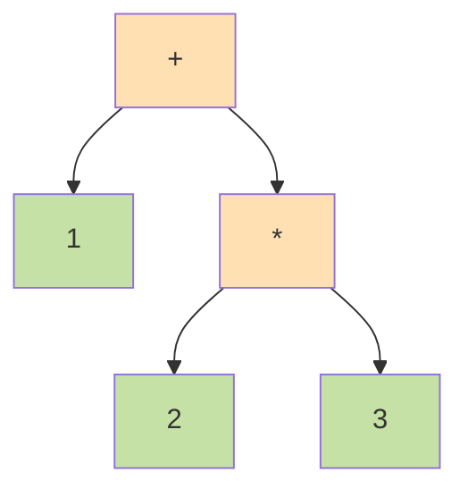

# 第 13 章 コンパイラと言語処理系

## まえがき — テキストが機械語になる魔法

`print("Hello")` と書いただけのファイル。これがなぜ動くんでしょう? あなたが書いた文字列を、CPU が直接実行できるはずがありません。間に **コンパイラ** または **インタプリタ** が立っていて、人間の言葉を機械語に翻訳してくれているのです。

でもコンパイラは「巨大で難しい」。だから本章では、コンパイラを **小さなパイプライン** に分解して、1 つずつ理解していきます。

> **🎯 章の目標**
>
> - コンパイラの全体像（字句 → 構文 → 意味 → IR → 最適化 → 機械語）を説明できる
> - 簡単な算術式を解析する再帰下降パーサを書ける
> - 型システム、ガベージコレクション、JIT などの現代的トピックを把握する
> - SQL オプティマイザや ML フレームワークが「ミニコンパイラ」だと分かる

---

## 13.1 なぜコンパイラを学ぶか

コンパイラ技術は **言語実装以外でも至るところに登場** します。

| 場面 | 「ミニコンパイラ」が動いている |
|---|---|
| 正規表現エンジン | NFA/DFA 構築 |
| データベース | クエリオプティマイザ |
| ビルドツール (webpack, Babel) | AST 変換 |
| 機械学習 (XLA, TVM) | 計算グラフ最適化 |
| シェーダ (GLSL → SPIR-V) | バックエンド |
| Excel の関数 | 式評価エンジン |

**1 つコンパイラを書くと、CS の他分野（オートマトン・データ構造・グラフ・最適化）が一気に繋がります**。

---

## 13.2 コンパイラの全体像


「**形を変えても意味を保つ**」変換器が 7 つ並んでいるイメージ。

- **フロントエンド**: 字句・構文・意味解析。言語に依存。
- **ミドルエンド**: 中間表現と最適化。言語にもターゲットにも依存しない。
- **バックエンド**: コード生成、レジスタ割付。ターゲットに依存。

LLVM はフロント/バックを分離した設計の代表で、Clang・Rust・Swift など多くの言語で使われています。「**新しい言語を作るときも、LLVM を使えばバックエンドはタダ**」。

---

## 13.3 字句解析 (Lexical Analysis)

ソースを **トークン列** に変換します。

### 13.3.1 例

```c
int x = 42;
```
↓
```
[INT_KEYWORD] [IDENT(x)] [ASSIGN(=)] [NUMBER(42)] [SEMI(;)]
```

### 13.3.2 実装

正規表現 → NFA (Thompson 構成法) → DFA (部分集合構成) → 最小化。

ツール:
- `lex`, `flex` (古典)
- ANTLR の lexer
- 手書きでも単純なバッファ + 状態機械

### 13.3.3 注意点

- **最長一致**: `==` を `=`+`=` にしない
- キーワード vs 識別子の区別はテーブル参照
- 数値・文字列・コメントの扱い

---

## 13.4 構文解析 (Parsing)

トークン列から **抽象構文木 (AST)** を構築。

### 13.4.1 例

`1 + 2 * 3` の AST:



「**先に評価するものを下に**」配置することで、優先順位が AST の構造に組み込まれます。`*` の方が `+` より深いので、先に計算される。

### 13.4.2 解析法

#### LL(k) — 下向き

「**左から右、左端導出、$k$ 文字先読み**」。

**再帰下降 (Recursive Descent)**: 各非終端に関数を 1 つ。手書きしやすい。

```python
# 再帰下降パーサの例
def expr():
    t = term()
    while peek() in ('+', '-'):
        op = consume()
        t = BinOp(op, t, term())
    return t

def term():
    f = factor()
    while peek() in ('*', '/'):
        op = consume()
        f = BinOp(op, f, factor())
    return f

def factor():
    if peek() == '(':
        consume('(')
        e = expr()
        consume(')')
        return e
    else:
        return Number(consume_number())
```

このパターンで、世界中のコンパイラフロントエンドが書かれています。

注意: **左再帰** は除去が必要。`A → A α | β` を `A → β A'; A' → α A' | ε` に変換。

#### LR(k) — 上向き

シフト・還元。手書き不向きだが広いクラスを扱える。`yacc`/`bison` が LALR(1)。

#### PEG / Packrat

順序付き選択。線形時間。曖昧性が起きにくい。Python の PEP 617 で採用。

#### GLR / Earley

任意の CFG を扱える、最悪 $O(n^3)$。自然言語処理で使う。

### 13.4.3 エラー回復

良いエラーメッセージは生産性に直結。「**Did you mean ...**」「**Unexpected token X, expected Y**」のような提案ができると神。

---

## 13.5 意味解析

AST に対する追加検査:
- 名前解決（変数・型・関数のスコープ）
- 型検査（次節）
- 制御フロー解析（到達不能、未初期化）
- シンボルテーブル構築

スコープは入れ子で、シンボルテーブルもスタック的に管理。

---

## 13.6 型システム

### 13.6.1 単純型

- プリミティブ: `int`, `float`, `bool`, `char`
- 合成: 関数型 `A -> B`、タプル、レコード、配列

### 13.6.2 型推論

明示しなくても型が決まる仕組み。

#### Hindley-Milner

ML, OCaml, Haskell で使われる完全推論。「**何も書かなくても全部の型が決まる**」。

```ocaml
let rec map f = function
  | [] -> []
  | x :: xs -> f x :: map f xs
(* map: ('a -> 'b) -> 'a list -> 'b list と推論 *)
```

#### 局所型推論

Java の `var`、C# の `var`、TypeScript。式の型から左辺を推測。

### 13.6.3 多相

- パラメトリック: `List<T>`、ジェネリクス
- サブタイプ: OOP の継承
- アドホック: 型クラス、オーバーロード

### 13.6.4 高度な型

- **依存型 (dependent type)**: 値が型に現れる (Coq, Idris, Lean)
- **線形型 (linear type)**: 値を 1 度しか使わない (Rust の所有権)
- **効果システム**: IO, 状態などを型で
- **GADT**: 一般化代数的データ型
- **型レベルプログラミング**: 型自体を計算

### 13.6.5 型検査の効果

未然に防げる:
- 型誤り
- null 参照（オプション型・Maybe）
- 所有権違反（Rust）
- 並行レース（Rust の Send/Sync）
- SQL インジェクション（型付き SQL ライブラリ）

「**コンパイル通れば動く**」感覚は、強い型システムの恩恵です。

---

## 13.7 中間表現 (IR)

ターゲット非依存の表現。

### 13.7.1 種類

| 種類 | 特徴 |
|---|---|
| AST | 元の構造 |
| 3 番地コード | `t1 = a + b; t2 = t1 * c` |
| SSA | 各変数は 1 度だけ代入。φ 関数で合流 |
| CPS | 制御フローを継続として明示 |
| バイトコード | JVM, .NET CIL, WebAssembly |

### 13.7.2 SSA (Static Single Assignment)

最適化解析がしやすい IR。

```
非 SSA:                 SSA:
x = 1                   x1 = 1
if (cond) x = 2         x2 = 2 (if cond)
y = x + 1               x3 = phi(x1, x2)
                        y = x3 + 1
```

LLVM, GCC が採用。

---

## 13.8 最適化

### 13.8.1 古典最適化

- **定数畳み込み**: `2 + 3` → `5`
- **共通部分式除去 (CSE)**: 同じ計算を重複させない
- **デッドコード除去**: 使われない計算を消す
- **ループ不変式の外出し**: ループ内で変わらない計算を外へ
- **強度低減**: `x * 2` → `x << 1`
- **インライン展開**: 小さい関数をその場に展開
- **末尾呼び出し最適化 (TCO)**: 再帰をループに

### 13.8.2 ループ最適化

- ループアンローリング
- ループフュージョン / 分割
- ループタイル化（キャッシュ局所性）
- 自動ベクトル化 (SIMD)

### 13.8.3 関数間最適化

- インライン化
- エスケープ解析（オブジェクトをスタックに置けるか判定）
- デバーチャライゼーション（仮想呼び出しを直接呼び出しに）

### 13.8.4 PGO / LTO

- **PGO (Profile-Guided Optimization)**: 実行統計を使う
- **LTO (Link-Time Optimization)**: リンク時にも最適化

これらで 10-30% 高速化することも。

---

## 13.9 コード生成

### 13.9.1 命令選択

IR を機械命令にマップ。木被覆、動的計画法。

### 13.9.2 レジスタ割付

「どの変数をどのレジスタに置くか」。

- **グラフ彩色**: 同時に生きる変数同士は別レジスタ
- **線形スキャン**: JIT 向き、高速
- **スピル**: レジスタ不足時はメモリへ

### 13.9.3 命令スケジューリング

パイプラインを意識した命令並べ替え。

### 13.9.4 呼び出し規約 (Calling Convention)

引数・戻り値・スタック・レジスタの保存責任。System V ABI、Microsoft x64、AAPCS など。

---

## 13.10 ランタイム

### 13.10.1 スタックフレーム

各関数呼び出しごとに作られる。

```
+------------------+
| 戻りアドレス     |
+------------------+
| 古いフレームポインタ|
+------------------+
| ローカル変数      |
+------------------+
```

### 13.10.2 ガベージコレクション (GC)

#### 種類

- **参照カウント**: シンプルだが循環が苦手。Python が補助 GC で対処
- **マーク&スイープ**: 到達可能性を辿る
- **コピー GC**: 半空間にコピー、断片化解消
- **世代別 GC**: 若い世代を頻繁、年老いた世代をたまに。Java HotSpot, V8 で採用
- **並行 GC**: 一時停止を最小化
- **リージョン推論 / 所有権 (Rust)**: GC を持たずに安全

#### 弱参照と強参照

```python
# 強参照
a = [1, 2, 3]

# 弱参照（オブジェクトを参照に数えない）
import weakref
w = weakref.ref(a)
```

### 13.10.3 例外処理

スタック巻き戻し。ゼロコスト例外（DWARF テーブル）が現代的。

---

## 13.11 インタプリタと JIT

### 13.11.1 インタプリタ

#### ツリーウォーク

AST を直接評価。教育用、遅い。

```python
def eval(ast):
    if ast.type == "num": return ast.value
    if ast.type == "+": return eval(ast.left) + eval(ast.right)
    if ast.type == "*": return eval(ast.left) * eval(ast.right)
```

#### バイトコード VM

- スタックマシン: JVM, Python, Lua
- レジスタマシン: V8 Ignition, LuaJIT

### 13.11.2 JIT (Just-In-Time)

実行時にネイティブコードへコンパイル。

- HotSpot (Java), V8 (JavaScript), PyPy (Python), TurboFan
- 多段最適化: ベースライン JIT → 最適化 JIT
- インラインキャッシュ、型フィードバック、脱最適化

JIT があると **動的言語が静的言語並みに速く** なります。V8 のおかげで JavaScript が現代の主役言語に。

### 13.11.3 AOT (Ahead-of-Time)

ビルド時にコンパイル。GraalVM, .NET Native, Dart AOT。起動が速い、サイズが大きい。

---

## 13.12 ドメイン特化コンパイラ

### 13.12.1 SQL オプティマイザ

```sql
SELECT * FROM users JOIN orders ON ...
WHERE users.created_at > ...
```

これを「**JOIN を WHERE より先に評価しよう**」「**インデックスを使おう**」と判断するのは、コンパイラ最適化と同じ発想。

### 13.12.2 機械学習 (XLA, TVM, MLIR)

PyTorch のモデルを GPU/TPU 向けに最適化するのもミニコンパイラ。

```
TF Graph ─→ HLO ─→ ハードウェア向けコード
```

### 13.12.3 シェーダ

GLSL/HLSL/MSL → SPIR-V → ドライバ最適化。

### 13.12.4 正規表現

正規表現は実行時に DFA を構築する **ミニコンパイラ**。

---

## 13.13 実装プロジェクトのおすすめ

1. **電卓**: 字句 → 構文 → 評価
2. **Tiny BASIC** または **Scheme 風言語**
3. **Lox** (Crafting Interpreters の言語)
4. **静的型付き ML 風言語に Hindley-Milner**
5. **LLVM IR を出力するフロントエンド**
6. **WebAssembly コンパイラ**

特に *Crafting Interpreters* (Bob Nystrom) は **無料で読める最高の入門書**。1 つの本で「ツリーウォークインタプリタ + バイトコード VM」を C で実装します。

---

## 13.14 演習問題

1. 算術式 `1 + 2 * 3 - 4` を再帰下降で解析し、AST を書け。
2. `(a + b) * (a - b)` の SSA 形式を書け。
3. 共通部分式除去で消える計算を、簡単な C 風コードで例示せよ。
4. グラフ彩色法でレジスタ割付を行う際の干渉グラフを 4 変数で描け。
5. 末尾呼び出し最適化が再帰のスタック使用を $O(1)$ にする理由を説明せよ。
6. JIT が「型フィードバック」で性能を上げる仕組みを述べよ。
7. ガベージコレクションのマーク&スイープと世代別 GC の長所短所を比較せよ。
8. Python で簡単な四則演算インタプリタを 100 行以内で書け。
9. LLVM IR を吐く Hello World を書け（Clang `-S -emit-llvm` で確認）。
10. SQL クエリオプティマイザがコンパイラと同じ仕事をしている部分を 3 つ列挙せよ。

---

## 13.15 この章のまとめ

| 段階 | 役割 |
|---|---|
| 字句 | テキスト → トークン |
| 構文 | トークン → AST |
| 意味 | 名前解決、型検査 |
| IR | ターゲット非依存の表現 |
| 最適化 | より速いコードへ |
| コード生成 | 機械語に |
| ランタイム | スタック、GC、例外 |

「**形を変えても意味を保つ**」変換器の集合。1 度作れば抽象が一気に身体化します。

## 13.16 次に読むもの

- Aho, Lam, Sethi, Ullman, *Compilers: Principles, Techniques, and Tools* (ドラゴン本)
- Nystrom, *Crafting Interpreters* — 無料、最高の入門
- Appel, *Modern Compiler Implementation in ML/Java/C*
- LLVM Tutorial
- Pierce, *Types and Programming Languages* — 型理論
- 中田育男『コンパイラの構成と最適化』

> **🌟 メッセージ**
> コンパイラは CS の中でも特に「**作って覚える**」分野。1 度自作すると、プログラミング言語の見え方が永遠に変わります。
