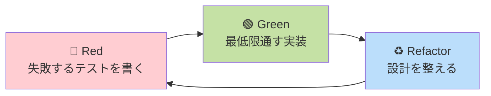

# 第 14 章 ソフトウェア工学

## まえがき — 「動く」と「保守できる」は別物

たった 1 人で書いた小さなスクリプトはすぐ動きます。でも、5 人のチームで 3 年運用する大規模システムはどうでしょう? 仕様は変わり、メンバーは入れ替わり、要件は増え続けます。**そのとき「保守できる形」になっているか** で、プロジェクトの寿命は天と地ほど違います。

ソフトウェア工学は「**書く技術**」ではなく「**書き続けられる技術**」を扱います。設計原則、テスト、バージョン管理、CI/CD、観測性、コードレビュー――どれも派手ではありませんが、長期生産性を支える土台です。

> **🎯 章の目標**
>
> - SOLID, DRY, YAGNI などの原則を理解する
> - GoF パターン、クリーンアーキテクチャを語れる
> - テストピラミッド、TDD、モック・スタブを使い分けられる
> - Git のモデルとレビュー文化を実務に活かせる
> - CI/CD・観測性・SLO/SLA を理解する

---

## 14.1 なぜソフトウェア工学を学ぶか

### 14.1.1 個人 vs 組織

| | 個人開発 | 組織開発 |
|---|---|---|
| 期間 | 数日〜数ヶ月 | 数年〜数十年 |
| メンバー | 1 人 | 数人〜数千人 |
| 引き継ぎ | なし | 頻繁 |
| 重要なこと | 動くこと | 動き続けること |

「**1 年後の自分や他人がいじっても破綻しないコード**」を作る技術がソフトウェア工学。

### 14.1.2 名言

- 「**早すぎる最適化はすべての悪の根源**」 (Knuth)
- 「**Make it work, make it right, make it fast**」 (Kent Beck)
- 「**コードは書かれる時間より読まれる時間の方が長い**」
- 「**動くコードに触るな…ただし保守は必要**」

これらの背景に流れる思想を学んでいきましょう。

---

## 14.2 ライフサイクルモデル

### 14.2.1 ウォーターフォール

要求 → 設計 → 実装 → テスト → 運用 を順に。

長所: 計画的、文書重視。
短所: 要求変更に弱い。

### 14.2.2 アジャイル

短いイテレーションで動くものを作りフィードバック。

#### スクラム

- スプリント (1-4 週)
- プロダクトバックログ
- スプリントレビュー、レトロスペクティブ

#### XP (Extreme Programming)

- TDD
- ペアプログラミング
- 継続的インテグレーション

#### カンバン

- WIP (Work In Progress) 制限
- フロー最適化

### 14.2.3 DevOps / SRE

「開発と運用を統合」。Google の SRE 本が古典。
- CI/CD
- IaC (Infrastructure as Code)
- 観測性
- ポストモーテム文化

---

## 14.3 要求と仕様

### 14.3.1 機能要求 vs 非機能要求

- **機能**: 何ができるか
- **非機能**: どれくらい速く、安定で、安全か

非機能要求の例:
- 性能 (応答時間 200ms 以下)
- 可用性 (99.9% アップ)
- セキュリティ (個人情報暗号化)
- 保守性 (コードレビュー必須)

### 14.3.2 ユーザーストーリーとジョブ理論

```
As a <ユーザータイプ>,
I want <機能>,
so that <理由>.
```

例: 「**As a** 通勤者, **I want** 電車の遅延通知, **so that** 別経路を選べる」

#### ジョブストーリー

```
When <状況>,
I want to <動機>,
so I can <結果>.
```

「**いつ・なぜ**」を明確にする。

### 14.3.3 「何を作らないか」を決める

要求工学の最大の仕事は **削ること**。「とりあえず入れておこう」が積み重なって破綻します。

---

## 14.4 設計原則

### 14.4.1 モジュール化

- **凝集度 (cohesion)**: 1 モジュール内の要素が密に関連 → **高い方が良い**
- **結合度 (coupling)**: モジュール間の依存度 → **低い方が良い**

「**密結合・低凝集**」がアンチパターン。例えば「ファイル名と URL を 1 つの関数で扱う」のは低凝集。

### 14.4.2 SOLID 原則

| 原則 | 意味 | 違反例 |
|---|---|---|
| **S**ingle Responsibility | 1 クラス 1 責務 | 1 つの「UserManager」が認証・通知・課金 |
| **O**pen/Closed | 拡張に開く、変更に閉じる | 新機能のたびに既存クラスを書き換える |
| **L**iskov Substitution | 派生型は基底の代わりに使える | `Square extends Rectangle` で setWidth が壊れる |
| **I**nterface Segregation | 太いインターフェースを分割 | `IBird` に `fly()` を入れて Penguin が困る |
| **D**ependency Inversion | 抽象に依存し具象に依存しない | クラス内で直接 `new MySQLConnection()` |

### 14.4.3 DRY / YAGNI / KISS

- **DRY (Don't Repeat Yourself)**: 重複を避ける
- **YAGNI (You Aren't Gonna Need It)**: 仮定の未来要件を入れない
- **KISS (Keep It Simple, Stupid)**: シンプルに

### 14.4.4 Rule of Three

「**3 度目で抽象化**」。早すぎる抽象化を避ける格言。1 回目はそのまま、2 回目はコピペで OK、3 回目に共通化。

---

## 14.5 デザインパターン (GoF)

### 14.5.1 23 パターンの分類

| 種別 | パターン |
|---|---|
| 生成 | Singleton, Factory Method, Abstract Factory, Builder, Prototype |
| 構造 | Adapter, Decorator, Facade, Proxy, Composite, Bridge, Flyweight |
| 振る舞い | Strategy, Observer, Iterator, Visitor, Command, State, Template Method, Chain of Responsibility, Mediator, Memento, Interpreter |

### 14.5.2 主要パターン例

#### Strategy

「**アルゴリズムを差し替え可能に**」

```python
class Sorter:
    def __init__(self, strategy):
        self.strategy = strategy
    def sort(self, data):
        return self.strategy(data)

quick = Sorter(quicksort)
merge = Sorter(mergesort)
```

#### Observer

「**状態変化を通知**」

```python
class Subject:
    def __init__(self):
        self.observers = []
    def attach(self, ob):
        self.observers.append(ob)
    def notify(self, event):
        for ob in self.observers:
            ob.update(event)
```

イベント駆動 UI、pub/sub の基礎。

#### Decorator

「**機能を後付け**」

```python
def with_logging(fn):
    def wrapper(*args, **kw):
        print(f"calling {fn.__name__}")
        return fn(*args, **kw)
    return wrapper

@with_logging
def add(a, b): return a + b
```

Python のデコレータがまさにこれ。

### 14.5.3 アーキテクチャパターン

| パターン | 内容 |
|---|---|
| MVC / MVP / MVVM | UI 層の分離 |
| Layered Architecture | 上から下へ依存 |
| Hexagonal (Ports and Adapters) | 中央のドメインを外側のアダプタが囲む |
| Clean Architecture | 同心円、依存は外→中 |
| Event-Driven | イベントで疎結合 |
| CQRS | コマンドとクエリを分離 |
| Event Sourcing | 状態でなくイベントを保存 |
| Microservices | サービスを分割 |

「**パターンに振り回されない**」「**チーム内の共通言語として使う**」が大事。

---

## 14.6 ドメイン駆動設計 (DDD)

### 14.6.1 ユビキタス言語

「**業務担当者とエンジニアが同じ言葉を使う**」。`Order` をある人は「注文」、別の人は「発注」と呼ぶような混乱を避ける。

### 14.6.2 戦術的設計

- **エンティティ**: 識別子で区別 (User, Order)
- **値オブジェクト**: 値で区別 (Money, Date)
- **集約 (Aggregate)**: 一貫性を保つ単位
- **リポジトリ**: 永続化の抽象
- **ドメインサービス**: エンティティ単独で表せないロジック

### 14.6.3 戦略的設計

- **境界づけられたコンテキスト**: モジュール境界
- **コンテキストマップ**: コンテキスト間の関係
- **腐敗防止層**: レガシーシステムとの境界

DDD は **複雑業務領域** で威力を発揮します。CRUD アプリには重すぎる。

---

## 14.7 リファクタリング

「**外部の振る舞いを変えずに内部構造を改善する**」。Martin Fowler の同名書がバイブル。

### 14.7.1 主なリファクタリング

- メソッド抽出
- インライン化
- 変数のリネーム
- フィールド移動
- クラス抽出
- 継承からコンポジションへ
- データクラスへのカプセル化

### 14.7.2 コードスメル

「**怪しい兆候**」。
- 重複
- 長い関数 (50 行超)
- 巨大クラス (1000 行超)
- 機能の横恋慕（他クラスのデータばかり触る）
- シャットガン手術（1 つの変更が多くのクラスに散る）
- データクラス（中身がフィールドだけ）

### 14.7.3 リファクタリングの前提条件

**テストがあること**。テストなしでリファクタリングはできない (= 振る舞いが変わってないと保証できない)。

---

## 14.8 テスト

### 14.8.1 テストの種類

| 種類 | 対象 | 速度 | 安定性 |
|---|---|---|---|
| 単体 (Unit) | 1 関数/クラス | 速い | 高 |
| 統合 (Integration) | 複数モジュール | 中 | 中 |
| E2E | システム全体 | 遅い | 低 |
| 受け入れ | ユーザ視点 | 遅い | - |
| 回帰 | 既存機能の維持 | - | - |
| パフォーマンス | 性能 | 遅い | - |
| セキュリティ | 脆弱性 | - | - |

### 14.8.2 テストピラミッド

```
                ▲
               ╱ ╲          ← 少数: E2E (遅い、不安定)
              ╱E2E╲
             ╱─────╲
            ╱       ╲       ← 中程度: 統合テスト
           ╱  統合   ╲
          ╱───────────╲
         ╱             ╲    ← 多数: 単体テスト (速い、安定)
        ╱  単体テスト   ╲
       ─────────────────
```

| 層 | 速度 | 数 |
|---|---|---|
| 単体 | ミリ秒 | 数千 |
| 統合 | 秒 | 数百 |
| E2E | 分 | 数十 |

土台に多数の高速な単体テスト、上に少数の遅い E2E。**逆ピラミッド** はアンチパターン。

### 14.8.3 TDD (Test-Driven Development)



「**テストが設計を導く**」のが本質。3 つのサイクルを高速で回すことで、設計が自然に整っていきます。

### 14.8.4 モック・スタブ・フェイク

外部依存（DB、ネットワーク）を差し替える Test Double。

```python
def test_send_email():
    mock_smtp = MagicMock()
    send_email(to="a@b.com", smtp=mock_smtp)
    mock_smtp.send.assert_called_once()
```

やりすぎると **脆いテスト**（実装変更で壊れる）になります。

### 14.8.5 プロパティベーステスト

入力をランダム生成して **性質** を検証 (QuickCheck, Hypothesis)。

```python
from hypothesis import given, strategies as st

@given(st.lists(st.integers()))
def test_sort_is_idempotent(lst):
    assert sorted(sorted(lst)) == sorted(lst)
```

「**ソートしたリストをもう一度ソートしても変わらない**」を、何百ケースも自動生成して検証。

### 14.8.6 カバレッジ

- 行カバレッジ
- 分岐カバレッジ
- 関数カバレッジ
- 条件カバレッジ
- MCDC (航空機ソフト)

注意: **カバレッジ 100% でもバグはあり得る**。あくまで指標。100% を目標にすると意味のないテストが量産されます。

### 14.8.7 ミューテーションテスト

「**意図的にコードを変異させ、テストが捕捉できるか**」を測る。テストの質を評価する強力な手法。

---

## 14.9 バージョン管理 (Git)

### 14.9.1 モデル

スナップショット + 有向非巡回グラフ:
- コミット
- ツリー（ファイル構造）
- ブロブ（ファイル内容）

ブランチは「コミットへの可動ポインタ」。

### 14.9.2 マージ vs リベース

```
マージ:                   リベース:
   o─o─o─o   (main)         o─o─o─o─o'─o' (main)
        \                              ↑
         o─o─o (feat)                  ここに直線で接続
              \
               o (merge commit)
```

リベースは履歴が直線で読みやすいが、**push 済みのブランチには使わない**（共同作業者を混乱させる）。

### 14.9.3 ワークフロー

| | 特徴 |
|---|---|
| Git Flow | feature, develop, release, master の階層構造 |
| GitHub Flow | feature ブランチ → main の単純フロー |
| Trunk-Based | main 中心、フィーチャーフラグで切替 |

### 14.9.4 良いコミット

- **1 コミット 1 変更** (atomic)
- 件名 50 文字、本文 72 文字折り返し
- **What ではなく Why** を書く

```
良い例:
  Fix off-by-one in pagination

  When the total count is exactly N, we showed an empty extra page.
  This was caused by computing pages as (count + 1) / size.
```

### 14.9.5 コードレビュー

#### 良いレビュー

- 小さく、頻繁に (200 行以内が理想)
- 自動チェック (lint, test) は機械に任せる
- 人は **設計・命名・意図** に集中
- 心理的安全性、ポジティブな言葉

#### 悪いレビュー

- 数日溜め込んでから「全部やり直して」
- 「私ならこう書く」と好みを押し付ける
- 主語を「あなた」にして批判口調

---

## 14.10 CI/CD

### 14.10.1 CI (Continuous Integration)

push のたびに **ビルド・テスト** を自動実行。
- GitHub Actions
- GitLab CI
- Jenkins
- CircleCI

### 14.10.2 CD (Continuous Delivery / Deployment)

メインブランチが **いつでも本番に出せる状態** を保つ。
- Blue/Green デプロイ
- Canary デプロイ
- Rolling デプロイ

### 14.10.3 フィーチャーフラグ

```python
if feature_enabled("new_search"):
    return new_search()
else:
    return old_search()
```

「**リリース**」と「**機能公開**」を分離。本番にデプロイしても、フラグで段階的に有効化。

### 14.10.4 IaC (Infrastructure as Code)

インフラもコードで管理し、PR でレビュー。
- Terraform
- Pulumi
- AWS CloudFormation
- Ansible / Chef / Puppet

---

## 14.11 観測性 (Observability)

### 14.11.1 3 本柱

- **ログ**: 何が起きたか (構造化、JSON 推奨)
- **メトリクス**: 数値の時系列 (Prometheus, Grafana)
- **トレース**: 1 リクエストの流れ (OpenTelemetry, Jaeger)

### 14.11.2 RED と USE メソッド

#### RED (リクエスト指向)

- **R**ate: 1 秒あたりのリクエスト数
- **E**rrors: エラー率
- **D**uration: 応答時間

#### USE (リソース指向)

- **U**tilization: 使用率
- **S**aturation: 飽和
- **E**rrors: エラー数

### 14.11.3 SLO / SLA / エラーバジェット

- **SLI**: 指標 (例: 99% のリクエストが 200ms 以内)
- **SLO**: 内部目標 (99.9%)
- **SLA**: 顧客との契約 (99.5%)
- **エラーバジェット**: 許容される失敗量 (月 0.1% = 約 43 分)

「**バジェット内なら新機能リリース、超えたら安定化に集中**」。

---

## 14.12 ドキュメント

### 14.12.1 種類

- **README**: 1 分でわかる導入
- **ADR (Architecture Decision Record)**: 「**なぜこの設計を選んだか**」を記録
- **設計ドキュメント (Design Doc)**: 大規模変更前
- **API ドキュメント** (OpenAPI, GraphQL Schema)
- **ランブック**: 障害対応手順

### 14.12.2 良いドキュメント

「**コードは How、ドキュメントは Why**」。

例: ADR

```
# ADR-001: PostgreSQL を採用

## 状況
- 書き込み多めの OLTP
- ACID が必要
- 半年で 1000 万行を見込む

## 決定
PostgreSQL を採用。

## 代替案
- MySQL: 採用も検討したが JSONB / 高度なインデックスで PG が優位
- DynamoDB: スキーマレスは魅力だが、結合クエリが多い

## 影響
- DBA を 1 人配置
- バックアップ戦略を整備
```

---

## 14.13 セキュアな開発

- 脅威モデリング (STRIDE)
- セキュアコーディング (OWASP)
- 依存パッケージのスキャン (Dependabot, Snyk)
- シークレット管理 (Vault, AWS Secrets Manager)

詳細は第 15 章で。

---

## 14.14 性能と保守性のメトリクス

### 14.14.1 コードメトリクス

- **循環的複雑度 (McCabe)**: 関数の複雑度
- **変更の局所性 (coupling)**: モジュール間の依存
- **テストカバレッジ**

### 14.14.2 DORA 4 メトリクス

DORA レポートで分析された、ハイパフォーマー組織の指標:

- デプロイ頻度
- リードタイム (コミット → 本番)
- MTTR (障害復旧時間)
- 変更失敗率

エリート組織は **1 日に複数回デプロイ、リードタイム数時間、MTTR 1 時間以内、失敗率 5% 以下**。

---

## 14.15 チームと文化

### 14.15.1 ペア・モブ

- ペアプログラミング: 2 人で 1 つの画面
- モブプログラミング: 数人で 1 つの画面

学習・引き継ぎ・コードレビューの代替。

### 14.15.2 ポストモーテム文化

「**非難なし** (blameless)」のポストモーテム:
- 何が起きた
- なぜ起きた
- 再発防止

人を責めず、システムと文化を改善。

### 14.15.3 オンコール

24/7 で対応するローテーション。**バーンアウト** を避けるため:
- ローテーション間隔
- ランブックの整備
- 自動化

### 14.15.4 ソフトスキル

- **書く**: ドキュメント、PR description
- **聞く**: ユーザの声、メンバーの懸念
- **対話する**: 意見の対立を建設的に

技術スキル + ソフトスキル = エンジニアの総合力。

---

## 14.16 演習問題

1. 「機能 X を Strategy パターンで実装する」「同じ機能を継承で実装する」を比較し、メリット・デメリットを表でまとめよ。
2. 関数 `add(a, b)` の TDD サイクルを Red→Green→Refactor で書け（テストフレームワーク任意）。
3. 任意のオープンソースリポジトリで PR を 1 件レビューし、観点（設計・命名・テスト・性能）ごとにコメントせよ。
4. ある機能の ADR を 1 ページ書け（背景・選択肢・採用案・トレードオフ）。
5. ピラミッドの形になっていないテストスイートの問題点を 3 つ挙げよ。
6. Git で「3 つのコミットを 1 つに整理」する手順を `rebase -i` で記述せよ。
7. SLO「月 99.9% の可用性」のエラーバジェットを分単位で計算せよ。
8. SOLID の各原則を破る具体的なコードを示し、修正案を書け。
9. CI のパイプラインを 1 つ設計（YAML）し、各ステップの目的を述べよ。
10. 「コミットメッセージはなぜ Why を書くべきか」を実例とともに説明せよ。

---

## 14.17 この章のまとめ

| 観点 | キーワード |
|---|---|
| 設計 | SOLID, DRY, パターン, DDD |
| テスト | ピラミッド, TDD, モック |
| Git | コミット, レビュー |
| CI/CD | 自動化, デプロイ戦略 |
| 観測性 | ログ, メトリクス, トレース |
| 文化 | ペア, ポストモーテム, ドキュメント |

ソフトウェア工学は派手ではないが、**長期に渡る生産性と安全性を支える土台**。「**1 年後の自分が触っても破綻しないか**」を毎日問い続けることが、エンジニアの卒業条件。

## 14.18 次に読むもの

- Beck, *Test-Driven Development: By Example*
- Fowler, *Refactoring* / *Patterns of Enterprise Application Architecture*
- GoF, *Design Patterns*
- Evans, *Domain-Driven Design*
- Hunt & Thomas, *The Pragmatic Programmer*
- Brooks, *The Mythical Man-Month* — 古典
- Google, *Software Engineering at Google* / *SRE Book*
- Martin, *Clean Code* / *Clean Architecture*

> **🌟 メッセージ**
> 技術力 = アルゴリズム力 ではなく、**技術力 = アルゴリズム力 + 設計力 + 運用力 + 対話力**。本章の知識は、シニアエンジニアが当たり前のように身につけている「**見えないスキル**」です。
