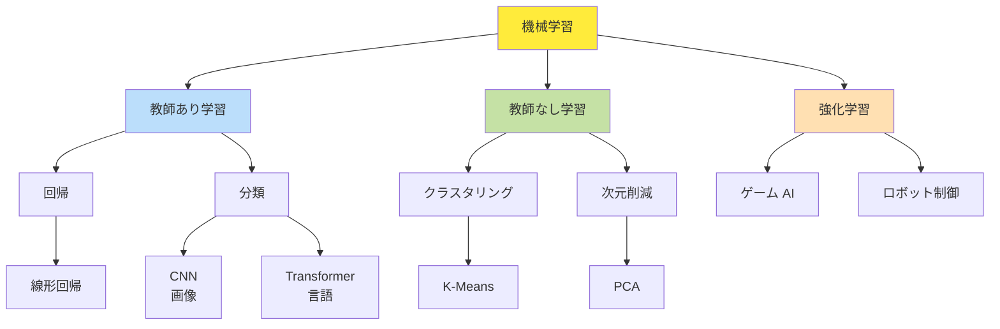
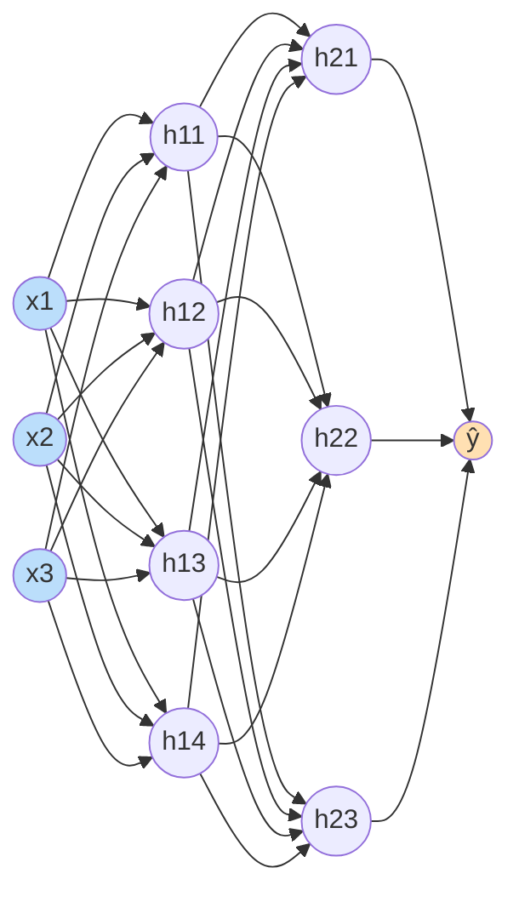

# 第 17 章 人工知能と機械学習

## まえがき — 機械が学ぶ時代

ChatGPT に質問したら答えてくれる、Spotify がぴったりの音楽を選んでくれる、Tesla が自動で車線変更する、医療画像から癌を検出する。これらすべてを支えているのが **機械学習 (ML)** と **人工知能 (AI)**。

「AI は魔法」ではありません。確率と統計、線形代数、微積分の組み合わせです。その仕組みを **原理から** 理解しましょう。

> **🎯 章の目標**
>
> - 古典的 AI（探索・推論）から統計的 ML、深層学習、LLM までを 1 本の流れとして理解する
> - 教師あり / 教師なし / 強化学習の枠組みと代表的アルゴリズムを使い分けられる
> - 過学習・正則化・評価指標・モデル選択を実務で判断できる
> - ニューラルネット、CNN、RNN、Transformer の基本構造を説明できる

---

## 17.1 なぜ AI/ML を学ぶか

「AI を作る人になる」だけでなく、**API 利用者を超えて中身を理解できる** エンジニアになることが目的です。

| AI の利用 | 求められる理解 |
|---|---|
| ChatGPT に質問 | 不要 |
| OpenAI API を叩く | プロンプトのコツ |
| 自社モデルを fine-tune | 機械学習の基礎 |
| カスタムモデル開発 | 深層学習・最適化 |
| 研究 | 数学・論文読解 |

本章は中段以上を目指す人向けです。

---

## 17.2 AI の歴史

```
1950s ─ チューリング・テスト、論理 AI、ELIZA
1960s ─ パーセプトロン
1970s ─ AI 冬 (期待外れ)
1980s ─ エキスパートシステム
1990s ─ 統計的機械学習、SVM、確率モデル
2000s ─ ビッグデータ + GPU
2012 ─── ImageNet で AlexNet 圧勝、深層学習革命
2017 ─── Transformer 登場 (Attention is All You Need)
2020s ── GPT-3, ChatGPT, 拡散モデル, LLM の時代
```

---

機械学習の全体像:



## 17.3 探索 — 古典的 AI

### 17.3.1 状態空間グラフ

「問題 = 状態のグラフをたどって解を見つける」と捉える。

例: 8 パズル、迷路、ルービックキューブ。

### 17.3.2 探索アルゴリズム

| 種類 | 動作 |
|---|---|
| BFS | 浅い順 (最短手数) |
| DFS | 深い順 (メモリ少) |
| 反復深化 | DFS の深さ制限を増やす |
| 貪欲 | ヒューリスティック値が良い順 |
| **A*** | $f(n) = g(n) + h(n)$ で最適探索 |

A* は GPS, ゲーム AI, ロボット経路で定番。

### 17.3.3 ゲーム探索

- **ミニマックス**: 自分は最大化、相手は最小化
- **αβ 枝刈り**: 探索を効率化
- **MCTS (Monte Carlo Tree Search)**: AlphaGo の核

```
MCTS の 4 段階:
1. Selection: UCB で有望ノードへ
2. Expansion: 新ノード追加
3. Simulation: ランダムプレイアウト
4. Backpropagation: 結果を上に伝播
```

---

## 17.4 機械学習の枠組み

### 17.4.1 3 つのパラダイム

| 種類 | 入力 | 目的 | 例 |
|---|---|---|---|
| 教師あり | (x, y) ペア | 関数 f を学ぶ | 分類、回帰 |
| 教師なし | x のみ | 構造を発見 | クラスタリング、次元削減 |
| 強化学習 | 環境との対話 | 方策を学ぶ | ゲーム AI、ロボット |

### 17.4.2 学習の基本サイクル

```
1. データ収集・前処理
2. 特徴量エンジニアリング (or 学習)
3. モデル選択
4. 学習 (損失最小化)
5. 評価 (汎化性能)
6. デプロイと監視
```

### 17.4.3 損失関数

| 損失 | 用途 |
|---|---|
| 二乗損失 $(y - \hat y)^2$ | 回帰 |
| クロスエントロピー $-\sum y \log \hat y$ | 分類 |
| ヒンジ損失 | SVM |
| 対数尤度 | 確率モデル |

---

## 17.5 過学習と汎化

### 17.5.1 訓練誤差 vs テスト誤差

```
誤差
 │           ───── 訓練誤差
 │       ／
 │     ／         ＼ テスト誤差 (過学習で上がる)
 │   ／         ／
 │ ／      ／
 +───────────→ モデル複雑度
```

訓練データに合わせすぎると、未知データに弱くなる。

### 17.5.2 対策

- データを増やす
- シンプルなモデル
- L1/L2 正則化
- ドロップアウト
- 早期終了
- データ拡張
- 交差検証

### 17.5.3 バイアス・バリアンス分解

期待誤差 = バイアス² + バリアンス + ノイズ

- バイアス大: モデルが単純すぎる (アンダーフィット)
- バリアンス大: モデルが複雑すぎる (過学習)

両者のスイートスポットを見つけるのが学習の腕。

---

## 17.6 評価とデータ分割

### 17.6.1 訓練・検証・テスト

```
データ ──┬── 訓練 (60%): モデル学習
        ├── 検証 (20%): ハイパーパラメータ調整
        └── テスト (20%): 最終評価
```

### 17.6.2 交差検証 (k-fold)

訓練データを k 分割し、k 回学習・評価を繰り返す。

```
Fold 1: [V][T][T][T][T]
Fold 2: [T][V][T][T][T]
...
平均誤差を取る
```

### 17.6.3 評価指標

#### 回帰

- MSE (Mean Squared Error)
- RMSE
- MAE
- R²

#### 分類

| 指標 | 内容 |
|---|---|
| Accuracy | 正解率 |
| Precision | 陽性予測の正解率 |
| Recall | 真陽性の検出率 |
| F1 | Precision と Recall の調和平均 |
| ROC-AUC | 全閾値での性能 |

```
混同行列:
              予測 +     予測 -
真 +   [ TP ]    [ FN ]
真 -   [ FP ]    [ TN ]

Precision = TP / (TP + FP)
Recall    = TP / (TP + FN)
```

#### 不均衡データ

スパムフィルタ等では Accuracy が誤誘導。**F1 や AUC** を見る。

### 17.6.4 データ漏洩 (Leakage)

「**未来の情報を訓練に混入**」「**テストデータをチューニングに使う**」。気づきにくく、本番で性能ガタ落ち。

---

## 17.7 古典機械学習

### 17.7.1 線形回帰

$\hat y = \mathbf{w}^T \mathbf{x} + b$

最小二乗解 (閉じた形):
$$\hat{\mathbf{w}} = (X^T X)^{-1} X^T \mathbf{y}$$

第 4 章でも登場。**機械学習の原型**。

### 17.7.2 ロジスティック回帰

二値分類:
$$P(y = 1 | x) = \sigma(\mathbf{w}^T \mathbf{x}) = \frac{1}{1 + e^{-\mathbf{w}^T \mathbf{x}}}$$

シンプルだが強力。実務でもベースラインによく使う。

### 17.7.3 k-近傍 (kNN)

訓練データを覚え、近い k 個の多数決。

メリット: 単純、訓練不要。
デメリット: 推論が遅い、次元の呪いに弱い。

### 17.7.4 決定木

軸並行な分割で空間を区切る。

```
                X1 < 5?
               /       \
            Yes         No
            /            \
        X2 < 3?      X2 < 7?
        / \           / \
       A   B         C   D
```

メリット: 解釈性が高い (「なぜそう予測したか」を説明可能)。
デメリット: 過学習しがち → 剪定。

### 17.7.5 アンサンブル — 弱い学習器の集合知

#### バギング

ランダムサンプリングで複数の決定木を作り、平均/多数決:
- **ランダムフォレスト**

#### ブースティング

弱学習器を順に追加、間違いを次が修正:
- AdaBoost
- Gradient Boosting
- **XGBoost, LightGBM, CatBoost**

**テーブルデータでは深層学習より強いことが多い**。Kaggle で最強。

#### スタッキング

複数モデルの予測を入力に、メタモデルで最終予測。

### 17.7.6 サポートベクタマシン (SVM)

「**マージン最大化**」する超平面。

カーネルトリックで非線形:
- RBF カーネル
- 多項式カーネル

少データ高次元に強い。

### 17.7.7 ナイーブベイズ

ベイズの定理 + 特徴独立仮定。

```
P(class | features) ∝ P(class) × ∏ P(featuresᵢ | class)
```

スパムフィルタの古典。シンプルだが侮れない。

### 17.7.8 教師なし学習

#### クラスタリング

- **K-Means**: 重心ベース
- **DBSCAN**: 密度ベース、ノイズに強い
- **階層クラスタリング**

#### 次元削減

- **PCA** (主成分分析): 線形、第 2 章
- **t-SNE, UMAP**: 非線形、可視化

#### 異常検知

- Isolation Forest
- One-Class SVM
- Autoencoder

---

## 17.8 ニューラルネットワーク

### 17.8.1 パーセプトロン

$\hat y = \sigma(\mathbf{w}^T \mathbf{x} + b)$

線形分離可能な問題のみ解ける。**XOR は解けない**（1969 年の失望）。

### 17.8.2 多層パーセプトロン (MLP)

層を重ねて非線形を表現。



各ニューロンは「**前の層の重み付き和 + 活性化関数**」。全結合だと層と層の間にビッシリと線がつながります。

**万能近似定理**: 1 隠れ層でも任意の連続関数を任意精度で近似可能。

### 17.8.3 活性化関数

| 関数 | 式 | 特徴 |
|---|---|---|
| シグモイド | $1/(1+e^{-x})$ | 飽和、勾配消失 |
| tanh | $-1$ 〜 $1$ | シグモイドより少しマシ |
| ReLU | $\max(0, x)$ | **深層学習を実用化した立役者** |
| Leaky ReLU | $\max(0.01x, x)$ | ReLU の改良 |
| GELU, Swish | より滑らか | Transformer で人気 |

### 17.8.4 誤差逆伝播 (Backpropagation)

第 3 章の連鎖律を、出力層から入力層へ伝播:

```
forward:  x → h₁ → h₂ → ŷ → 損失 L
backward: ∂L/∂x ← ∂L/∂h₁ ← ∂L/∂h₂ ← ∂L/∂ŷ ← 1
```

PyTorch の `loss.backward()` で自動的に実行されます:

```python
loss = (y_pred - y_true).pow(2).mean()
loss.backward()
optimizer.step()
```

### 17.8.5 最適化

- **SGD** (確率的勾配降下)
- **Momentum**: 慣性を加える
- **Adam, AdamW**: 適応的学習率（広く使われる）
- **学習率スケジューリング**: warmup, cosine

### 17.8.6 正則化

- ドロップアウト: ランダムにニューロンを無効化
- バッチ正規化 (BN) / レイヤー正規化 (LN)
- 重み減衰 (L2)
- データ拡張

### 17.8.7 勾配の問題

- **消失**: 残差接続 (ResNet)、適切な初期化 (He, Xavier)
- **爆発**: 勾配クリッピング

---

## 17.9 畳み込みニューラルネット (CNN)

画像など **局所性のあるデータ** に有効。

### 17.9.1 畳み込み層

小さなフィルタ（カーネル）を移動させて特徴抽出:

```
入力画像     フィルタ      出力 (特徴マップ)
[5 3 1]    [1 0]
[2 7 4] *  [0 1] ─→  [12 7]
[6 9 2]               [9 9]
```

**重み共有** でパラメータ削減。

### 17.9.2 プーリング

最大値・平均で空間を縮約。

### 17.9.3 アーキテクチャ

```
LeNet (1998) → AlexNet (2012) → VGG (2014)
       → GoogLeNet (2014) → ResNet (2015, 残差接続)
       → EfficientNet (2019)
```

### 17.9.4 応用

- 物体検出: Faster R-CNN, YOLO, DETR
- セグメンテーション: U-Net, Mask R-CNN, SAM
- 画像生成: GAN, Diffusion

---

## 17.10 リカレント NN (RNN)

時系列・系列を扱う。

### 17.10.1 バニラ RNN

```
h_t = tanh(W_x x_t + W_h h_{t-1} + b)
y_t = W_y h_t
```

問題: 長期依存で勾配消失。

### 17.10.2 LSTM (Long Short-Term Memory)

ゲート機構（忘却・入力・出力）で長期依存を学習:

```
忘却ゲート: 何を忘れるか
入力ゲート: 何を覚えるか
出力ゲート: 何を出すか
```

### 17.10.3 GRU

LSTM の簡略版。よく使われる。

### 17.10.4 応用

- 系列ラベリング
- 機械翻訳
- 音声認識

ただし現在は Transformer に置き換わっています。

---

## 17.11 Attention と Transformer

### 17.11.1 Attention の発想

「**クエリと最も関連するキーから値を取り出す**」加重和:

```
Attention(Q, K, V) = softmax(QK^T / √d_k) V
```

長距離依存を **1 ステップで参照** できる。

### 17.11.2 Self-Attention

入力系列が **自身を参照**:

```
The cat sat on the mat
 ↑   ↑
 これらが互いを見る
```

「The」が「cat」と関連が強い、と学習。

### 17.11.3 Multi-Head Attention

複数の注意を並列に。多様な関係を捉える。

### 17.11.4 Transformer (2017)

エンコーダ・デコーダ構成:
- 位置エンコーディング
- 残差接続
- レイヤー正規化
- フィードフォワード

派生:
- **BERT**: エンコーダのみ、理解
- **GPT**: デコーダのみ、生成
- **T5**: 両方

### 17.11.5 スケーリング則

「パラメータ・データ・計算量を増やすと性能が **冪乗で改善**」（Kaplan et al.）。これが LLM 競争の根拠。

---

## 17.12 大規模言語モデル (LLM)

### 17.12.1 学習

```
1. 事前学習: 大規模コーパスで次トークン予測
2. 指示学習 (Instruction Tuning): タスク特化
3. RLHF: 人間フィードバックで調整
```

### 17.12.2 プロンプトエンジニアリング

- Zero-Shot: 例なし
- Few-Shot: いくつか例を見せる
- Chain-of-Thought: 「ステップで考えてみよう」と促す

### 17.12.3 RAG (Retrieval-Augmented Generation)

外部知識を **検索して与える**:

```
質問 → ベクトル検索 → 関連文書 → LLM で回答
```

幻覚を減らす定石。

### 17.12.4 Agent / ツール使用

LLM が外部ツール (Web 検索、計算機、API) を呼ぶ:

```
LLM: 「天気を知りたい」
   ↓
Tool: get_weather("Tokyo") → 25°C
   ↓
LLM: 「東京は 25°C です」
```

### 17.12.5 課題

- **幻覚** (Hallucination): 嘘を自信たっぷりに
- **プロンプトインジェクション**: 悪意のある指示
- **バイアス**: 訓練データに偏る
- **アライメント**: 人間の価値観に沿わせる

---

## 17.13 強化学習

### 17.13.1 マルコフ決定過程 (MDP)

- 状態 $s$
- 行動 $a$
- 遷移確率 $P(s'|s, a)$
- 報酬 $R(s, a)$
- 割引率 $\gamma$

エージェントは **報酬を最大化する方策 $\pi(a|s)$** を学ぶ。

### 17.13.2 Q 学習

行動価値関数 $Q(s, a)$ を更新:
$$Q(s, a) \leftarrow Q(s, a) + \alpha [r + \gamma \max_{a'} Q(s', a') - Q(s, a)]$$

### 17.13.3 Deep Q-Network (DQN)

Q 関数をニューラルネットで近似。Atari で人間超え (Mnih et al. 2015)。

### 17.13.4 方策勾配

直接方策を最適化:
- REINFORCE
- A2C/A3C
- **PPO** (実用で人気)
- SAC

### 17.13.5 探索と活用のトレードオフ

- ε-greedy: 確率 ε でランダム
- UCB: 信頼区間上限
- Curiosity: 探索ボーナス

### 17.13.6 応用

- ゲーム (AlphaGo, StarCraft, Dota)
- ロボット制御
- 推薦システム
- LLM のアライメント (RLHF)

---

## 17.14 生成モデル

### 17.14.1 VAE (Variational Autoencoder)

潜在変数モデル + 変分推論。生成と表現学習。

### 17.14.2 GAN

生成器と識別器の対立:
```
G: 「偽物を作る」
D: 「本物か偽物か見破る」
両者が競って G が上達
```

DeepFake、画像生成で有名。

### 17.14.3 拡散モデル (Diffusion)

ノイズ付加 → 逆向きに復元。

```
画像 → +ノイズ → +ノイズ → ... → 純粋ノイズ
                  ↓ 逆過程
                生成
```

Stable Diffusion, DALL-E 2, Imagen の核。

---

## 17.15 機械学習システム (MLOps)

学習だけでなく **運用** が本番。

```
データ → 特徴量ストア → 学習 → モデル登録
                        ↓
              評価 → デプロイ → 推論サービング
                        ↓
                      監視 (ドリフト検知)
                        ↓
                      再学習
```

ツール:
- Feast (特徴量ストア)
- MLflow (実験追跡)
- Kubeflow / Airflow (パイプライン)
- Triton, vLLM (推論サービング)

### 17.15.1 監視ポイント

- **データドリフト**: 入力分布の変化
- **概念ドリフト**: y の分布の変化
- **性能劣化**: 精度・遅延

「**学習したモデルは時間とともに腐る**」。継続的な再学習が必要。

---

## 17.16 倫理と責任ある AI

### 17.16.1 公平性 (Fairness)

群間で性能・誤りが偏らない。

例: 顔認識で非白人の精度が低い → 採用差別。

### 17.16.2 説明可能性 (XAI)

- SHAP, LIME (局所説明)
- 注目マップ
- グラフィカルモデル

「**なぜそう予測したか**」が説明できることは、医療・金融・法律で必須。

### 17.16.3 プライバシ

- 差分プライバシ
- 連合学習 (端末で学習、モデルだけ集約)
- データの匿名化

### 17.16.4 透明性とアカウンタビリティ

- データセットの来歴
- モデルカード
- 影響評価

技術者として **「何を作るか・作らないか」** を判断する責任があります。

---

## 17.17 演習問題

1. アヤメデータでロジスティック回帰を実装し、Accuracy, Precision, Recall, F1 を計算せよ。
2. 線形回帰の正規方程式 $\mathbf{w} = (X^TX)^{-1}X^T\mathbf{y}$ を導出せよ。
3. 二値分類で陽性が 1%、再現率 95%、適合率 50% のとき、F1 を求めよ。
4. ReLU と Sigmoid を比較し、深層 NN で ReLU が好まれる理由を述べよ。
5. CNN がパラメータ数を MLP より大幅に削減できる仕組みを説明せよ。
6. Self-Attention の計算量が系列長 $n$ に対して $O(n^2)$ である理由と、長文化の課題を述べよ。
7. 強化学習の Q 学習の更新式の各項の意味を述べよ。
8. データ漏洩の例を 2 つ挙げ、防ぎ方を述べよ。
9. PyTorch で 2 層 MLP を定義し、MNIST で学習させるコードを書け。
10. RAG の利点と限界を「LLM 単独の場合」と比較して 5 つ挙げよ。

---

## 17.18 この章のまとめ

| 領域 | キーワード |
|---|---|
| 古典 ML | 回帰, SVM, 決定木, アンサンブル |
| 深層学習 | NN, 誤差逆伝播, ReLU, Adam |
| 画像 | CNN, ResNet, Vision Transformer |
| 系列 | RNN, LSTM, Transformer |
| LLM | GPT, RLHF, RAG, Agent |
| 強化学習 | Q 学習, DQN, PPO |
| 生成 | VAE, GAN, Diffusion |
| 運用 | MLOps, 監視, ドリフト |

機械学習は確率統計・線形代数・最適化・微積分のすべてが交差する領域。**評価と監視が学習と同じくらい重要** です。

## 17.19 次に読むもの

- Bishop, *Pattern Recognition and Machine Learning*
- Hastie, Tibshirani, Friedman, *The Elements of Statistical Learning*
- Goodfellow, Bengio, Courville, *Deep Learning*
- Sutton & Barto, *Reinforcement Learning: An Introduction*
- Murphy, *Probabilistic Machine Learning*
- 斎藤康毅『ゼロから作る Deep Learning』
- Andrew Ng の Coursera, Fast.ai

> **🌟 メッセージ**
> 機械学習は数学とエンジニアリングの両方が要る分野。**「ベンチマークの数字を盲信せず、実環境での挙動と倫理に責任を持つ」エンジニア** になってください。
