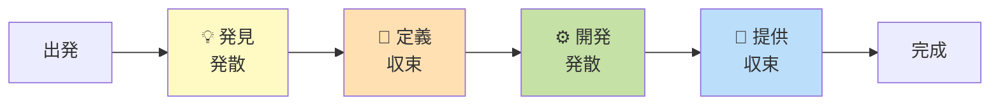

# 第 18 章 ヒューマンコンピュータインタラクション (HCI)

## まえがき — 人が使えてこそのソフトウェア

「機能はあるのに使われない」「マニュアルを読まないと操作できない」「目の不自由な人が使えない」――こうした失敗のほとんどは **ユーザの認知** を考えていないことが原因です。

ソフトウェアは最終的に **人間** が使います。人間は完璧ではなく、注意力には限界があり、認知のクセを持ちます。それを理解した設計が、UI/UX、CLI、API、エラーメッセージの質を決めます。

> **🎯 章の目標**
>
> - ユーザーの認知（知覚・記憶・注意）を理解する
> - ユーザビリティとアクセシビリティの原則を設計に反映できる
> - プロトタイピング・ユーザー調査・評価のサイクルを実践できる
> - 開発者向け UX (DX) の重要性を語れる

---

## 18.1 なぜ HCI を学ぶか

### 18.1.1 「使われない機能」のコスト

調査によると、ソフトウェアの **約 64% の機能はほとんど使われない**（Standish Group）。原因の多くは:
- 発見されない
- 理解されない
- 操作が面倒

機能を作るより、**使ってもらう** のが本当の挑戦。

### 18.1.2 エンジニアにとっての HCI

「UI デザイナーの仕事」と思われがち。実は:
- CLI ツールの引数設計
- エラーメッセージの書き方
- API のレスポンス形式
- ライブラリの関数命名

すべて HCI です。**プログラマも UX を作る当事者**。

---

## 18.2 認知の基礎

### 18.2.1 知覚 — どう見えるか

#### ゲシュタルト原理

人間は **形をひとまとめに認識** する性質があります。

| 原理 | 内容 |
|---|---|
| 近接 | 近いものをグループと認識 |
| 類似 | 似たものをグループと認識 |
| 連続 | なめらかな線として認識 |
| 閉合 | 閉じた形として認識 |
| 図と地 | 図形と背景を区別 |

```
近接の例:
●●  ●●  ●●        2 つ 2 つに見える

●●●●●●           1 列に見える
```

UI 設計では、関連する要素を近づける、似た要素を同じスタイルにする、などで **直感的な構造** を作ります。

#### 色

- **約 7% の男性が色覚多様性**。色だけで情報を伝えない
- 必ず **形・テキストでも区別**
- コントラスト 4.5:1 以上 (WCAG)

#### フィッツの法則

「**目標までの時間**」は距離と大きさで決まる:

$$T = a + b \log_2(D/W + 1)$$

- $D$: 目標までの距離
- $W$: 目標の大きさ

「**大きく、近くに** ボタンを置けば押しやすい」。スマホの親指の届く範囲、画面隅 (角は無限大！) などの設計指針。

#### ヒックの法則

「**選択肢が増えると判断時間が対数的に増える**」。選択肢を絞る、グルーピングする、デフォルト値を設定する、など。

### 18.2.2 記憶

#### 短期記憶: 7 ± 2

「マジカルナンバー 7」: 人が一度に保持できる項目数。

対策: **チャンキング**。電話番号を `090-1234-5678` のように区切る。

#### 認識 > 想起

「**思い出す**」より「**選ぶ**」のが楽。

```
悪い: 「ファイル名を入力してください」
良い: 「最近のファイル一覧から選択」
```

### 18.2.3 注意 — 認知負荷

ユーザの注意は限られた資源:
- **外的負荷**: 不要な装飾・複雑な UI
- **内在的負荷**: タスク自体の難しさ
- **関連的負荷**: 学習に役立つ集中

設計の目的は **不要な認知負荷を減らす**。

### 18.2.4 メンタルモデル

ユーザは「**自分なりの仕組みの理解**」を持っています。デザインモデル ≠ メンタルモデル だと混乱が起きます。

例: 「ゴミ箱に入れた = 削除済み」と思うが、実際にはまだ復元可能。これがメンタルモデルとの一致。

#### アフォーダンスとシグニファイア

- **アフォーダンス**: 「押せそう」「引けそう」と認識される性質
- **シグニファイア**: それを **示す** 視覚的手がかり

「ボタンに見えるからクリックする」「下線に見えるからリンクと分かる」。

---

## 18.3 ユーザビリティ原則

### 18.3.1 Nielsen の 10 ヒューリスティック

Jakob Nielsen がまとめた、UI 評価の定番チェックリスト:

1. **システム状態の可視化** (今何が起きてる?)
2. **システムと現実世界の一致** (アイコンが実物に似てる)
3. **ユーザコントロールと自由** (取り消し、戻る)
4. **一貫性と標準** (同じ操作は同じ結果)
5. **エラー予防** (確認ダイアログ)
6. **認識 > 想起** (一覧から選ぶ)
7. **効率と柔軟性** (ショートカット、初心者・上級者対応)
8. **美的でミニマルな設計**
9. **エラーからの回復支援** (具体的なエラーメッセージ)
10. **ヘルプとドキュメント**

### 18.3.2 Schneiderman の 8 黄金則

- 一貫性
- 普遍的使用 (上級者も初心者も)
- 情報のフィードバック
- ダイアログの完結
- エラー処理
- 取り消し
- 主導権
- 短期記憶負荷の軽減

---

## 18.4 インタラクションデザイン

### 18.4.1 入力モダリティ

| モダリティ | 例 |
|---|---|
| GUI | マウス、タッチ |
| CLI | キーボード |
| 音声 | Siri, Alexa |
| ジェスチャ | VR、Kinect |
| 視線 | アクセシビリティ |
| 脳波 | 研究段階 |

### 18.4.2 CLI の良し悪し

CLI も UX。

#### 良いエラーメッセージ

```
悪い:
$ rm important.txt
(何も表示されない)

良い:
$ rm important.txt
rm: cannot remove 'important.txt': Permission denied
Try: sudo rm important.txt
```

「**何が起きた・なぜ・どう直すか**」の 3 点セット。

#### 不可逆操作には確認

```bash
$ rm -i file.txt
remove file.txt? [y/N]:
```

ただし慣れた人には冗長。`--force` で省略可能に。

#### 標準入出力

機械可読 (パイプで繋げる) を基本に、人間向けの装飾は別フラグ:

```bash
$ ls --json | jq '.files[].name'
```

### 18.4.3 Web/モバイル UI

#### ナビゲーション

「**今どこにいるか**」が常に分かるように:
- パンくず (ホーム > 商品 > 詳細)
- アクティブ状態
- ページタイトル

#### フォーム

- 明確なラベル
- プレースホルダはヒント、ラベルの代用にしない
- インラインバリデーション
- ストレスのない長さ

```
悪い: [必須] エラー: "name required"
良い: [必須 ✓] お名前 (例: 山田太郎)
            ↑入力後の即時フィードバック
```

#### 待ち時間

- 1 秒以内 → 即時に感じる
- 1-3 秒 → 進行を感じる
- 10 秒で集中切れ

対策:
- スケルトンローダー
- 進捗バー
- 楽観的 UI（先に成功を表示）

### 18.4.4 マイクロインタラクション

ボタンのフィードバック、トースト通知、アニメーション。やりすぎは逆効果。

---

## 18.5 アクセシビリティ (a11y)

### 18.5.1 4 原則 (WCAG)

1. **知覚可能 (Perceivable)**: テキスト代替、キャプション
2. **操作可能 (Operable)**: キーボード操作、十分な時間
3. **理解可能 (Understandable)**: 読みやすさ、予測可能
4. **堅牢 (Robust)**: 支援技術と互換

### 18.5.2 実装ポイント

#### セマンティック HTML

```html
<!-- 悪い -->
<div onclick="...">クリック</div>

<!-- 良い -->
<button onclick="...">クリック</button>
```

`button` なら Tab で選べ、Enter で押せる。スクリーンリーダーが「ボタン」と読み上げる。

#### ARIA

セマンティックを補強:
```html
<div role="alert" aria-live="assertive">
  保存しました
</div>
```

#### コントラスト

WCAG AA: 4.5:1、AAA: 7:1。Lighthouse, axe-core で検証。

#### キーボードフォーカス

```css
:focus { outline: 2px solid blue; }
```

「フォーカスリングが消えない」が原則。

#### 動画

- 字幕（聴覚障害）
- 音声説明（視覚障害）
- トランスクリプト

### 18.5.3 カーブカット効果

「**障害者向けの設計が、すべてのユーザを助ける**」。

例:
- 歩道の縁石カット → 車椅子のため → ベビーカー、台車も助かる
- 字幕 → 聴覚障害者のため → 騒音環境、外国語学習者も助かる
- 大きなボタン → 高齢者のため → 子供、片手操作の人も助かる

---

## 18.6 国際化 (i18n) と地域化 (l10n)

- **Unicode, UTF-8**: 文字エンコーディング
- 文字方向 (LTR / RTL)
- 日付・通貨・数値書式
- 翻訳メッセージ (gettext, ICU MessageFormat)
- 名前順、姓名の文化的差異
- タイムゾーン
- 暦 (西暦、和暦、ヒジュラ暦)

「**ハードコードされた文字列**」「**`yyyy/MM/dd` 固定**」は国際化の敵。

---

## 18.7 デザインプロセス

### 18.7.1 ダブルダイヤモンド



問題を発散して定義し、解決策を発散して提供する。**2 度の「発散 → 収束」サイクル** が良いデザインを生みます。

### 18.7.2 ユーザー調査

| 手法 | 内容 |
|---|---|
| インタビュー | 半構造化が定番 |
| アンケート | 量的データ |
| 観察 | 民族誌的、ユーザの環境で |
| ペルソナ | 代表ユーザの像 |
| ジャーニーマップ | 体験の流れ |

#### ジョブストーリー

「**いつ・なぜ・どうしたい**」を明確に:
```
When 通勤中に音楽を聴きたい
I want to オフラインで再生したい
So I can 電波がない地下鉄でも音楽を楽しめる
```

### 18.7.3 プロトタイピング

```
紙 → ワイヤーフレーム → 高忠実モック → インタラクティブ → 実装
```

「**早く失敗して学ぶ** (Fail fast)」。実装前に紙で試せば 1 万倍コストが安い。

ツール: Figma, Sketch, Adobe XD, Storybook (実コンポーネントの目録)。

---

## 18.8 評価手法

### 18.8.1 形成的 (Formative) — 設計中

- **ヒューリスティック評価**: 専門家が原則と照合
- **認知ウォークスルー**: タスクを 1 ステップずつ追う

### 18.8.2 総括的 (Summative) — 完成後

- **ユーザビリティテスト**: 5 名で 80% の問題が見つかる (Nielsen)
- **思考発話法 (Think-Aloud)**: 操作中の独り言を記録
- **A/B テスト**: 統計的検定 (第 4 章)
- **アンケート**: SUS (System Usability Scale), NPS
- **アナリティクス**: クリック率、離脱率、タスク成功率、時間

### 18.8.3 倫理

- **同意 (Informed Consent)**
- データ匿名化、GDPR / 個人情報保護法
- **「ダークパターン」を作らない**

#### ダークパターン例

- キャンセルしにくい登録
- 偽のカウントダウン (「残り 3 個！」が嘘)
- 同意なき自動更新
- 紛らわしい配色 (取り消しを目立たなく)

これらは短期的に売上を上げるが、**信頼を失う最速の方法**。

---

## 18.9 アクセシブルなデフォルトと包摂的設計

- ダークモード
- テキストサイズ可変
- モーション低減 (`prefers-reduced-motion`)
- 動的フォント
- 音声インターフェースは **低コンテキスト言語**
- 第二言語話者向けの **シンプルな表現**

「**最も助けが必要な人**」を中心に置くと、結果的に全員に優しい。

---

## 18.10 開発者向け UX (DX)

API・SDK・ドキュメント・CLI も UX を持ちます。

### 18.10.1 良い API の特徴

- 一貫した命名
- 即時の "Hello World"
- 段階的開示（最初は簡単、徐々に高度な機能）
- 良いエラーメッセージ
- バージョン互換性方針

### 18.10.2 良いドキュメント

- **クイックスタート** (5 分で動く)
- **チュートリアル** (順を追って学ぶ)
- **リファレンス** (詳細スペック)
- **コンセプト** (なぜそう設計されているか)

Stripe, Twilio のドキュメントが手本。

### 18.10.3 良いエラー

```
悪い: Error 4001
良い: Authentication failed: invalid API key.
       Check your API key at https://dashboard.example.com/keys
```

---

## 18.11 演習問題

1. 任意の Web サービスを Nielsen の 10 ヒューリスティックで評価し、3 つの問題と改善案を挙げよ。
2. CLI ツールのエラーメッセージを「悪い例」と「良い例」で比較せよ。
3. フォームの入力エラーをユーザに伝える 3 つの方法を比較せよ。
4. アクセシビリティチェックを Lighthouse で行い、コントラスト不足や ARIA エラーを修正せよ。
5. ユーザーインタビュー 5 件を仮想設計し、聞くべき質問を 10 個書け。
6. A/B テストで「ボタン色を青→緑」を試す際、サンプルサイズと注意点を述べよ。
7. ダークパターンの実例を 3 つ挙げ、倫理的な代替を提案せよ。
8. 自分の作ったライブラリの README を、Stripe ドキュメントの構成で書き直せ。
9. スクリーンリーダで自分のサイトを操作し、3 つの問題を見つけよ。
10. ユーザーペルソナを 3 人作り、それぞれのジョブストーリーを 1 つ書け。

---

## 18.12 この章のまとめ

| 視点 | キーワード |
|---|---|
| 認知 | フィッツ、ヒック、ゲシュタルト、メンタルモデル |
| 原則 | Nielsen 10、Schneiderman 8 |
| 実装 | フォーム、待ち時間、フィードバック |
| 一貫性 | アクセシビリティ、国際化 |
| 評価 | ユーザテスト、A/B、アンケート |
| 倫理 | ダークパターンを作らない |

「**人を中心に置いた設計**」。エンジニアが HCI を学ぶと、機能追加だけでなく **使われる機能** を作れます。

## 18.13 次に読むもの

- Norman, *The Design of Everyday Things* — 名著
- Nielsen, *Usability Engineering*
- Krug, *Don't Make Me Think*
- Tidwell, *Designing Interfaces*
- WCAG 2.2 仕様
- Inclusive Design Principles (Microsoft)
- 『誰のためのデザイン？』(Norman 訳本)

> **🌟 メッセージ**
> 「ユーザーは自分自身ではない」――これが HCI の出発点。**自分が分かりやすいから良い** ではなく、**ユーザにとって分かりやすいか** を常に問う姿勢が、優秀なエンジニアの条件です。
