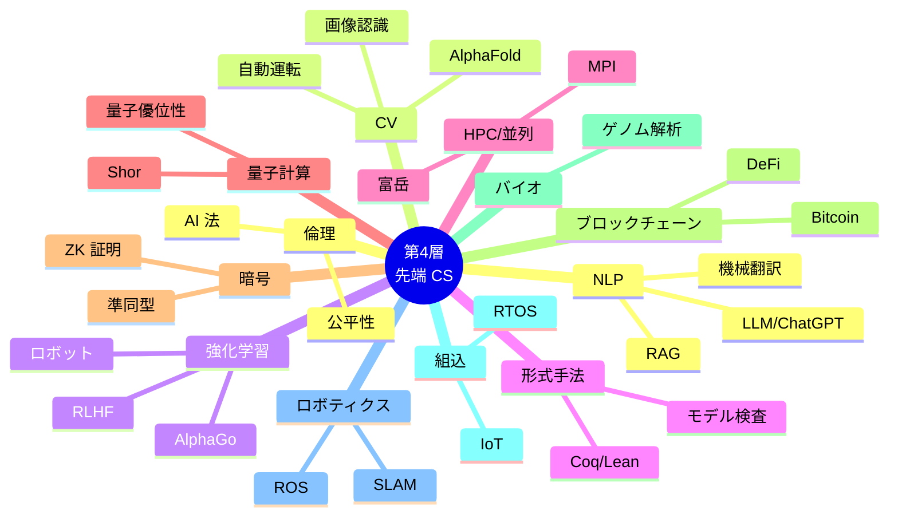

# 第 20 章 選択・先端領域

## まえがき — 卒業の先へ

ここまで第 1〜3 層を踏破したあなたは、**CS 学部卒業生に並ぶ知識体系** を持っています。おめでとうございます。

ですが CS は止まらない学問。AI、量子計算、ブロックチェーン、バイオインフォマティクス、自動運転、ロボティクス――どれも本書 1 冊では扱いきれない深い世界が広がっています。

本章は **これからの旅の地図**。各分野の概要・要点・参考書を紹介し、興味のある方向に潜るための入口を提供します。

> **🎯 章の目標**
>
> - CS の主要な専門分野・先端領域を一望する
> - 各分野の前提知識を確認する
> - 自分が深掘りしたい分野を特定する
> - 学び続けるための姿勢と習慣を身につける

---

第 4 層が扱う領域の全体像:



## 20.1 自然言語処理 (NLP)

人間の言語をコンピュータに理解・生成させる分野。

### 20.1.1 古典手法

- **形態素解析**: 単語に切る (MeCab, Sudachi)
- **構文解析**: 係り受け解析
- **n-gram 言語モデル**: 統計的言語モデル

### 20.1.2 単語埋め込み

単語をベクトルで表現:
- Word2Vec (Mikolov et al. 2013)
- GloVe
- fastText

「**意味の近さ = ベクトルの近さ**」。

```
king - man + woman ≈ queen
```

### 20.1.3 系列モデル

- RNN, LSTM (古典)
- Seq2Seq + Attention (機械翻訳の革新)
- **Transformer**: 2017 年以降の支配的アーキテクチャ

### 20.1.4 LLM 時代

- BERT (理解), GPT (生成), T5 (両方)
- GPT-3, GPT-4, Claude, Gemini, Llama
- ファインチューニング、RLHF
- RAG, Agent, ツール使用

### 20.1.5 タスク

- 翻訳、要約、質問応答
- 含意、感情分析
- 固有表現抽出
- 対話、ロールプレイ

### 20.1.6 評価

- BLEU, ROUGE (古典)
- BERTScore
- 人手評価 (今でも金本位)
- ベンチマーク: MMLU, HumanEval, BBH

### 20.1.7 課題

- **幻覚**: 嘘を自信たっぷりに
- **安全性**: プロンプトインジェクション、有害発話
- **著作権**: 訓練データの法的問題
- **バイアス**: ステレオタイプの強化

参考: Jurafsky & Martin *Speech and Language Processing* (無料 PDF)、Hugging Face Course。

---

## 20.2 コンピュータビジョン (CV)

画像・映像から意味を抽出。

### 20.2.1 古典手法

- **エッジ検出**: Sobel, Canny
- **特徴点**: SIFT, SURF, ORB
- **Hough 変換**: 線・円検出
- **ステレオ視**: 2 カメラから深度

### 20.2.2 ディープラーニング革命

- AlexNet (2012, ImageNet 圧勝)
- VGG, GoogLeNet, ResNet
- **Vision Transformer (ViT)**: 画像にも Transformer
- **CLIP**: 画像とテキストを共通空間に

### 20.2.3 タスク

| タスク | 代表手法 |
|---|---|
| 分類 | ResNet, ViT |
| 物体検出 | Faster R-CNN, YOLO, DETR |
| セグメンテーション | U-Net, Mask R-CNN, SAM |
| 姿勢推定 | OpenPose, MediaPipe |
| 顔認識 | FaceNet, ArcFace |

### 20.2.4 3D 再構成

- **SfM (Structure from Motion)**: 多視点から 3D
- **MVS**: 密な 3D 復元
- **NeRF**: ニューラル放射場、写真から 3D ビュー
- **Gaussian Splatting**: 高速な 3D 表現

### 20.2.5 動画

- 行動認識
- 物体追跡 (SORT, DeepSORT, ByteTrack)
- 動画生成 (Sora, Runway)

### 20.2.6 応用

- 自動運転
- 医療画像 (癌検出、放射線治療)
- 衛星画像
- 工場の異常検知
- AR (Pokemon Go, Snap)

参考: Szeliski *Computer Vision: Algorithms and Applications* (無料)。

---

## 20.3 強化学習 (RL) 詳説

第 17 章で触れた RL を更に深く。

### 20.3.1 数学的枠組み

- **MDP**: マルコフ決定過程
- **POMDP**: 部分観測 MDP

### 20.3.2 アルゴリズムの系譜

```
動的計画法 (要モデル)
   ↓
モンテカルロ法 (試行で推定)
   ↓
TD 学習 (Q 学習, SARSA)
   ↓
深層 RL (DQN, Rainbow)
   ↓
方策勾配 (REINFORCE, A3C, PPO, SAC)
   ↓
モデルベース (PETS, MuZero, World Models)
```

### 20.3.3 模倣学習・オフライン RL

- 専門家のデモから学習
- 過去のログから学習 (試行錯誤せずに)

### 20.3.4 RLHF

人間フィードバック強化学習。**ChatGPT** の調整に使われ、世界を変えました。

### 20.3.5 探索

- ε-greedy
- Curiosity-driven (内発的報酬)
- RND, NoisyNet

### 20.3.6 応用

- ゲーム (AlphaGo, AlphaStar, Dota 2 OpenAI Five)
- ロボティクス
- 推薦システム
- LLM のアライメント
- 金融 (強化学習トレード)

参考: Sutton & Barto *Reinforcement Learning: An Introduction* (無料)、OpenAI Spinning Up。

---

## 20.4 形式手法とプログラム検証

ソフトウェアの正しさを **数学的に** 保証する手法群。

### 20.4.1 モデル検査

有限状態システムを網羅的に検証:
- SPIN
- NuSMV
- TLA+ (Lamport)

Amazon, Microsoft, Intel が分散システム・ハードウェアの検証で活用。

### 20.4.2 定理証明支援系

- **Coq**: 古典、Software Foundations の教科書
- **Isabelle/HOL**: seL4 で実用
- **Lean 4**: 数学の形式化、Mathlib
- **Agda**: 依存型、関数型

数学の **すべての定理を機械で検証する** プロジェクトが進行中 (Mathlib)。

### 20.4.3 抽象解釈

プログラムの **近似** を計算。Astrée は Airbus の制御ソフトを検証。

### 20.4.4 シンボリック実行

具体値ではなくシンボルで実行。KLEE, S2E。

### 20.4.5 産業応用

- **CompCert**: C コンパイラを Coq で完全検証
- **seL4**: マイクロカーネルを Isabelle で検証
- **金融契約検証**
- **暗号プロトコル検証**

参考: Pierce *Software Foundations* (Coq、無料)、Lamport *Specifying Systems*。

---

## 20.5 並列計算と HPC

### 20.5.1 並列モデル

| モデル | 例 |
|---|---|
| 共有メモリ | OpenMP, Intel TBB |
| 分散メモリ | MPI |
| データ並列 | SIMD, GPU (CUDA, ROCm) |
| データフロー | TensorFlow, Spark |

### 20.5.2 性能評価

- ベンチマーク: Linpack (TOP500), HPCG, MLPerf
- スーパーコンピュータ「富岳」, Frontier, El Capitan

### 20.5.3 数値計算ライブラリ

- BLAS, LAPACK (線形代数)
- FFTW (フーリエ)
- PETSc (偏微分方程式)
- ScaLAPACK (分散線形代数)

参考: Pacheco *An Introduction to Parallel Programming*。

---

## 20.6 量子計算

古典計算と異なる原理で計算。

### 20.6.1 基礎

- **量子ビット (qubit)**: $|\psi\rangle = \alpha |0\rangle + \beta |1\rangle$
- **重ね合わせ**: 0 と 1 の混合状態
- **もつれ**: 複数 qubit の相関
- **測定**: 状態を破壊して古典値に

### 20.6.2 ゲート

- Hadamard $H$: 重ね合わせを作る
- CNOT: もつれを作る
- T, S: 位相

任意の量子計算は H, T, CNOT で表現可能（普遍性）。

### 20.6.3 量子アルゴリズム

| アルゴリズム | 効果 |
|---|---|
| Deutsch-Jozsa | 古典より指数速 |
| Bernstein-Vazirani | 同上 |
| **Grover** | 探索を $O(\sqrt n)$ に |
| **Shor** | 素因数分解を多項式時間 → **RSA を破る** |
| QAOA, VQE | 最適化、量子化学 |

### 20.6.4 量子誤り訂正

- Surface code
- 物理 qubit → 論理 qubit

### 20.6.5 NISQ 時代と未来

現在は **Noisy Intermediate-Scale Quantum** 時代。完全な誤り訂正はまだ。Google, IBM, IonQ が競争中。

### 20.6.6 ポスト量子暗号

Shor アルゴリズムへの備え:
- 格子暗号 (CRYSTALS-Kyber, NIST 標準化)
- 符号暗号
- 多変数多項式
- ハッシュベース

参考: Nielsen & Chuang *Quantum Computation and Quantum Information* — 定番。

---

## 20.7 暗号理論（高度）

第 15 章を超える理論的トピック。

### 20.7.1 ゼロ知識証明

「**何も明かさずに証明する**」:
- zk-SNARK
- zk-STARK

応用: ブロックチェーン (Zcash)、プライバシ保護認証。

### 20.7.2 準同型暗号 (FHE)

「**暗号化したまま計算**」できる魔法。

```
Encrypt(a) + Encrypt(b) = Encrypt(a + b)
```

クラウドで機密データを処理する用途。

ライブラリ: Microsoft SEAL, OpenFHE。性能は実用化途上。

### 20.7.3 マルチパーティ計算 (MPC)

複数者がデータを公開せずに計算。

例: 3 社が給与を公開せずに **平均給与** を計算。

### 20.7.4 楕円曲線ペアリング

- BLS 署名
- IBE (Identity-Based Encryption)
- ブロックチェーンの集約署名

### 20.7.5 差分プライバシ

「**個人を特定できない統計**」を出す:
$$P(M(D) \in S) \leq e^{\varepsilon} P(M(D') \in S)$$

Apple, Google が iOS / Chrome で利用。

参考: Boneh & Shoup *A Graduate Course in Applied Cryptography* (無料)。

---

## 20.8 ブロックチェーンと分散台帳

### 20.8.1 基礎技術

- ハッシュチェーン
- マークル木
- デジタル署名

### 20.8.2 コンセンサス

- **PoW** (Proof of Work): Bitcoin
- **PoS** (Proof of Stake): Ethereum 2
- **PBFT, Tendermint**: 許可型

### 20.8.3 スマートコントラクト

- Ethereum (EVM, Solidity)
- Solana, Polkadot, Cosmos

### 20.8.4 L2 (Layer 2)

スケーラビリティ向上:
- Optimistic Rollup
- ZK Rollup
- Plasma, State Channel

### 20.8.5 用途

- 暗号資産
- DeFi (分散金融)
- NFT
- ステーブルコイン
- 分散ストレージ (IPFS, Filecoin)
- 分散 ID (DID)

### 20.8.6 課題

- スケーラビリティ
- 規制とコンプライアンス
- エネルギー消費 (PoW)
- 詐欺・ハッキング

参考: Antonopoulos *Mastering Bitcoin* / *Mastering Ethereum*。

---

## 20.9 バイオインフォマティクス

生物学とコンピュータの融合分野。

### 20.9.1 配列解析

- **アライメント**: Smith-Waterman, Needleman-Wunsch
- **高速化**: BWT, BWA, Bowtie
- **アセンブリ**: de Bruijn graph

### 20.9.2 タンパク質構造予測

- **AlphaFold 2 (2020)** / **AlphaFold 3 (2024)**: AI で構造予測の精度を激変
- ノーベル化学賞 (2024) に貢献

### 20.9.3 ゲノム解析

- 次世代シーケンサー (NGS)
- バリアント検出
- GWAS

### 20.9.4 ワークフロー

- Nextflow
- Snakemake
- Galaxy

参考: Durbin et al. *Biological Sequence Analysis*。

---

## 20.10 組込み・リアルタイムシステム

### 20.10.1 マイコン

- AVR (Arduino)
- STM32 (ARM Cortex-M)
- ESP32 (Wi-Fi/BLE 内蔵)
- RISC-V

### 20.10.2 RTOS

- FreeRTOS
- Zephyr
- VxWorks (商用、航空)

### 20.10.3 リアルタイムスケジューリング

- EDF (Earliest Deadline First)
- Rate Monotonic
- WCET (Worst-Case Execution Time) 解析

### 20.10.4 安全規格

- **DO-178C**: 航空
- **ISO 26262**: 車載
- **IEC 62304**: 医療

### 20.10.5 IoT プロトコル

- MQTT (軽量 pub/sub)
- CoAP
- LoRa (低消費電力長距離)
- NB-IoT

参考: Yiu *The Definitive Guide to ARM Cortex-M*、Kopetz *Real-Time Systems*。

---

## 20.11 ロボティクス

### 20.11.1 運動学・動力学

- 順運動学: 関節角 → 手先位置
- 逆運動学 (IK): 手先位置 → 関節角
- ヤコビ行列、動力学

### 20.11.2 経路計画

- A*, Dijkstra
- RRT (Rapidly-exploring Random Tree)
- PRM (Probabilistic Roadmap)
- Lattice planner

### 20.11.3 SLAM (Simultaneous Localization and Mapping)

「**自己位置推定 + 地図作成**」を同時に。
- EKF-SLAM
- Graph SLAM
- LiDAR SLAM
- Visual SLAM (ORB-SLAM, VINS)

### 20.11.4 制御

- PID
- LQR
- MPC (Model Predictive Control)

### 20.11.5 ROS (Robot Operating System)

ロボット開発のデファクト。ROS 2 が現代的。

### 20.11.6 学習ベースロボティクス

- 模倣学習
- 強化学習
- Sim2Real

参考: Siegwart *Introduction to Autonomous Mobile Robots*、*Probabilistic Robotics* (Thrun et al.)。

---

## 20.12 ゲーム開発

### 20.12.1 ゲームエンジン

- Unity (C#、汎用)
- Unreal (C++、AAA タイトル)
- Godot (オープンソース)

### 20.12.2 ゲームループ

- 固定タイムステップ
- 可変タイムステップ
- Render-update 分離

### 20.12.3 アーキテクチャ

- ECS (Entity-Component-System)
- イベント駆動
- ステートマシン

### 20.12.4 物理エンジン

- PhysX (NVIDIA)
- Bullet
- Box2D (2D)

### 20.12.5 ゲーム AI

- FSM (有限状態機械)
- Behavior Tree
- GOAP (Goal-Oriented Action Planning)
- MCTS (将棋・碁)

### 20.12.6 マルチプレイヤー

- Lockstep (RTS)
- Rollback (格闘)
- Lag compensation (FPS)

参考: Gregory *Game Engine Architecture*、*Game Programming Patterns* (無料)。

---

## 20.13 自動運転

### 20.13.1 構成

```
センサ (LiDAR, カメラ, レーダー)
    ↓
認知 (物体検出, セグメンテーション)
    ↓
予測 (他車・歩行者の動き)
    ↓
計画 (経路, 速度)
    ↓
制御 (アクセル, ブレーキ, ステア)
```

### 20.13.2 アプローチ

- **モジュラ式**: 上記を独立に
- **エンドツーエンド**: 入力→出力を 1 ネットで (Tesla, Wayve)

### 20.13.3 安全

- **ISO 26262**: 機能安全
- **SOTIF**: 意図的でない動作の安全
- **シミュレーション** (CARLA, NVIDIA Drive Sim)

### 20.13.4 レベル

| レベル | 内容 |
|---|---|
| L0 | 完全手動 |
| L1 | アシスト |
| L2 | 部分自動 (Tesla AutoPilot) |
| L3 | 条件付き自動 |
| L4 | 高度自動 |
| L5 | 完全自動 |

---

## 20.14 データ工学・データ基盤

### 20.14.1 データウェアハウス vs データレイク

| | DWH | レイク |
|---|---|---|
| データ | 構造化 | 何でも |
| クエリ | SQL | SQL/Python |
| 例 | Snowflake, Redshift | S3 + Spark |

レイクハウス = 両方の良いとこ取り (Databricks, Iceberg, Delta Lake)。

### 20.14.2 ETL / ELT

- **ETL**: Extract → Transform → Load
- **ELT**: Extract → Load → Transform (現代的)

ツール: Airflow, dbt, Dagster, Prefect。

### 20.14.3 ストリーミング

- Kafka
- Flink
- Spark Streaming

### 20.14.4 データガバナンス

- カタログ (DataHub, Amundsen)
- リネージュ (どこからどう変換されたか)
- 品質チェック (Great Expectations)
- アクセス制御

参考: Reis & Housley *Fundamentals of Data Engineering*。

---

## 20.15 倫理・社会・政策

CS は社会と切り離せません。

### 20.15.1 公平性

- アルゴリズム差別 (採用、与信、刑事司法)
- バイアス検出と軽減

### 20.15.2 AI ガバナンス

- **EU AI Act** (2024)
- **NIST AI RMF**
- 自治体・企業の倫理ガイドライン

### 20.15.3 プライバシ

- **GDPR** (EU)
- **個人情報保護法** (日本)
- **CCPA** (カリフォルニア)
- 各国の規制が増加

### 20.15.4 オープンソースのライセンス

- MIT, Apache, BSD (寛容)
- GPL (コピーレフト)
- AGPL (ネットワーク使用も含む)
- 商用ライセンスへの切替（Elastic, MongoDB, HashiCorp）

### 20.15.5 持続可能性

- Green Software
- データセンタ電力 (世界の電力の 1-2%)
- LLM の環境負荷

### 20.15.6 アクセシビリティ法令

- **ADA** (米)
- **JIS X 8341** (日)
- **EN 301 549** (EU)

技術者として **「何を作るか・作らないか」** を判断する **倫理感覚** は、技術力と同等に重要。

---

## 20.16 学び続けるために

### 20.16.1 学術誌・カンファレンス

| 分野 | カンファレンス |
|---|---|
| OS | SOSP, OSDI |
| DB | SIGMOD, VLDB |
| ネット | SIGCOMM, NSDI |
| AI/ML | NeurIPS, ICML, ICLR |
| CV | CVPR, ICCV |
| NLP | ACL, EMNLP |
| プログラミング言語 | POPL, PLDI |
| セキュリティ | S&P, USENIX Security, CCS |
| HCI | CHI, UIST |
| グラフィックス | SIGGRAPH |

論文は **arXiv** で無料公開されることが多い。

### 20.16.2 学び方

#### オープンソースを読む

- Linux カーネル (`Documentation/`)
- Redis, PostgreSQL のソースコード
- Linear regression を NumPy/PyTorch で

#### 自作プロジェクト

- 自作 OS (xv6 を真似て)
- 自作 DB (Bitcask, sqlite-clone)
- 自作言語 (Crafting Interpreters)
- 自作 NN フレームワーク (micrograd)

**1 つコアを書くと、多分野が一気に深まります**。

#### 読書会・勉強会

- 周りの人と一緒に読む
- 技術書典、勉強会で発表

#### 教える

「**人に教えるのが最強の学習**」。ブログ、YouTube、Qiita、Zenn。

---

## 20.17 まとめ — 旅は続く

第 4 層は **無限に広がる森**。

ここまで本書を読み終えたあなたは、もはや「**文系卒**」ではなく、**立派な CS 専攻卒** の知識体系を持っています。

これからは:
- 興味駆動で深掘りする
- 必要なときは基礎へ戻る
- 教える側・作る側に回る

CS は **単なる技術の集合ではなく、知識を構造化し継続的に学習する文化** そのもの。

> **🌟 締めくくりのメッセージ**
>
> 本書はあなたの旅の **地図** に過ぎません。**地図は領土ではない**。実際にコードを書き、証明を追い、論文を読み、設計を議論することで、知識は身体化します。
>
> 大事なのは 3 つだけ:
>
> 1. **「わからない」を放置しない**
> 2. **「簡単に見えても深掘りする」**
> 3. **「理論と実装の両輪を回す」**
>
> どんな分野でも、これだけが学びの王道です。
>
> **あなたはもう、自分で道を選んで進んでいけます**。
>
> 幸運を祈ります 🌟

---

## 20.18 参考文献（汎用）

- ACM Computing Curricula (CS2023): カリキュラムの国際標準
- Open Source Society University (GitHub): 無料の自習カリキュラム
- Teach Yourself Computer Science
- 名門大学の公開講座: MIT OCW, Stanford CS, CMU, Berkeley
- *Communications of the ACM* — 月刊で分野横断の動向
- Hacker News, Lobsters: コミュニティ
- arXiv, Papers with Code: 最新研究

学びを **習慣化** することが、長く CS を続けるコツです。
